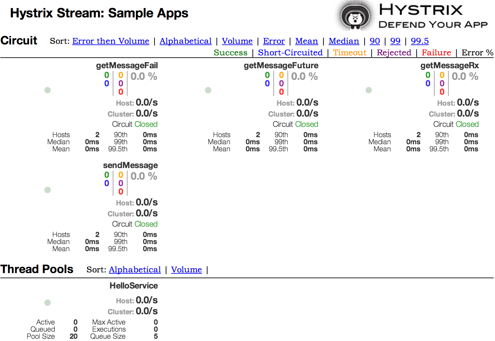
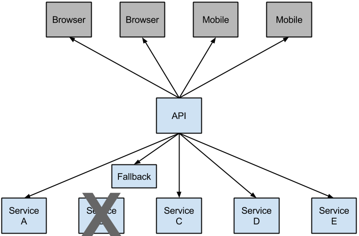

# 3.断路器：Hystrix客户端

Netflix创建了一个名为Hystrix的库，该库实现了断路器模式。在微服务架构中，通常有多个服务调用层，如以下示例所示：

图3.1。微服务图



较低级别的服务中的服务故障可能会导致级联故障，直至用户。当对特定服务的调用超过circuitBreaker.requestVolumeThreshold（默认值：20个请求）并且失败百分比大于由metrics.rollingStats.timeInMilliseconds（默认值：10秒）定义的滚动窗口中的circuitBreaker.errorThresholdPercentage（默认值：> 50％）时，电路断开，无法进行呼叫。在错误和断路的情况下，开发人员可以提供备用功能。

图3.2。Hystrix后备可防止级联故障



开路可以停止级联故障，并让不堪重负的服务故障时间得以恢复。回退可以是另一个受Hystrix保护的调用，静态数据或合理的空值。可以将回退链接在一起，以便第一个回退进行其他业务调用，而后者又回退到静态数据。

## 3.1如何包含Hystrix

要将Hystrix包括在您的项目中，请使用组ID为org.springframework.cloud的启动程序以及工件ID为spring-cloud-starter-netflix-hystrix的工件。有关使用当前Spring Cloud Release Train设置构建系统的详细信息，请参见Spring Cloud Project页面。

以下示例显示了带有Hystrix断路器的最小型Eureka服务器：

```java
SpringBootApplication
@EnableCircuitBreaker
public class Application {

    public static void main(String[] args) {
        new SpringApplicationBuilder(Application.class).web(true).run(args);
    }

}

@Component
public class StoreIntegration {

    @HystrixCommand(fallbackMethod = "defaultStores")
    public Object getStores(Map<String, Object> parameters) {
        //do stuff that might fail
    }

    public Object defaultStores(Map<String, Object> parameters) {
        return /* something useful */;
    }
}
```

@HystrixCommand由一个名为“ javanica”的Netflix contrib库提供。Spring Cloud会自动将带有该批注的Spring bean包装在连接到Hystrix断路器的代理中。断路器计算何时断开和闭合电路，以及在发生故障时应采取的措施。要配置@HystrixCommand，可以将commandProperties属性与@HystrixProperty批注一起使用。有关更多详细信息，请参见此处。有关可用属性的详细信息，请参见Hystrix Wiki。

## 3.2传播安全上下文或使用Spring Scope

如果您希望某些线程本地上下文传播到@HystrixCommand中，则默认声明将不起作用，因为它在线程池中执行命令（如果超时）。您可以通过配置或要求注解使用不同的“隔离策略”，将Hystrix切换为与调用者使用相同的线程，或直接在注解中使用。以下示例演示了如何在注释中设置线程：

```java
@HystrixCommand(fallbackMethod = "stubMyService",
    commandProperties = {
      @HystrixProperty(name="execution.isolation.strategy", value="SEMAPHORE")
    }
)
...
```

如果使用@SessionScope或@RequestScope，则同样适用。如果遇到运行时异常，提示它找不到范围内的上下文，则需要使用同一线程。

您还可以选择将hystrix.shareSecurityContext属性设置为true。这样做会自动配置一个Hystrix并发策略插件挂钩，以将SecurityContext从您的主线程转移到Hystrix命令使用的线程。Hystrix不允许注册多个Hystrix并发策略，因此可以通过将自己的HystrixConcurrencyStrategy声明为Spring bean来使用扩展机制。Spring Cloud在Spring上下文中寻找您的实现，并将其包装在自己的插件中。

## 3.3健康指标

连接的断路器的状态也显示在调用应用程序的/ health端点中，如以下示例所示

```json
{
    "hystrix": {
        "openCircuitBreakers": [
            "StoreIntegration::getStoresByLocationLink"
        ],
        "status": "CIRCUIT_OPEN"
    },
    "status": "UP"
}
```

## 3.4 Hystrix指标流

要启用Hystrix指标流，请包括对spring-boot-starter-actuator的依赖关系，并设置management.endpoints.web.exposure.include：hystrix.stream。这样做会将/actuator/hystrix.stream公开为管理端点，如以下示例所示：

```xml
 <dependency>
        <groupId>org.springframework.boot</groupId>
        <artifactId>spring-boot-starter-actuator</artifactId>
    </dependency>
```

