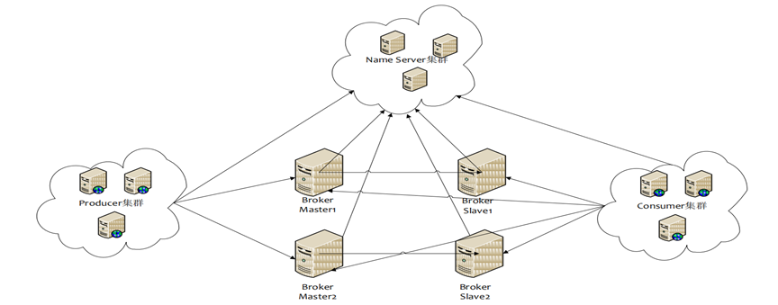

# ppt1

## 源码解读前之思考：RocketMQ架构主要参与者

思考点：
 1、上述各参与者之间如何通信。
 2、各个组件宕机对高可用性的影响。

建议：在看RocketMQ源码之前，建议先看官方文档（设计文档与用户手册），全面了解

RocketMQ基本的工作原理与主要解决课题，为后续深入学习打下基础。

## 源码分析消息发送

•消息发送者启动流程

•消息发送流程
  1、获取主题路由信息
   2、队列负载
   3、客户端--》Broker(服务端处理)

​     4、消息存储（本节点到为止）

•消息高可用设计
 例如在两台Broker组成的集群中a:q0,q1,q2,q3）b:q0,q1,q2,q3，按照轮询算法，如果上一次选择的是a:q0队列，当broker宕机后，RocketMQ如何避免再次发送到broker a 造成重试后还是失败？

## ppt2

RocketMQ存储系统概要设计

逻辑偏移是在当前文件中的偏移量

物理偏移是在所有文件中的偏移量