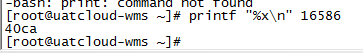
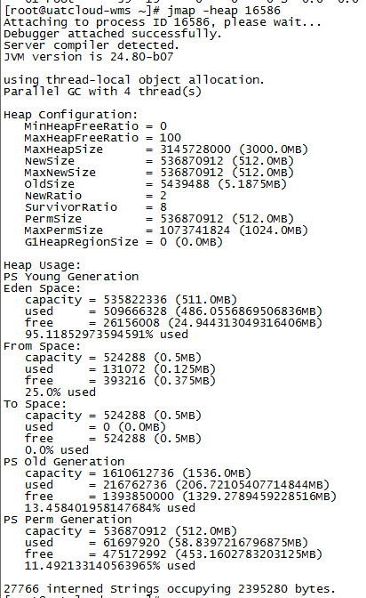
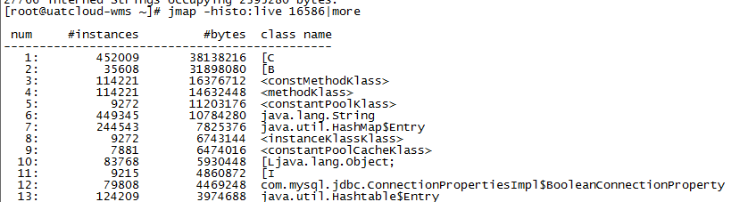

## top

top -c 显示进程运行信息列表

top -Hp 显示一个进程的线程运行信息列表

prtintf "%x\n" 线程号   将一个10进制的线程PID转换为一个16进制的数

jstack 线程10进制数|grep '线程16进制数' -C5 --color 通过线程id，过滤得到线程堆栈

jstack 16586|grep '40ca' -C5 --color

pstack/jstack/grep 有同样的功能

## 线上OOM

可能原因

1. 内存分配少了，满足不了业务量
2. 对象创建了没有被释放，导致内存泄露，内存耗尽
3. 系统资源被频繁申请

jmap -heap 进程号（通过 top -c查看）   查看jvm内存分布

jmap -histo:live 进程号|more    找到最耗内存的对象

实例数  所占内存  类名

pstree

netstat

查看创建的进程数，网络连接数

sshd

ll /proc/进程数/fd   查看句柄详情

ll /proc/进程数/task 查看线程数

0  标准输入

1 标准输出

2 标准错误输出

3 socket

ll /proc/进程数/fd |wc -l

ll /proc/进程数/task |wc -l   等同 pstree -p | wc -l

