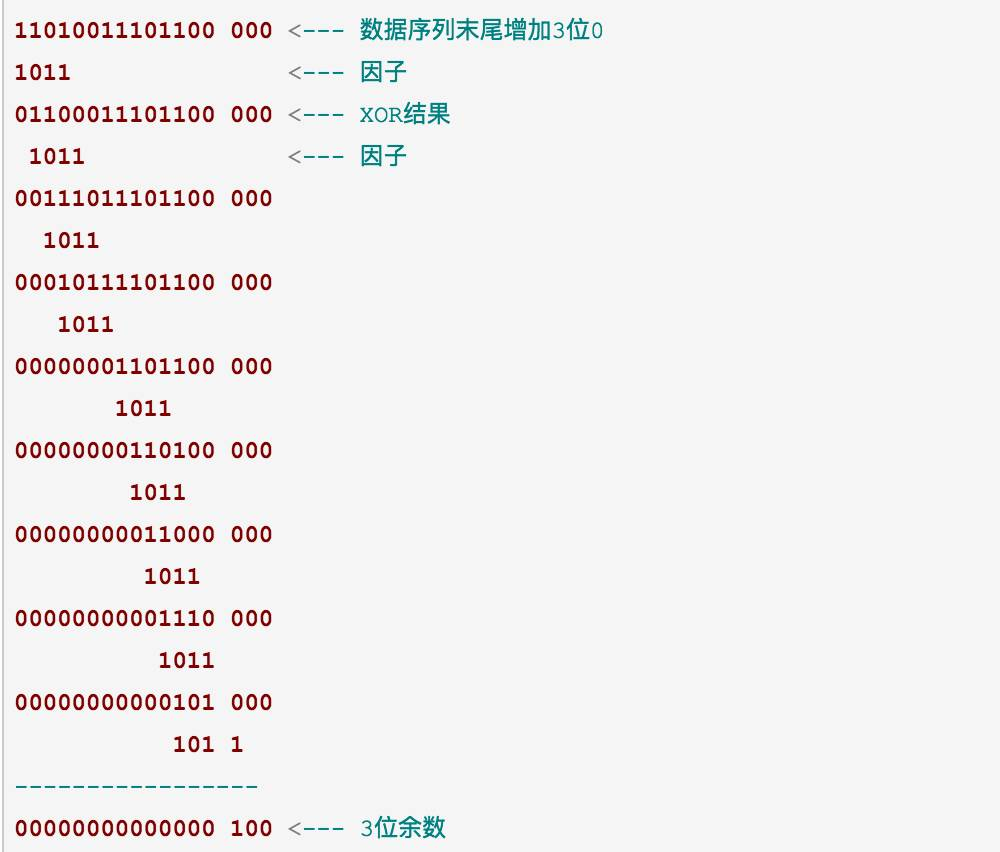

## 以太网协议

以太网和wifi 是链路层的两种协议

以太网的数据以帧（frame）为单位进行传输

### 帧的格式

帧是 0/1序列，包含 头部  数据（payload） 尾部 三部分

preamble|sfd|dst|src|type|payload(data)|pad|fcs|extension

帧按照此格式进行发送和接收

preamble 序言

#### 帧头部

帧头部7byte称为preamble（序言）。每个byte都是0xAA(16进制表示)。系统通常会以一定频率发送0/1序列（例如10），如果接收端的接收频率和发送端不一样，就会漏接收数据。即便频率相同也有可能因为网卡 路由器或其它原因导致偏差。序言的作用使接收端调整接收频率和发送端一致（叫时钟频率复原 recover the clock）

帧的起始信号 SFD(start frame delimiter) 是固定值0xAB,标识要开始传输数据 1 byte=8bit

目的地址DST(destination) 6byte 和 6byte 源地址SRC(source)

这里的目的和源 是mac地址，mac地址只能在同一个以太网中被识别

Type 说明数据类型（0x0800为IPV4,0x0806为ARP）

#### 帧数据

数据中包裹中更高层协议的数据。数据的尾部可能被填充了0（pad区域）。因为帧的长度是 46到1500个byte，如果不够46则进行0填充

#### 帧尾部

校验序列FCS(frame check sequence).作用是校验数据是否错误。

Fcs采用crc（cyclic(循环的) redundancy(冗余) check）算法.

n位crc算法取一个n bit的因子，数据序列结尾增加n-1个0. 因子和数据序列不断的XOR(异或)运算，直到得到n-1位的余数。对余数各位取反。然后存储在FCS的位置

例：11010011101100 计算fcs值。因子取 1011

00000000000000    100  3位余数 ，取反则 011

这里是4位因子举例，以太网使用的因子是32位，以达到更好的检验效果

### 交换器

早期是集线器，通过集线器向目标电脑发信息，同时多个电脑同时向集线器发信息，则提示冲突，冲突解决一般会等待一段时间从新发送，试错

集线器向外 广播式发送 信息，所有电脑都能接到，不安全。

交换器实现端口到端口的交互，允许多路同时通信

## wifi

wifi方式像集线器，向所有设备发送信号。通过检查dst来确定是否是接收方。不安全，通过加密来保证安全（早起wep 现在是wpa 和wpa2）

