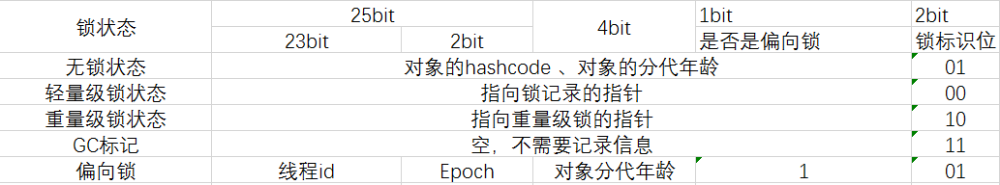

方法上加锁，锁是当前实例对象

静态同步方法加锁，锁是当前类的class对象

普通方法加锁，锁是指定实例对象

同步方法块通过moniterenter moniterexit实现锁

同步方法 通过置access_flags 为1来实现锁

1. 锁的优化 

- 锁粗化

  

- 锁消除

  单线程加锁，虚拟机 会去掉锁

- 偏向锁

- 适应性自旋-自旋锁

  想获取锁的线程执行一段自旋操作，看锁有没有被释放，锁释放的快则效率高，释放慢，则自旋消耗系统资源

  -XX:+UseSpinning 开启自旋

  -XX:+PreBlockSpin 设置自旋次数

  自适应自旋锁，根据锁被释放的频率，即获取锁的概率，适当的进行自旋，尽可能的获取锁，也尽可能的不多自旋

  

  参考[jvm内部细节1](https://www.cnblogs.com/javaminer/p/3889023.html)

参考[jvm内部细节2](https://www.cnblogs.com/javaminer/p/3889023.html)

java对象头

markwork 是在类实例化的时候，被添加到实例对象上的

markwork 设计成一个非固定的数据结构，以便存储更多的数据

| 25bit          | 4bit           | 1 bit      | 2bit     |
| -------------- | -------------- | ---------- | -------- |
| 对象的hashcode | 对象的分代年龄 | 是否偏向锁 | 锁标识位 |

moniter 是线程的私有数据结构

轻量级锁状态，线程会不停的去抢锁，当升级为重量级锁之后，抢锁的线程会进入阻塞状态

偏向锁和轻量级锁是通过 markwork实现控制的

重量级锁是通过 markwork和monitor来实现控制的

