原文地址：https://www.oracle.com/technetwork/tutorials/tutorials-1876574.html#ClearCT 


## 探索JVM架构

#### Hotspot Architecture

​	HotSpot JVM具有一种体系结构，该体系结构支持强大的特性和功能基础，并支持实现高性能和大规模可伸缩性的能力。例如，HotSpot JVM JIT编译器会生成动态优化。换句话说，它们在Java应用程序运行时做出优化决策，并生成针对底层系统体系结构的高性能本机指令。此外，通过其运行时环境和多线程垃圾收集器的日趋成熟和不断的工程设计，即使在最大的可用计算机系统上，HotSpot JVM仍可实现高可伸缩性。


​											JVM的主要组件包括类加载器，运行时数据区域和执行引擎。

#### Key Hotspot Components

下图突出显示了JVM中与性能有关的关键组件。

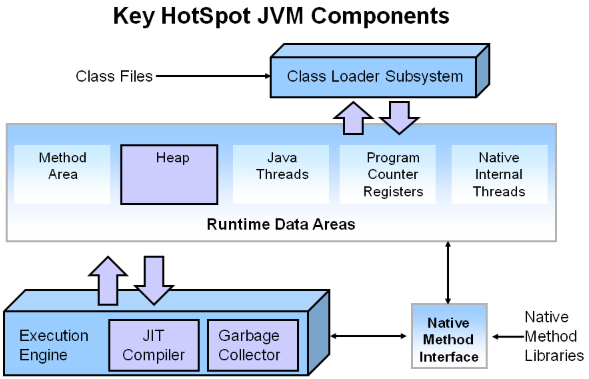

JVM的三个组件主要在调整性能时着重。堆是存储对象数据的位置。然后，该区域由启动时选择的垃圾收集器管理。大多数调整选项都与确定堆大小和为您的情况选择最合适的垃圾收集器有关。JIT编译器对性能也有很大的影响，但很少需要使用JVM的较新版本进行调整。

### Performance Basics 优化基础

通常，在调整Java应用程序时，重点放在两个主要目标之一：响应性或吞吐量。随着教程的进行，我们将再次参考这些概念。

#### Responsiveness 相应能力

响应能力是指应用程序或系统对请求的数据片段做出响应的速度。示例包括：

- 桌面用户界面对事件的响应速度
- 网站返回页面的速度
- 数据库查询返回的速度

对于注重响应性的应用程序，较长的暂停时间是不可接受的。重点是在短时间内做出响应。

#### Throughput吞吐量

吞吐量专注于最大程度地提高应用程序在特定时间段内的工作量。如何测量吞吐量的示例包括：

- 在给定时间内完成的事务数。
- 批处理程序在一小时内可以完成的作业数。
- 一小时内可以完成的数据库查询数。

高暂停时间对于注重吞吐量的应用程序是可以接受的。由于高吞吐量应用程序会在更长的时间内关注基准测试，因此不考虑快速响应时间。

## The G1 Garbage Collector

垃圾优先（G1）收集器是服务器样式的垃圾收集器，目标是具有大内存的多处理器计算机。它极有可能满足垃圾回收（GC）暂停时间目标，同时实现高吞吐量。Oracle JDK 7更新4和更高版本完全支持G1垃圾收集器。G1收集器设计用于以下应用程序：

- 可以与CMS收集器之类的应用程序线程并行运行。
- 紧凑的自由空间，无需较长的GC引起的暂停时间。
- 需要更多可预测的GC暂停时间。
- 不想牺牲很多吞吐量性能。
- 不需要更大的Java堆。

G1计划作为并发标记扫描收集器（CMS）的长期替代产品。将G1与CMS进行比较，有一些差异使G1成为更好的解决方案。一个区别是G1是压缩收集器。G1足够紧凑，可以完全避免使用细粒度的空闲列表进行分配，而是依赖于区域。这大大简化了收集器的部分，并且大部分消除了潜在的碎片问题。而且，G1提供的垃圾收集暂停比CMS收集器更具可预测性，并允许用户指定所需的暂停目标。

### G1 Operational Overview

较旧的垃圾收集器（串行，并行，CMS）将堆分成三个部分：固定内存大小的年轻代，旧代和永久代。

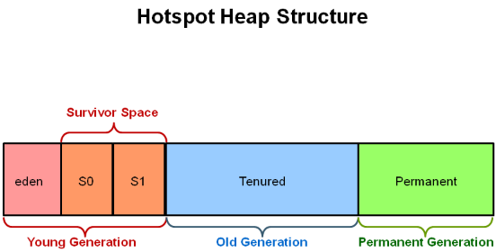

所有内存对象最终都属于这三个部分之一。

G1收集器采用了不同的方法。

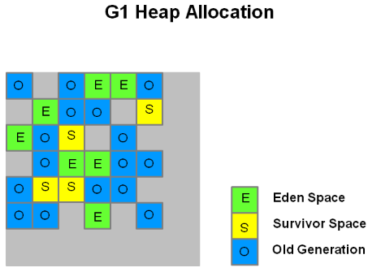

​		堆被划分为一组大小相等的堆区域，每个区域都有一个连续的虚拟内存范围。某些区域集被分配了与较旧的收集者相同的角色（eden，survivor区，老年代），但是它们的大小并没有固定。这在内存使用方面提供了更大的灵活性。

​		当执行垃圾收集时，G1以类似于CMS收集器的方式运行。G1执行并发全局标记阶段，以确定整个堆中对象的活动性。标记阶段完成后，G1知道哪些区域大部分为空。它首先收集在这些区域中，通常会产生大量的自由空间。这就是为什么这种垃圾收集方法称为“垃圾优先”的原因。顾名思义，G1将其收集和压缩活动集中在可能充满可回收对象（即垃圾）的堆区域。G1使用暂停预测模型来满足用户定义的暂停时间目标，并根据指定的暂停时间目标选择要收集的区域数。

​		由G1标识为可回收的成熟区域是使用疏散收集的垃圾。G1将对象从堆的一个或多个区域复制到堆上的单个区域，并在此过程中压缩并释放内存。撤离是在多处理器上并行执行的，以减少暂停时间并增加吞吐量。因此，对于每个垃圾收集，G1都在用户定义的暂停时间内连续工作以减少碎片。这超出了前面两种方法的能力。CMS（并发标记扫描）垃圾收集器不进行压缩。ParallelOld垃圾回收仅执行整个堆压缩，这导致相当长的暂停时间。

​		重要的是要注意，G1不是实时收集器。它很有可能达到设定的暂停时间目标，但并非绝对确定。G1根据先前收集的数据，估算在用户指定的目标时间内可以收集多少个区域。因此，收集器具有收集区域成本的合理准确的模型，并且收集器使用此模型来确定要收集哪些和多少个区域，同时保持在暂停时间目标之内。

​	注意：G1同时具有并发（与应用程序线程一起运行，例如优化，标记，清理）和并行（多线程，例如stop the world）阶段。完整的垃圾回收仍然是单线程的，但是如果调整得当，

### G1 Footprint

​		如果从ParallelOldGC或CMS收集器迁移到G1，则可能会看到较大的JVM进程大小。这在很大程度上与“记帐”数据结构有关，例如“**Remembered Sets**”和“**Collection Sets**”。

**Remembered Sets**或RSets将对象引用跟踪到给定区域中。堆中每个区域有一个RSet。RSet允许并行和独立地收集区域。RSets的总体足迹影响小于5％。

​		**Collection Sets**或CSet将在GC中收集的区域集。GC期间，将撤消（复制/移动）CSet中的所有实时数据。区域集可以是eden，survivor和/或old。CSets对JVM的大小影响不到1％。

### Recommended Use Cases for G1

​		G1的首要重点是为运行需要大堆且GC延迟有限的应用程序的用户提供解决方案。这意味着堆大小约为6GB或更大，并且稳定且可预测的暂停时间低于0.5秒。

​		如果当前具有CMS或ParallelOldGC垃圾收集器的应用程序具有以下一个或多个特征，则将其切换到G1会很有帮助。

- 完整的GC持续时间太长或太频繁。
- 对象分配率或提升率差异很大。
- 不必要的长时间垃圾收集或压缩暂停（长于0.5到1秒）

注意：如果您使用的是CMS或ParallelOldGC，并且您的应用程序没有经历长时间的垃圾收集暂停，那么可以继续使用当前的收集器。使用最新的JDK不需要更改为G1收集器。

## Reviewing Generational GC and CMS

​		并发标记扫描（CMS）收集器（也称为并发低暂停收集器）收集有期限的世代。它尝试通过与应用程序线程同时执行大多数垃圾回收工作来最大程度地减少由于垃圾回收导致的暂停。通常，并发的低暂停收集器不会复制或压缩活动对象。无需移动活动对象即可完成垃圾回收。如果碎片成为问题，请分配更大的堆。

注意：年轻一代的CMS收集器使用与并行收集器相同的算法。

### CMS Collection Phases

| 阶段                                                     | 描述                                                         |
| -------------------------------------------------------- | ------------------------------------------------------------ |
| (1) Initial Mark<br/>*(Stop the World Event)* 初始化标记 | 老一代的对象被“标记”为可访问的，包括那些年轻一代可能可以访问的对象。相对于次要的收集暂停时间，暂停时间通常持续时间较短。 |
| (2) Concurrent Marking 并发标记                          | 在执行Java应用程序线程时，并发地遍历终身生成对象图以查找可访问对象。从已标记的对象开始扫描，并从根开始标记所有可访问的对象。变体在并发阶段2、3和5期间执行，并且在这些阶段在CMS生成中分配的任何对象（包括提升的对象）都立即标记为活动。 |
| (3) Remark<br/>*(Stop the World Event)*从新标记          | 查找在并发收集器完成对对象的跟踪之后，由于Java应用程序对对象的更新而导致并发标记阶段遗漏的对象。 |
| (4) Concurrent Sweep并发清理                             | 收集在标记阶段被标识为不可访问的对象。死对象的集合将对象的空间添加到空闲列表中，以供以后分配。此时可能会合并死物。请注意，活动对象不会移动。 |
| (5) Resetting 重置                                       | 通过清除数据结构为下一个并发收集做准备。                     |

### Reviewing Garbage Collection Steps

接下来，让我们逐步回顾CMS Collector的操作。

**1.CMS收集器的堆结构**

堆分为三个空间。

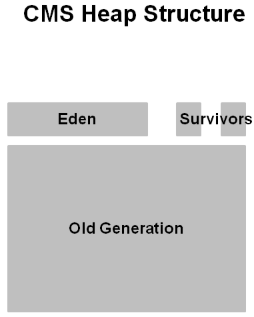

年轻一代分为伊甸园和两个幸存者空间。老一辈是一个连续的空间。对象收集就位。除非存在完整的GC，否则不执行压缩。

**2.Young GC如何在CMS中工作**

年轻一代是浅绿色，老一代是蓝色。如果您的应用程序已经运行了一段时间，这就是CMS的样子。物体散落在老年代的区域周围。

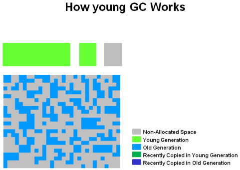

使用CMS，可以将旧的对象重新分配到位。他们不会四处走动。除非有完整的GC，否则不会压缩空间。

**3.年轻代收集**

存活对象从eden空间和survivor空间复制到另一个survivor空间。达到老化阈值的所有较旧对象都将升级为旧对象-老年代。

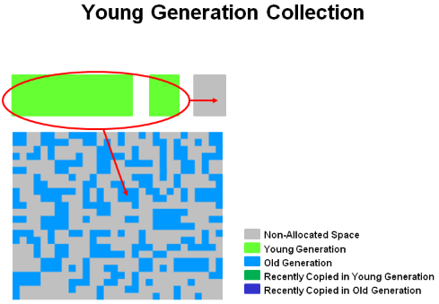

**4.年轻代GC之后**

年轻的GC之后，将清除Eden空间，并清除其中一个幸存者空间。

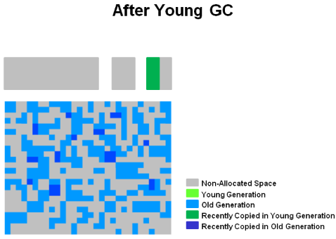

新提升的对象在图中以深蓝色显示。绿色物体尚存于尚未升级为老一代的年轻一代物体中。

**5.CMS的老年代收集**

发生了两个STW：初始标记和标记。当老一代达到一定的占用率时，CMS就开始了。


（1）初始标记是短暂的暂停阶段，其中标记了活动（可到达）对象。（2）在应用程序继续执行的同时，并发标记会找到活动对象。最终，在（3）备注阶段中，找到在前一阶段（2）并发标记期间丢失的对象。

**6.老一代收集-并发清理**

在上一阶段未标记的对象将被释放。没有压缩。

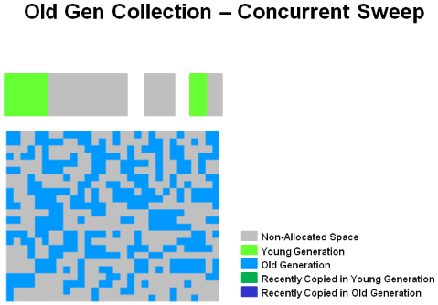

注意：未标记的对象==死对象

**7.老年代收集-清理之后**

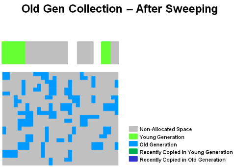

最后，CMS收集器将进入（5）重置阶段，并等待下一次达到GC阈值。

## G1垃圾收集器

G1收集器采用了另一种分配堆的方法。后续图片逐步检查了G1系统。

**1.G1堆结构**

堆是一个内存区域，分为多个固定大小的区域。

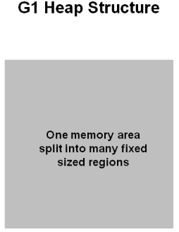

区域大小由JVM在启动时选择。JVM通常针对大约2000个区域，大小从1到32Mb不等。

**2.G1堆分配**

实际上，这些区域被映射为eden，survivor和老年代空间的逻辑表示。

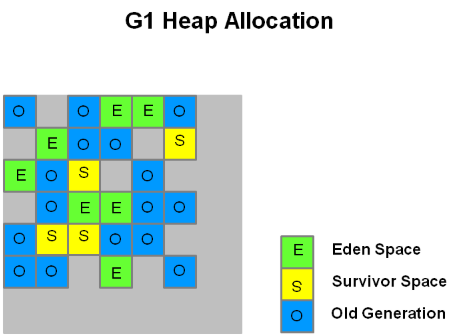

图片中的颜色显示了哪个区域与哪个角色相关联。将活动对象从一个区域撤离（即复制或移动）到另一个区域。区域被设计为在不停止所有其他应用程序线程的情况下并行收集。

如图所示，可以将区域分配到Eden，survivor和老年代区域。此外，还有第四种类型的物体被称为巨大区域。这些区域旨在容纳标准区域大小的50％或更大的对象。它们存储为一组连续区域。最后，最后一种区域类型将是堆的未使用区域。

注意：在撰写本文时，尚未优化大型对象的收集。因此，应避免创建这种大小的对象。

**3.G1的年轻代**

堆分为大约2000个区域。最小大小为1Mb，最大大小为32Mb。蓝色区域保存老年代，绿色区域保存新生代。

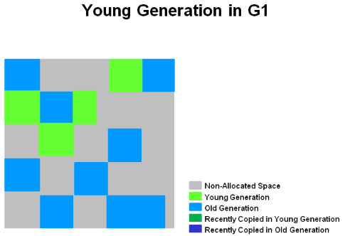

请注意，区域不需要像旧的垃圾收集器那样连续。

**4.G1中的年轻GC**

将活的对象撤离（即复制或移动）到一个或多个幸存者区域。如果满足老化阈值，则某些对象将被提升到老年代区域。

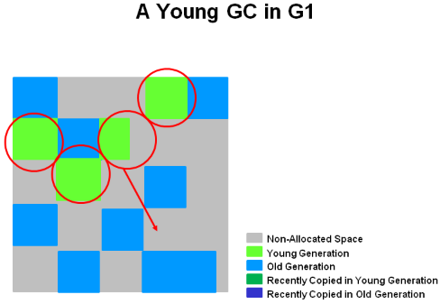

这是（STW）暂停。计算下一个年轻GC的eden大小和幸存者大小。保留会计信息以帮助计算大小。需要考虑诸如暂停时间目标之类的事情。

这种方法使调整区域大小变得非常容易，可以根据需要增大或缩小区域。

**5.带有G1的年轻GC结束**

活的对象已被疏散到幸存者地区或老年代区域。


最近晋升的对象以深蓝色显示。幸存者区域为绿色。

总而言之，关于G1的年轻一代，可以说以下几点：

- 堆是分成区域的单个内存空间。
- 年轻代内存由一组非连续区域组成。这使得在需要时易于调整大小。
- 年轻一代的垃圾收集器或年轻的GC STW。将停止所有应用程序线程以进行操作。
- 年轻代的GC使用多个线程并行完成。
- 将存活对象复制到新的幸存者或老年代区域。

### G1的老年代收集

与CMS收集器类似，G1收集器被设计为用于旧对象的低暂停收集器。下表描述了旧版本的G1收集阶段。

#### G1收集阶段-并发标记周期阶段

G1收集器在旧堆上执行以下阶段。请注意，某些阶段是年轻一代收集的一部分。

| 阶段                                                        | 描述                                                         |
| ----------------------------------------------------------- | ------------------------------------------------------------ |
| (1) Initial Mark<br/>*(Stop the World Event)*初始标记       | 这是STW。使用G1，它可以搭载在普通的年轻代GC上。标记幸存者区域（根区域），这些区域可能引用了老年代的对象。 |
| (2) Root Region Scanning 根区域扫描                         | 扫描幸存者区域以获取旧一代的参考。在应用程序继续运行时会发生这种情况。必须先完成该阶段，然后才能生成年轻的GC。 |
| (3) Concurrent Marking并发标记                              | 在整个堆中查找活动对象。在应用程序运行时会发生这种情况。这个阶段可以被年轻一代的垃圾收集中断。 |
| (4) Remark<br/>*(Stop the World Event)*从新标记             | 完成堆中活动对象的标记。使用一种称为快照（SATB）的算法，该算法比CMS收集器中使用的算法快得多。 |
| (5) Cleanup<br/>*(Stop the World Event and Concurrent)*清理 | 1对活动对象和完全空闲的区域执行计费。（STW）2擦洗已记住的集合。（STW）3重置空白区域并将其返回到空闲列表。（同时） |
| (*) Copying<br/>*(Stop the World Event)*复制                | 这是STW撤离活动物体或将活动物体复制到新的未使用区域的站点。这可以用记录为[GC暂停（年轻）]的年轻一代区域来完成。或记录为[GC暂停（混合）]的年轻一代区域和老一代区域。 |

### G1老年代收集步骤

在定义了阶段之后，让我们看一下它们如何与G1收集器中的旧版本交互。

**6.初始化标记阶段**

活对象的初始标记背负在年轻的垃圾收集器上。在日志中，这被标记为GC暂停（年轻）（斜体）。

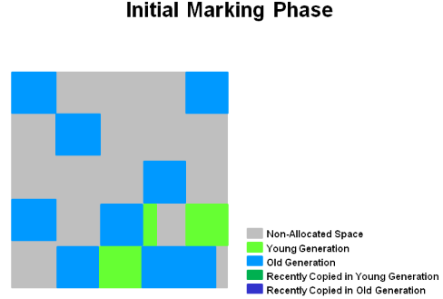

**7并发标记阶段**

如果找到空白区域（如“ X”所示），则在“备注”阶段将其立即删除。另外，计算确定活跃度的“会计”信息。

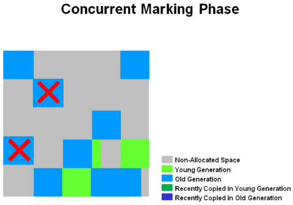

**8从新标记阶段**

空区域将被删除并回收。现在，将计算所有区域的区域活跃度。

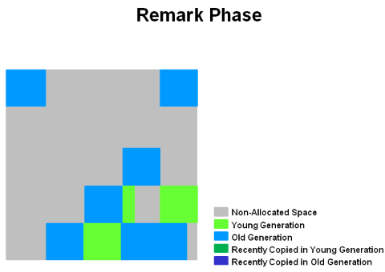

**9复制/清理 阶段**

G1选择“活度”最低的区域，这些区域可以被最快地收集。然后在收集年轻GC的同时收集这些区域。在日志中将其表示为[GC暂停（混合）]。因此，年轻代和老年代都被同时收集。

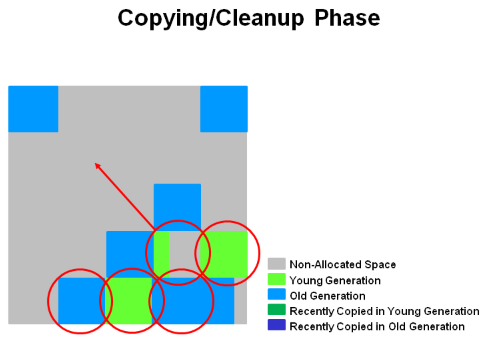

**10.复制/清理阶段之后**

选定的区域已被收集并压缩为图中所示的深蓝色区域和深绿色区域。

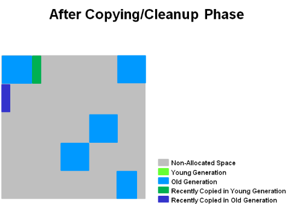

### 上一代GC的摘要

总之，关于旧一代的G1垃圾回收，我们可以提出一些关键点。

- 并发标记阶段
  - 活动信息是在应用程序运行时同时计算的。
  - 此活动信息标识在疏散暂停期间最适合回收的区域。
  - 没有CMS中的清扫阶段。
- 备注- 从新标记阶段
  - 使用开始时快照（SATB）算法，该算法比CMS使用的算法快得多。
  - 完全回收空区域。
- 复制/清理阶段
  - 同时回收年轻代和老年代。
  - 老年代区域是根据其活跃度来选择的。

## 命令行选项和最佳实践

### 基本命令行

要启用G1收集器，请使用：-XX：+ UseG1GC

这是用于启动JDK演示和示例下载中包含的Java2Demo的示例命令行：

**`java -Xmx50m -Xms50m -XX:+UseG1GC -XX:MaxGCPauseMillis=200 -jar c:\javademos\demo\jfc\Java2D\Java2demo.jar`**

### 按键命令行开关

-XX：+ UseG1GC-告诉JVM使用G1垃圾收集器。

-XX：MaxGCPauseMillis = 200-设置最大GC暂停时间的目标。这是一个软目标，并且JVM将尽最大的努力来实现它。因此，有时将无法达到暂停时间目标。默认值为200毫秒。

-XX：InitiatingHeapOccupancyPercent = 45-启动整个并发GC周期的（整个）堆占用率。G1使用它根据整个堆（而不只是世代之一）的占用量来触发并发GC周期。值为0表示“进行恒定的GC循环”。默认值为45（即45％已满或已占用）。

### 最佳实践

使用G1时应遵循一些最佳做法。

#### 不要设置年轻代大小

通过-Xmn插入以G1收集器的默认行为来显式设置年轻代大小。

- G1将不再遵守集合的暂停时间目标。因此，实质上，设置年轻代大小将禁用暂停时间目标。
- G1不再能够根据需要扩展和缩小年轻一代的空间。由于尺寸是固定的，因此无法更改尺寸。

#### 响应时间指标

与其使用平均响应时间（ART）作为度量标准来设置XX：MaxGCPauseMillis = <N>，不如考虑设置将在90％或更多的时间内满足目标的值。这意味着发出请求的90％用户的响应时间不会超过目标时间。请记住，暂停时间是一个目标，不能保证始终得到满足。

#### 什么是疏散失败？

当JVM在幸存者和晋升对象的GC期间JVM用完堆区域时发生升级失败。堆无法扩展，因为它已经达到最大值。当使用-XX：+ PrintGCDetails（按空间间隔溢出）时，这会在GC日志中指出。这很贵！

- GC仍必须继续，因此必须释放空间。
- 复制失败的对象必须保留到位。
- 必须重新生成CSet中区域RSet的任何更新。
- 所有这些步骤都很昂贵。

##### 如何避免疏散失败

为避免疏散失败，请考虑以下选项。

- 增加堆大小
  - 增加-XX：G1ReservePercent = n，默认值为10。
  - G1试图通过保留备用内存以防万一，需要更多的“空间”，从而创建了错误的上限。
- 提前开始标记周期
- 使用-XX：ConcGCThreads = n选项增加标记线程的数量。

### G1 GC交换机完整列表

这是G1 GC交换机的完整列表。记住要使用上面概述的最佳实践。

| 选项和默认值                         | 描述                                                         |
| ------------------------------------ | ------------------------------------------------------------ |
| -XX:+UseG1GC                         | 使用垃圾优先（G1）收集器                                     |
| -XX:MaxGCPauseMillis=n               | 设置最大GC暂停时间的目标。这是一个软目标，并且JVM将尽最大的努力来实现它。 |
| -XX:InitiatingHeapOccupancyPercent=n | 启动整个并发GC周期的（整个）堆占用率的百分比。由GC使用的GC会根据整个堆的占用情况触发一个并发的GC周期，而不仅仅是整个世代之一（例如G1）。值为0表示“进行恒定的GC循环”。默认值为45。 |
| -XX:NewRatio=n                       | 新生代老年代大小比例。预设值为2。                            |
| -XX:SurvivorRatio=n                  | 伊甸园/幸存者空间大小之比。预设值为8。                       |
| -XX:MaxTenuringThreshold=n           | 任职期限的最大值。预设值为15。--回收15后直接进入老年代       |
| -XX:ParallelGCThreads=n              | 设置在垃圾回收器的并行阶段使用的线程数。缺省值随运行JVM的平台而异。 |
| -XX:ConcGCThreads=n                  | 并发垃圾收集器将使用的线程数。缺省值随运行JVM的平台而异。    |
| -XX:G1ReservePercent=n               | 设置保留为错误上限的堆数量，以减少升级失败的可能性。预设值为10。 |
| -XX:G1HeapRegionSize=n               | 使用G1，Java堆可细分为大小一致的区域。这将设置各个细分的大小。该参数的默认值是根据堆大小按人机工程学确定的。最小值为1Mb，最大值为32Mb。 |

## 使用G1 GC日志

我们需要讨论的最后一个主题是使用日志记录信息来分析G1收集器的性能。本部分提供可用于收集数据的开关和日志中打印的信息的快速概述。

### 设置日志详细信息

您可以将细节设置为三个不同的细节级别。

（1）-verbosegc（等效于-XX：+ PrintGC）将日志的详细信息级别设置为fine。
示例输出

```
[GC pause (G1 Humongous Allocation) (young) (initial-mark) 24M- >21M(64M), 0.2349730 secs]
[GC pause (G1 Evacuation Pause) (mixed) 66M->21M(236M), 0.1625268 secs]  
```

（2）-XX：+ PrintGCDetails将细节级别设置为更精细。这些选项显示以下信息：

- 每个阶段都会显示平均，最小和最大时间。

- 根扫描，RSet更新（具有已处理的缓冲区信息），RSet扫描，对象复制，终止（具有尝试次数）。

- 还显示“其他”时间，例如花在选择CSet，参考处理，参考排队和释放CSet上的时间。

- 显示伊甸园，幸存者和堆总数。

  示例输出

  ```
  [Ext Root Scanning (ms): Avg: 1.7 Min: 0.0 Max: 3.7 Diff: 3.7]
  [Eden: 818M(818M)->0B(714M) Survivors: 0B->104M Heap: 836M(4096M)->409M(4096M)]
  ```

（3）-XX：+ UnlockExperimentalVMOptions -XX：G1LogLevel = finest将详细信息级别设置为最佳。更精细，但包含单个工作线程信息。

```
[Ext Root Scanning (ms): 2.1 2.4 2.0 0.0
           Avg: 1.6 Min: 0.0 Max: 2.4 Diff: 2.3]
       [Update RS (ms):  0.4  0.2  0.4  0.0
           Avg: 0.2 Min: 0.0 Max: 0.4 Diff: 0.4]
           [Processed Buffers : 5 1 10 0
           Sum: 16, Avg: 4, Min: 0, Max: 10, Diff: 10]
```

#### Determining Time 决定时间

几个开关确定如何在GC日志中显示时间。

（1）-XX：+ PrintGCTimeStamps-显示自JVM启动以来经过的时间。

示例输出

```
 1.729: [GC pause (young) 46M->35M(1332M), 0.0310029 secs]
```

（2）-XX：+ PrintGCDateStamps-将时间前缀添加到每个条目。

```
    2012-05-02T11:16:32.057+0200: [GC pause (young) 46M->35M(1332M), 0.0317225 secs]
```

### 了解G1日志

为了理解日志，本节使用实际的GC日志输出定义了一些术语。以下示例显示了日志的输出，并提供了对其中术语和值的解释。

注意：有关更多信息，请查看Poonam Bajaj在G1 GC日志上的博客文章。

博客地址：https://blogs.oracle.com/poonam/understanding-g1-gc-logs 

#### G1日志条款索引

**Parallel Time**并行时间

```
414.557: [GC pause (young), 0.03039600 secs] [Parallel Time: 22.9 ms]
[GC Worker Start (ms): 7096.0 7096.0 7096.1 7096.1 706.1 7096.1 7096.1 7096.1 7096.2 7096.2 7096.2 7096.2
       Avg: 7096.1, Min: 7096.0, Max: 7096.2, Diff: 0.2]
```

*Parallel Time* –暂停的主要并行部分的总经过时间

*Worker Start* – 工作线程开始的时间戳

注意：日志按线程ID排序，并且在每个条目上都一致

**External Root Scanning**外部根扫描

```
[Ext Root Scanning (ms): 3.1 3.4 3.4 3.0 4.2 2.0 3.6 3.2 3.4 7.7 3.7 4.4
     Avg: 3.8, Min: 2.0, Max: 7.7, Diff: 5.7]
```

*External root scanning* - 扫描外部根目录所花费的时间（例如，指向堆的系统字典之类的东西。

***Update Remembered*Set**更新记忆集

```
[Update RS (ms): 0.1 0.0 0.0 0.0 0.0 0.0 0.0 0.0 0.0 0.0 0.0 0.0 Avg: 0.0, Min: 0.0, Max: 0.1, Diff: 0.1]
   [Processed Buffers : 26 0 0 0 0 0 0 0 0 0 0 0
    Sum: 26, Avg: 2, Min: 0, Max: 26, Diff: 26]
```

*Update Remembered Set* - 在暂停开始之前，必须更新所有已完成但尚未由并发优化线程处理的缓冲区。时间取决于卡的密度。卡数越多，花费的时间就越长。

**Scanning Remembered Sets**扫描记忆集

```
[Scan RS (ms): 0.4 0.2 0.1 0.3 0.0 0.0 0.1 0.2 0.0 0.1 0.0 0.0 Avg: 0.1, Min: 0.0, Max: 0.4, Diff: 0.3]F
```

*Scanning Remembered Sets* -寻找指向集合集的指针。

**Object Copy**对象复制

```
[Object Copy (ms): 16.7 16.7 16.7 16.9 16.0 18.1 16.5 16.8 16.7 12.3 16.4 15.7 Avg: 16.3, Min: 12.3, Max:  18.1, Diff: 5.8]
```

*Object copy* – 每个线程花费在复制和撤离对象上的时间。

**Termination Time**终止时间

```
[Termination (ms): 0.0 0.0 0.0 0.0 0.0 0.0 0.0 0.0 0.0 0.0 0.0
0.0 Avg: 0.0, Min: 0.0, Max: 0.0, Diff: 0.0] [Termination Attempts : 1 1 1 1 1 1 1 1 1 1 1 1 Sum: 12, Avg: 1, Min: 1, Max: 1, Diff: 0]
```

*Termination time* -当工作线程完成其特定对象集以进行复制和扫描时，它将输入终止协议。它寻找要窃取的工作，并在完成工作后再次输入终止协议。终止尝试包括所有窃取工作的尝试。

**GC Worker End**GC工作线程结束

```
[GC Worker End (ms): 7116.4 7116.3 7116.4 7116.3 7116.4 7116.3 7116.4 7116.4 7116.4 7116.4 7116.3 7116.3
    Avg: 7116.4, Min: 7116.3, Max: 7116.4, Diff:   0.1]
[GC Worker (ms): 20.4 20.3 20.3 20.2 20.3 20.2 20.2 20.2 20.3 20.2 20.1 20.1
     Avg: 20.2, Min: 20.1, Max: 20.4, Diff: 0.3]
```

*GC worker end time* – 各个GC工作线程停止的时间戳。

*GC worker time* –各个GC工作线程所花费的时间。

**GC Worker Other**Gc其它工作线程

```
[GC Worker Other (ms): 2.6 2.6 2.7 2.7 2.7 2.7 2.7 2.8 2.8 2.8 2.8 2.8
    Avg: 2.7, Min: 2.6, Max: 2.8, Diff: 0.2]
```

*GC worker other* – 不能归因于先前列出的工作程序阶段的时间（对于每个GC线程）。应该相当低。过去，我们看到过高的值，它们被归因于JVM其他部分的瓶颈（例如，分层存储的代码缓存占用率增加）。

**Clear CT**

```
[Clear CT: 0.6 ms]
```

清除RSet扫描元数据的卡表所需的时间

**Other**

```
[Other: 6.8 ms]
```

GC的其他各个连续阶段所花费的时间暂停。

**CSet**

```
[Choose CSet: 0.1 ms]
```

最终确定要收集的区域集所花费的时间。通常很小；选择旧时稍长一些。

**Ref Proc**

```
[Ref Proc: 4.4 ms]
```

GC先前阶段推迟处理软，弱等参考时所花费的时间。

**Ref Enq**

```
[Ref Enq: 0.1 ms]
```

在待处理列表上放置软引用，弱引用等所花费的时间。

**Free CSet**

```
[Free CSet: 2.0 ms]
```

花时间释放刚刚收集的一组区域，包括它们记住的区域。