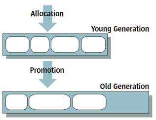
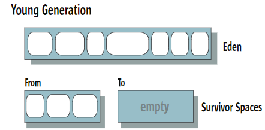
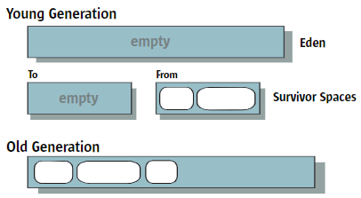
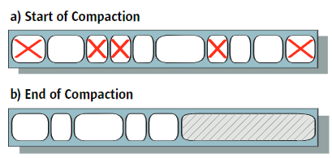
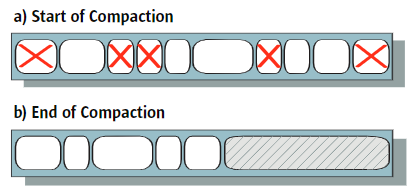
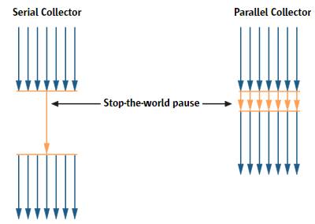
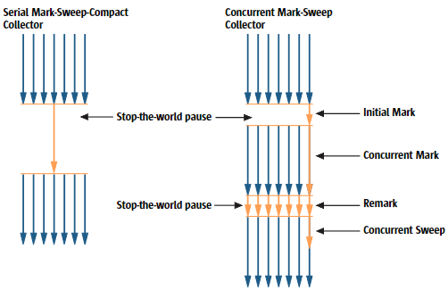
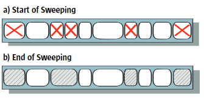

原文地址：[chrome-extension://ikhdkkncnoglghljlkmcimlnlhkeamad/pdf-viewer/web/viewer.html?file=https%3A%2F%2Fwww.oracle.com%2Ftechnetwork%2Fjava%2Fjavase%2Fmemorymanagement-whitepaper-150215.pdf](chrome-extension://ikhdkkncnoglghljlkmcimlnlhkeamad/pdf-viewer/web/viewer.html?file=https%3A%2F%2Fwww.oracle.com%2Ftechnetwork%2Fjava%2Fjavase%2Fmemorymanagement-whitepaper-150215.pdf) 

# Java HotSpot™虚拟机中的内存管理

## 1介绍

Java™2平台标准版（J2SE™）的一项优势是它可以执行自动内存管理，从而使开发人员免受显式内存管理的复杂性的困扰。

本文概述了Sun J2SE 5.0版本中Java HotSpot虚拟机（JVM）中的内存管理。它描述了可用于执行内存管理的垃圾收集器，并提供了一些有关选择和配置收集器以及为收集器运行所在的内存区域设置大小的建议。它还作为一种资源，列出了影响垃圾收集器行为的一些最常用的选项，并提供了许多指向更详细的文档的链接。

第二部分是针对自动内存管理概念的新读者的。本文简要讨论了这种管理的好处，而不是要求程序员为数据显式分配空间。然后，第3节概述了一般垃圾回收概念，设计选择和性能指标。它还根据对象的预期生存期将常用的内存组织引入到称为世代的不同区域。事实证明，这种分离可以有效减少各种应用程序中垃圾收集的暂停时间和总体成本。

本文的其余部分提供了特定于HotSpot JVM的信息。第4节描述了四个可用的垃圾收集器，其中一个是J2SE 5.0 update 6中的新增垃圾收集器，并记录了它们全部利用的世代内存组织。对于每个收集器，第4节总结了所使用的收集算法的类型，并指定何时选择该收集器。

第5节描述了J2SE 5.0版本中的一项新技术，该技术结合了（1）自动选择垃圾收集器，堆大小和HotSpot。基于运行应用程序的平台和操作系统的JVM（客户端或服务器），以及（2）根据用户指定的所需行为进行动态垃圾回收调整，该技术称为人体工程学。

第6节为选择和建议提供了建议。配置垃圾收集器。它还提供有关如何处理OutOfMemoryErrors的建议。第7节简要介绍了一些可用于评估垃圾收集性能的工具，第8节列出了与垃圾收集器选择和行为有关的最常用的命令行选项。最后，第9节提供了指向本文涵盖的各个主题的更详细文档的链接。

## 2显式与自动内存管理

内存管理是这样的过程：识别何时不再需要分配的对象，释放（释放）此类对象使用的内存，并使该内存可用于后续分配。在某些编程语言中，内存管理是程序员的责任。该任务的复杂性导致许多常见错误，这些错误可能导致程序意外或错误的行为并崩溃。因此，开发人员通常会花费大量时间来调试和尝试纠正此类错误。

具有显式内存管理的程序中经常发生的一个问题是悬挂引用。可以释放一个对象使用的空间，而其他对象仍然可以引用该空间。如果具有该（悬挂的）引用的对象试图访问原始对象，但空间已被重新分配给新对象，则结果将是不可预测的，而不是预期的结果

显式内存管理的另一个常见问题是空间泄漏。当分配内存并且不再引用但不释放内存时，就会发生这些泄漏。例如，如果您打算释放链接列表使用的空间，但犯了一个错误，即仅释放列表的第一个元素，则不再引用其余的列表元素，但它们超出了程序的范围，无法使用或使用恢复了。如果发生足够的泄漏，它们可以继续消耗内存，直到耗尽所有可用内存为止

现在，尤其是大多数现代面向对象的语言普遍采用的另一种内存管理方法是通过称为垃圾收集器的程序进行自动管理。自动内存管理可增强接口的抽象性和更可靠的代码.Sun Microsystems，Inc.3简介垃圾回收避免了悬而未决的引用问题，因为仍然在某处引用的对象将永远不会被垃圾回收，因此不会被认为是免费的。垃圾回收还解决了上述的空间泄漏问题，因为它会自动释放不再引用的所有内存。

## 3垃圾收集概念

垃圾收集器负责

- 分配内存
- 确保所有引用的对象都保留在内存中，并且
- 恢复由执行代码中的引用无法访问的对象使用的内存。

被引用的对象被称为实时对象。不再引用的对象被视为已死，并被称为垃圾。查找和释放（也称为回收）这些对象使用的空间的过程称为垃圾收集。

垃圾回收解决了许多但不是全部的内存分配问题。例如，您可以无限期创建对象并继续引用它们，直到没有可用的内存为止。垃圾收集也是一项复杂的任务，需要花费时间和资源

用于组织内存以及分配和释放空间的精确算法由垃圾收集器处理，并向程序员隐藏。通常是从称为堆的大型内存池中分配空间的。

垃圾收集的时间取决于垃圾收集器。通常，整个堆或堆的一部分会在堆满或达到使用率的阈值百分比时收集

完成分配请求的任务是一项艰巨的任务，其中涉及在堆中查找一定大小的未使用内存块。大多数动态内存分配算法的主要问题是避免碎片化（请参见下文），同时保持分配和释放效率。

### 理想的垃圾收集器特征

垃圾收集器必须既安全又全面。也就是说，永远都不能错误地释放活动数据，并且垃圾回收的回收周期不应少于一小部分

还希望垃圾收集器高效运行，而不会在应用程序未运行期间引入长时间的暂停。但是，与大多数与计算机相关的系统一样，通常在时间，空间和频率之间进行权衡。例如，如果堆大小很小，则收集会很快，但是堆会更快地填满，因此需要更频繁的收集。相反，大堆将需要更长的时间来填充，因此收集将不那么频繁，但是它们可能会花费更长的时间。

另一个理想的垃圾收集器特性是碎片的限制。当释放内存垃圾对象时，可用空间可能会在各个区域中以小块的形式出现，从而在任何一个连续区域中可能没有足够的空间可用于分配大型对象。消除碎片的一种方法称为压缩，在下面的各种垃圾收集器设计选择中进行讨论。

可伸缩性也很重要。分配不应成为多处理器系统上多线程应用程序的可伸缩性瓶颈，收集也不应该是这样的瓶颈。Sun Microsystems，Inc.4

### 设计选择

在设计或选择垃圾收集算法时，必须做出许多选择：

- 串行与并行

  使用串行收集，一次仅发生一件事。例如，即使有多个CPU可用，也仅利用一个CPU执行收集。使用parallelcollection时，垃圾回收任务分为多个部分，这些子部分在不同的CPU上同时执行。并发操作可以使收集更快地完成，但要付出一些额外的复杂性和潜在的分散性。

- 并发与停止世界

  同步当执行“停止世界垃圾”收集时，应用程序的执行将在收集期间完全暂停。或者，可以与应用程序同时（即同时）执行一个或多个垃圾回收任务。通常，并发垃圾收集器会同时执行其大部分工作，但有时也可能不得不停止一些短暂的暂停。停止世界垃圾收集比并发收集更简单，因为堆已冻结并且对象在收集期间未更改。其缺点是某些应用程序被暂停可能是不必要的。相应地，当同时执行垃圾收集时，暂停时间会缩短，但是收集器必须格外小心，因为它操作的对象可能由应用程序同时更新。这会给并发收集器增加一些开销，这会影响性能并需要更大的堆大小。

- 压缩与非压缩与复制

  对比垃圾收集器确定内存中的哪些对象是活动对象以及哪些是垃圾后，它可以压缩内存，将所有活动对象一起移动并完全回收剩余的内存。压缩后，在第一个自由位置上分配新对象既容易又快速。可以利用一个简单的指针来跟踪下一个可用于对象分配的位置。与压缩收集器相反，非压缩收集器就地释放垃圾对象利用的空间，即，它不会像压缩收集器一样移动所有活动对象来创建较大的回收区域。好处是可以更快地完成垃圾收集，但缺点是可能会产生碎片。通常，从具有就地释放的堆中分配要比从压缩堆中分配更为昂贵。可能有必要在堆中搜索足够大的内存连续区域以容纳新对象。第三个替代方案是复制收集器，它可以将活动对象复制（或撤离）到另一个存储区中。这样做的好处是可以将源区视为空的，并且可用于后续的快速轻松分配，但缺点是复制需要额外的时间以及可能需要的额外空间

### 性能指标

若干指标可用于评估垃圾收集器的性能，包括：

- 吞吐量-长时间考虑的未花费在垃圾收集中的总时间的百分比。•垃圾收集的开销-吞吐量的倒数，即总时间的百分比

- 暂停时间-发生垃圾收集时停止执行应用程序的时间长度。•收集频率-收集相对于应用程序执行的频率。

- 占地面积-大小的度量，例如堆大小。

- 提示时间-从对象变为垃圾到内存可用之间的时间。SunMicrosystems，Inc.5垃圾回收

交互式应用程序可能需要很短的暂停时间，而总体执行时间对非交互式应用程序更重要。实时应用程序将要求在任何时间段内，垃圾收集暂停和在收集器中花费的时间比例都较小。占用空间小可能是在小型个人计算机或嵌入式系统中运行的应用程序的主要关注点。

### 分代收集

当使用一种称为世代收集的技术时，内存将分为几代，即保存不同年龄对象的单独池。例如，使用最广泛的配置有两代：一个用于年轻对象，一个用于旧对象、

可以使用不同的算法在不同的世代中执行垃圾回收，每种算法都基于该特定世代的共同观察特征进行了优化。分代垃圾回收利用以下观察结果，即所谓的弱代论假设，涉及以多种编程语言（包括Java编程语言）编写的应用程序：

- 大部分分配的对象不会被长期引用（认为是实时存在的），也就是说，它们会死得很早。

- 很少有从较早到较年轻的对象的引用

年轻人代集合相对频繁地出现，并且高效且快速，因为年轻人代空间通常很小，并且可能包含许多不再引用的对象。

在某些年轻一代收藏中幸存下来的物品最终被提升或保留给老一代。参见图1。这一代人通常比年轻一代大，并且其居住增长更慢。结果，旧的收藏很少见，但完成所需的时间要长得多



图1常规垃圾回收

由于年轻一代的收集很频繁，因此为年轻一代选择的垃圾收集算法通常会提高速度。另一方面，老一代通常由空间效率更高的算法来管理，因为老一代占用了大部分堆，老一代算法必须在低垃圾密度下工作良好。

## 4J2SE 5.0 HotSpot JVM中的垃圾收集器

从J2SE 5.0更新6开始，Java HotSpot虚拟机包括四个垃圾收集器。所有收集器都是代代的。本节描述了集合的生成和类型，并讨论了为什么对象分配通常快速高效的原因。然后提供有关每个收集器的详细信息

## HotSpot 分代

Java HotSpot虚拟机中的内存分为三代：年轻一代，旧一代和永久一代。大多数对象最初是在年轻一代中分配的。老一代包含已在一些年轻一代集合中幸存的对象，以及一些可能直接在老一代中分配的大型对象。JVM认为方便进行垃圾收集器管理的永久代持有对象，例如描述类和方法的对象以及类和方法本身

年轻一代由一个称为Edenplus的区域组成，其中有两个较小的幸存者空间，如图2所示。大多数对象最初都是在Eden中分配的。（如前所述，可以在老一代中直接分配一些大对象。）幸存者空间保存的对象至少在一个年轻世代中幸存下来，因此在被认为“足够老”之前，有更多的机会死亡。老一辈。在任何给定时间，幸存者空间中的一个（在图中标记为From）都保存着这些对象，而另一个则是空的，直到下一次收集之前一直没有使用。



图2.年轻一代的内存区域

### 垃圾收集类型

当年轻一代填满时，将执行该一代的年轻一代集合（有时称为次要集合）。当老一代或永久一代填满时，通常会完成所谓的完整集合（有时称为主要集合）。也就是说，所有世代都被收集了。通常，首先使用专门为那个世代设计的收集算法来收集年轻世代，因为它通常是识别年轻世代中最有效的垃圾处理算法。给定收集器的旧世代收集算法在旧世代和永久世代上都运行。如果发生压缩，则将每一代分别压缩

有时，如果老一代先被收集起来，那么老一代人太饱了，无法接受所有可能从年轻一代升级到老一代的对象。在那种情况下，除了CMS收集器之外的所有收集器都不会运行年轻代收集算法。而是在整个堆上使用旧的collectionalgorithm。（CMS的旧一代算法是一种特殊情况，因为它无法收集年轻一代。）Sun Microsystems，Inc. 7 J2SE 5.0 HotSpot JVM中的垃圾收集器Young GenerationEdenFromToemptySurvivor空间

### 快速分配

从下面的垃圾收集器描述中可以看到，在许多情况下，都有大量连续的内存块可用于分配对象。使用简单的指针技巧，从这样的块进行分配是有效的。即，始终跟踪先前分配的对象的末尾。当需要满足新的分配请求时，所有要做的就是检查对象是否适合生成的其余部分，如果是，则更新指针并初始化对象。

对于多线程应用程序，分配操作必须是多线程安全的。如果使用全局锁来确保这一点，则分配给一代将成为瓶颈并降低性能。相反，HotSpot JVM采用了一种称为线程本地分配缓冲区（TLAB）的技术。通过为每个线程分配自己的缓冲区（即一代的一小部分），可以提高多线程分配的吞吐量。由于每个TLAB中只能分配一个线程，因此可以通过使用指针指针技术快速进行分配，而无需任何锁定。只有在很少的情况下，当线程填满其TLAB并需要获取新的TLAB时，才必须使用同步。为了减少由于使用TLAB而造成的空间浪费，采用了几种技术。例如，按分配器确定TLAB的大小，平均浪费不到Eden的1％。结合使用TLAB和使用指针指针跳转技术的线性分配，可以使每个分配高效，仅需要大约10条本机指令

### Serial Collector串行收集器

使用串行收集器，可以以一种世界停止的方式连续（使用单个CPU）完成旧的和旧的收集。也就是说，在进行收集时，应用程序的执行将停止

#### 使用串行收集器收集年轻一代

图3说明了使用串行收集器的年轻一代收集器的操作。伊甸园中的活动对象被复制到最初为空的幸存者空间，图中标记为“ To”，但太大的对象无法舒适地容纳在“ Tospace”中。这些对象直接复制到旧的对象。被占领的幸存者空间中仍相对年轻的活动对象（标记为“来自”）也被复制到另一个幸存者空间中，而相对较旧的对象则被复制到旧的对象中。注意：如果Tospace已满，则将尚未复制的来自Eden或From的活动对象进行保管，无论它们存活了多少年轻代收藏。根据定义，在复制活动对象之后，保留在Eden或Fromspace中的任何对象都不是活动的，因此无需检查它们。（这些垃圾对象在图中用X标记，尽管实际上收集器并未检查或标记这些对象。）


图3：系列年轻一代

在完成了年轻一代的收集后，伊甸园和以前居住的幸存者空间都空了，只有以前是空的幸存者空间包含了活物。此时，survivorspaces交换角色。请参见图4。Sun Microsystems，Inc. 8 J2SE 5.0热点JVM中的垃圾收集器年轻一代老一代EdenFromToemptySurvivor空间



图4.年轻一代收藏之后

#### 使用串行收集器的旧一代收集

使用串行收集器，可以通过mark-sweep-compactcollection算法收集旧世代和永久世代。在标记阶段，收集器确定哪些对象仍然存在。扫描阶段在各个世代“扫描”，识别出垃圾。然后，收集器执行滑动压缩，将活动对象滑动到旧世代空间的开始处（并且对于永久世代也是如此），将任何可用空间留在相对端的单个连续块中。参见图5。压缩允许将来分配给老一代或永久一代使用快速的指针技术。



图5.上一代的紧凑

#### 使用串行收集器的旧一代收集

使用串行收集器，可以通过mark-sweep-compactcollection算法收集旧世代和永久世代。在标记阶段，收集器确定哪些对象仍然存在。扫描阶段在各个世代“扫描”，识别出垃圾。然后，收集器执行滑动压缩，将活动对象滑动到旧世代空间的开始处（并且对于永久世代也是如此），将任何可用空间留在相对端的单个连续块中。参见图5。压缩允许将来分配给老一代或永久一代使用快速的指针技术。



图5.上一代的紧凑

#### 何时使用串行收集器

串行收集器是大多数在客户端样式的计算机上运行且不需要低暂停时间的应用程序的首选收集器。在当今的硬件上，串行收集器可以有效地管理许多不平凡的应用程序，这些应用程序具有64MB的堆，并且相对较短的最坏情况暂停时间不到半秒（对于完整收集而言）

#### 串行收集器选择

在J2SE 5.0版本中，如第5节所述，在不是服务器级机器的机器上，串行收集器会自动被选择为默认的垃圾收集器。在其他机器上，可以使用-XX：+ UseSerialGC命令显式请求serialcollector。线路选项

### Parallel Collector并行收集器

如今，许多Java应用程序在具有大量物理内存和多个CPU的计算机上运行。并行收集器（也称为吞吐量收集器）的开发是为了利用可用的CPU，而不是让大多数CPU保持空闲状态，而只有一个进行垃圾收集工作。

#### 使用并行收集器收集年轻一代

并行收集器使用串行收集器使用的年轻代收集算法的并行版本。它仍然是一个停滞不前的复制收集器，但正在执行年轻的一代Sun Microsystems，Inc.9在J2SE 5.0 HotSpot JVM中的垃圾收集器a）压缩的开始b）压缩的结束年轻的一代老一代EdenToFromemptyempty Survivor Spaces使用许多CPU进行并行收集，可减少垃圾收集的开销，从而提高应用程序的吞吐量。图6说明了年轻一代的串行收集器和并行收集器之间的区别



图6串行和并行年轻代集合之间的比较

#### 使用并行收集器的旧一代收集

并行收集器的旧式垃圾收集使用与串行收集器相同的串行标记清除紧凑收集算法完成

#### 何时使用并行收集器

可以从并行收集器中受益的应用程序是那些在具有多个CPU的计算机上运行并且没有暂停时间限制的应用程序，因为仍然会发生很少但可能很长的上一代收集。并行收集器通常适合的应用程序示例包括那些进行批处理，开票，工资单，科学计算等的应用程序

您可能要考虑选择parallelcompact收集器（如下所述）而不是parallelcollector，因为前者执行所有世代的并行收集，而不仅仅是年轻一代

#### 并行收集器选择

在J2SE 5.0发行版中，并行收集器被自动选择为服务器类计算机上的默认垃圾收集器（在第5节中定义）。在其他机器上，可以使用-XX：+ UseParallelGC命令行选项显式请求并行收集器。

### Parallel Compacting Collector并行压缩收集器

并行压缩收集器是在J2SE 5.0 Update 6中引入的。它与parallelcollector的区别在于，它使用新的算法进行旧式垃圾收集。注意：最终，parallelcompacting收集器将取代并行收集器

#### 使用并行压缩收集器的年轻一代收集

使用与使用并行收集器的年轻代收集相同的算法，完成用于并行压缩收集器的年轻代垃圾收集

#### 使用并行压缩收集器的旧版本收集

借助平行压实收集器，老生常世的产品以停产的方式进行收集，大多采用滑动压实的平行方式。收集器利用三个阶段。首先，逻辑上将每一代划分为固定大小的区域。在标记阶段，可以从应用程序代码直接访问的活动对象的初始集合分配到垃圾回收线程中，然后并行标记所有活动对象。当一个对象被标识为活动对象时，将使用有关该对象的大小和位置的信息来更新其所在区域的数据。Sun Microsystems，Inc.10 J2SE 5.0 HotSpot JVM中的垃圾收集器停顿世界串行收集器并行收集器摘要阶段针对区域而非对象进行操作。由于以前收集的压缩，典型地，每一代左侧的某些部分将很密集，其中大部分包含有生命的物体。可以从如此密集的区域中回收的空间量不值得压缩它们。因此，摘要阶段要做的第一件事是检查区域的密度，从最左边的区域开始，直到达到可以从某个区域恢复的空间以及该区域右边的空间值得压缩这些区域的成本为止地区。该点左侧的区域称为密集前缀，并且在这些区域中没有对象移动。该点右边的区域将被压缩，从而消除了所有死角。摘要阶段为每个压缩区域计算并存储实时数据的第一个字节的新位置。注意：summaryphase当前被实现为串行阶段；并行化是可能的，但对性能的影响不如打标和压实阶段的并行化

在压缩阶段，垃圾回收线程使用摘要数据来标识需要填充的区域，并且线程可以独立地将数据复制到这些区域中。这将产生一个堆，该堆在一端密集地打包，在另一端有一个大的空块

#### 何时使用并行压缩收集器

与并行收集器一样，并行压缩收集器对于运行在具有多个CPU的机器上的应用程序非常有用。另外，较早的收集的并行操作减少了暂停时间，并使并行压缩收集器比并行收集器更适合具有暂停时间限制的应用程序。并行压缩收集器可能不适用于在大型共享计算机（例如SunRays）上运行的应用程序，在大型共享计算机上，没有单个应用程序会长时间垄断多个CPU。在此类计算机上，请考虑减少用于垃圾收集的线程数（通过–XX：ParallelGCThreads = n命令行选项）或选择其他收集器

#### 平行压实收集器的选择

如果要使用并行压缩收集器，则必须通过指定命令行选项-XX：+ UseParallelOldGC来选择它、

### Concurrent Mark-Sweep (CMS) Collector并发标记扫描（CMS）收集器

对于许多应用程序而言，端到端吞吐量不如快速响应时间那么重要。年轻的一代收藏通常不会造成长时间的停顿。但是，旧的收集虽然很少，但可能会造成长时间的暂停，尤其是在涉及大堆时。为了解决此问题，HotSpot JVM包括一个称为并发标记扫描（CMS）收集器的收集器，也称为低延迟收集器

#### 使用CMS收集器收集年轻一代】

CMS收集器以与并行收集器相同的方式收集年轻代。

#### 使用CMS收集器的旧一代收集

使用CMS收集器收集的大多数旧版本是在执行应用程序的同时完成的

CMS收集器的收集周期始于一个短暂的暂停，称为初始标记，该暂停标识了可直接从应用程序代码访问的活动对象的初始集合。然后，在并发标记阶段，收集器标记从该集合可传递到达的所有活动对象。因为在标记阶段进行时应用程序正在运行并且正在更新参考字段，所以不能保证在并发标记阶段结束时不会标记所有活动对象。为解决此问题，应用程序再次停止第二次暂停，称为remark，该暂停通过重新访问在并行标记阶段修改的所有对象来完成标记。因为注释暂停比初始标记更重要，所以并行运行多个线程以提高其效率

在备注阶段结束时，确保已标记了堆中的所有活动对象，因此，随后的并发清除阶段将回收已标识的所有垃圾。图7说明了使用串行mark-sweep-compactcollector和CMS收集器的旧式收集之间的差异。Sun Microsystems，Inc.11 J2SE 5.0 HotSpot JVM中的垃圾收集器



图7：串行和CMS旧代集合之间的比较

由于某些任务（例如在备注阶段重新访问对象）增加了收集器要做的工作量，因此其开销也随之增加。对于大多数试图减少暂停时间的收集器来说，这是一个典型的权衡

CMS收集器是唯一非紧凑的收集器。也就是说，在释放死物占用的空间后，它不会将有生命的物体移动到旧一代的一端。参见图8



图8：老式CMS扫除（但不压缩）

这样可以节省时间，但是由于可用空间不是连续的，因此收集器不能再使用简单指针来指示可以将下一个对象分配到的下一个可用位置。相反，它现在需要使用免费列表。也就是说，它创建了一些将未分配的内存区域链接在一起的列表，并且每次需要分配对象时，都必须在适当的列表（基于所需的内存量）中搜索足以容纳该对象的区域。结果，与使用简单的触碰指针技术相比，分配给老一代的对象要昂贵得多，这也给年轻一代的集合带来了额外的开销，因为老一代中的大多数分配都是在年轻一代的集合中提升对象时发生的

CMS收集器的另一个缺点是需要比其他收集器更大的堆大小。假定应用程序被允许在标记阶段运行，它可以继续分配内存，从而有可能继续增长旧的一代。此外，尽管收集者保证在标记阶段识别所有活动对象，但是某些对象在该阶段可能会变成垃圾，直到下一个旧的收集阶段，它们才会被回收。这些对象称为浮动垃圾

最后，由于缺乏压实性，可能发生碎裂。为了处理碎片，CMScollector跟踪流行的对象大小，估计将来的需求，并可能拆分或加入免费块以满足需求。Sun Microsystems，Inc. 12 J2SE 5.0热点JVM中的垃圾收集器停止世界暂停停止世界暂停序列号-Sweep-CompactCollectorConcurrent Mark-SweepCollectorInitial MarkConcurrent MarkRemarkConcurrent Sweepa）扫描开始b）扫描结束

与其他收集器不同，当旧版本已满时，CMS收集器不会启动旧版本集合。而是尝试尽早启动收集，以便它可以在此之前完成。否则，CMS收集器将恢复为并行和串行收集器使用的更耗时的“停止世界标记清除”算法。为避免这种情况，CMScollector会根据有关先前收集时间以及旧数据被占用的速度的统计信息，一次启动。如果旧版本的占用量超过了初始占用量，则CMS收集器也将开始收集。初始占用的值由命令行选项–XX：CMSInitiatingOccupancyFraction = n设置，其中nis是旧一代的百分比。默认值为68

总而言之，与并行收集器相比，CMS收集器减少了老一代的停顿时间（有时是显着的），但代价是年轻一代的停顿时间略长，一些吞吐量减少和额外的堆大小要求

#### 增量模式

CMS收集器可以在并发阶段以增量方式完成的模式下使用。此模式旨在通过定期停止并发阶段以将处理返回给应用程序来减轻长的并发阶段的影响。收藏家所做的工作分为几小段时间，这些时间安排在年轻一代收藏之间。当需要并发收集器提供的低暂停时间的应用程序在具有少量处理器（例如1或2）的机器上运行时，此功能很有用。有关使用此模式的更多信息，请参见第9节中的“使用5.0 Java™虚拟机进行垃圾回收”。

#### 何时使用CMS收集器

如果您的应用程序需要更短的垃圾收集暂停，并且在应用程序运行时可以与垃圾收集器共享处理器资源，请使用CMS收集器。（由于其并发性，CMS收集器在收集周期中将CPU周期从应用程序移开了。）通常，具有较长寿命数据集（较大的旧一代）并且在具有两个或更多计算机的计算机上运行的应用程序处理器，往往会受益于此收集器的使用。一个示例将是Web服务器。对于暂停时间要求较低的任何应用程序，都应考虑使用CMS收集器。对于在单个处理器上具有中等大小的旧版本的交互式应用程序，它也可能会产生良好的结果。

#### CMS收集器选择

如果要使用CMS收集器，则必须通过指定命令行选项-XX：+ UseConcMarkSweepGC来明确选择它。如果希望它以增量模式运行，请通过–XX：+ CMSIncrementalMode选项启用该模式。

## 5人体工程学-自动选择和行为调整

在J2SE 5.0版本中，将根据运行应用程序的平台和操作系统自动选择垃圾收集器，堆大小和HotSpot虚拟机（客户端或服务器）的默认值。这些自动选择可以更好地满足不同类型应用程序的需求，同时与以前的版本相比，所需的命令行选项更少

此外，还为并行垃圾收集器添加了一种动态调整收集的新方法。使用这种方法，用户可以指定所需的行为，然后垃圾回收器会动态调整堆区域的大小，以尝试实现请求的行为。平台相关的默认选择和使用所需行为的垃圾回收调整的结合被称为人机工程学。人体工程学的目标是通过最少的命令行调整从JVM提供良好的性能

### 自动选择收集器，堆大小和虚拟机

一台服务器级机器被定义为与

- 2个或更多物理处理器，以及
- 2或更多GB的物理内存

服务器级计算机的此定义适用于所有平台，但运行Windows操作系统版本的32位平台除外。

在不是服务器类计算机的计算机上，JVM，垃圾收集器和堆大小的默认值为

- 客户端JVM
- 串行垃圾收集器
- 初始堆大小为4MB
- 最大堆大小为64MB

在服务器类计算机上，除非您明确指定-clientcommand line选项来请求客户端JVM，否则JVM始终是服务器JVM。在运行服务器JVM的服务器类计算机上，默认垃圾收集器是并行收集器。否则，默认为串行收集器

在运行带有并行垃圾收集器的JVM（客户端或服务器）的服务器级计算机上，默认初始堆大小和最大堆大小为

- 初始堆大小为物理内存的1/64，最大为1GB。（请注意，最小初始堆大小为32MB，因为服务器级计算机被定义为至少具有2GB内存，而2GB的1/64为32MB。）
- 最大堆大小为物理内存的1/4，最大为1GB

否则，将使用与非服务器类计算机相同的默认大小（4MB初始堆大小和64MB最大堆大小）。默认值始终可以由命令行选项覆盖。相关选项在第8节中显示

### 基于行为的并行收集器优化

在J2SE 5.0发行版中，基于应用程序对垃圾回收的期望行为，为并行垃圾回收器添加了一种新的调整方法。命令行选项用于根据目标来指定所需的行为，以实现最大暂停时间和应用程序吞吐量

#### 最大暂停时间目标

最大暂停时间目标由命令行选项-XX：MaxGCPauseMillis = n指定。

这被解释为对并行收集器的提示，要求暂停时间为毫微秒或更少。并行收集器将调整堆大小和其他与垃圾收集相关的参数，以使垃圾收集暂停时间短于毫微秒。这些调整可能导致垃圾回收器降低应用程序的整体吞吐量，并且在某些情况下，无法满足所需的暂停时间目标

最大暂停时间目标将分别应用于每一代。通常，如果未达到目标，则使世代变小，以尝试达到目标。默认情况下未设置最大暂停时间目标

#### 吞吐量目标

吞吐量目标是根据进行垃圾收集所花费的时间和在垃圾收集之外所花费的时间（称为应用程序时间）来衡量的。该目标由命令行指定-option：XX：GCTimeRatio = n垃圾收集时间与应用程序时间的比率为1 /（1 + n），例如-XX：GCTimeRatio = 19将目标设置为垃圾收集总时间的5％。默认目标是1％（即n = 99）。垃圾回收所花费的时间是所有世代的总时间。如果未达到吞吐量目标，则增加世代的大小，以增加应用程序可以在两次回收之间运行的时间。更大的一代需要更多的时间来填补.Sun Microsystems，Inc.14人机工程学-自动选择和行为调整

#### 足迹目标

如果已满足吞吐量和最大暂停时间目标，则垃圾收集器会减小堆的大小，直到无法满足其中一个目标（始终是吞吐量目标）。然后解决未实现的目标

#### 目标重点

并行垃圾收集器尝试首先满足最大暂停时间目标。只有在达到要求后，他们才能实现吞吐量目标。同样，仅在达到最初的两个目标之后才考虑足迹目标。

## 6推荐建议

上一节中描述的人体工程学原理导致自动垃圾收集器，虚拟机和堆大小选择对于大多数应用程序都是合理的。因此，选择和配置垃圾收集器的最初建议是什么都不做！也就是说，不要指定特定垃圾收集器的用法等。让系统根据运行应用程序的平台和操作系统进行自动选择。然后测试您的应用程序。如果其性能可以接受，并且吞吐量足够高且暂停时间足够短，那么您就可以完成。您无需进行故障排除或修改垃圾收集器选项

另一方面，如果您的应用程序似乎存在与垃圾回收相关的性能问题，那么您首先要做的最简单的事情就是考虑默认情况下选择的垃圾回收器是否合适，并考虑到您的应用程序和平台特性。如果不是，请显式选择您认为合适的收集器，然后查看性能是否可以接受

您可以使用第7节中所述的工具来衡量和分析性能。基于结果，您可以考虑修改选项，例如控制堆大小或垃圾收集行为的选项。第8节中显示了一些最常用的选项。请注意：性能调整的最佳方法是先测量，然后进行调整。使用与实际使用代码相关的测试进行测量。另外，提防过分优化，因为应用程序数据集，硬件等（甚至是垃圾收集器的实现！）可能会随着时间而变化。

本节提供有关选择垃圾收集器和指定堆大小的信息。然后，它提供了优化并行垃圾收集器的建议，并提供了有关OutOutMemoryErrors的处理方法的建议。

### 何时选择其他垃圾收集器

第4节为每个收集器说明了建议使用该收集器的情况。第5节描述了默认情况下自动选择串行或并行收集器的平台。如果您的应用程序或环境特征要求保证使用与默认收集器不同的收集器，请通过以下命令行选项之一明确请求该收集器：

```
–XX:+UseParallelGC
–XX:+UseParallelOldGC
–XX:+UseConcMarkSweep
–XX:+UseConcMarkSweepGCHeap
```

### 堆大小

第5节介绍了默认的初始堆大小和最大堆大小。对于许多应用程序来说，这些大小可能是合适的，但是如果您对性能问题（请参见第7节）或OutOfMemoryError（在本节后面讨论）的分析表明特定代或整个堆的大小存在问题，则可以通过第8节中指定的命令行选项修改大小。例如，非服务器类计算机上的默认最大堆大小通常为64MB，通常太小，因此可以通过–Xmx选项指定更大的大小。除非暂停时间较长，否则请尝试为堆分配尽可能多的内存。吞吐量与可用内存量成正比。Sun Microsystems，Inc.拥有最多的可用内存15影响垃圾收集性能的重要因素

在确定可以负担得起的总内存量之后，您可以考虑调整不同代的大小。影响垃圾收集性能的第二大影响因素是专用于年轻一代的堆的比例。除非您发现过多的旧一代收藏或暂停时间有问题，否则请为年轻一代留出足够的存储空间。但是，在使用串行收集器时，不要将年轻的堆授予堆总大小的一半以上

当您使用并行垃圾收集器之一时，最好指定所需的行为，而不是确切的堆大小值。让收集器自动动态地修改堆大小以实现该行为，如下所述

### 并行收集器的调整策略

如果选择的垃圾收集器（自动或显式）是并行收集器或并行Compacting收集器，则继续并指定适合您的应用程序的吞吐量目标（请参阅第5节）。除非您知道，否则不要为堆选择最大值您需要的堆大于默认的最大堆大小。堆将增长或缩小到可以支持所选吞吐量目标的大小。在初始化过程中以及应用程序行为发生更改时，堆大小可能会出现一些振荡

如果堆增长到最大，则在大多数情况下，这意味着无法在该最大大小内达到吞吐量目标。将最大大小设置为接近平台上总物理内存但不会导致应用程序交换的值。再次执行该应用程序。如果仍然没有达到吞吐量目标，那么对于平台上的可用内存来说，应用程序时间目标就太高了

如果可以达到吞吐量目标，但暂停时间太长，请选择最大暂停时间目标。选择最大暂停时间目标可能意味着您的吞吐量目标将无法实现，因此请选择一个可以接受的折中值应用

即使应用程序已达到稳定状态，当垃圾收集器尝试满足竞争目标时，堆的大小也会振荡。实现吞吐量目标（可能需要更大的堆）的压力与目标竞争，以获得最大的暂停时间和最小的占用空间（这两者都可能需要较小的堆）

### 关于OutOfMemoryError怎么办

java.lang.OutOfMemoryError。如果没有足够的空间分配对象，则会引发该错误。也就是说，垃圾回收无法再提供任何空间来容纳新对象，并且堆也无法进一步扩展。OutOfMemoryError不一定表示内存泄漏。该问题可能只是一个配置问题，例如，如果指定的堆大小（如果未指定，则为默认大小）不足以容纳应用程序

诊断OutOfMemoryError的第一步是检查完整的错误消息。在异常消息中，在“ java.lang.OutOfMemoryError”之后提供了更多信息。以下是一些常见的示例，这些附加信息可能是什么，可能意味着什么以及如何处理：

- Java堆空间

  这表示无法在堆中分配对象。问题可能只是配置问题。例如，如果由–Xmx命令行选项指定（或默认选择）的最大堆大小对于应用程序而言不足，则可能会出现此错误。这也可能表明不再需要的对象无法被垃圾回收，因为应用程序无意间持有了对它们的引用。HAT工具（请参阅第7节）可用于查看所有可到达的对象并了解哪些引用使每个对象保持活动状态。该错误的另一个潜在来源可能是应用程序过度使用了终结器，以致调用终结器的线程无法跟上将终结器添加到队列的速率。jconsole管理工具可用于监视即将完成的对象数。SunMicrosystems，Inc.16建议

- PermGen空间

  这表示永久世代已满。如前所述，这是JVM存储元数据的堆区域。如果应用程序加载大量类，则可能需要增加永久生成。您可以通过指定命令行选项–XX：MaxPermSize = n来执行此操作，其中n指定大小。

- 请求的数组大小超过了VM限制

  这表示应用程序尝试分配的数组大于堆大小。例如，如果应用程序尝试分配512MB的数组，但最大堆大小为256MB，则将引发此错误。在大多数情况下，问题可能是堆大小太小，或者是错误导致应用程序尝试创建其大小计算错误地巨大的数组。

可以使用第7节中描述的某些工具来诊断OutOfMemoryError问题。一些最有用的工具是堆分析工具（HAT），jconsolemanagement管理工具以及带有–histooption的jmap工具

## 7评估垃圾收集性能的工具

可以使用各种诊断和监视工具来评估垃圾收集性能。本节提供其中一些的简要概述。有关更多信息，请参见第9节中的“工具和故障排除”链接。

### –XX：+ PrintGCDetails命令行选项

获取有关垃圾回收的初始信息的最简单方法之一是指定命令行选项–XX：+ PrintGCDetails。对于每个收集，这将导致输出信息，例如各个世代垃圾收集之前和之后的活动对象的大小，每个世代的总可用空间以及收集所花费的时间长度

### –XX：+ PrintGCTimeStamps命令行选项

除了使用命令行选项–XX：+ PrintGCDetailsis时输出的信息之外，这还将在每个集合的开始输出时间戳。时间戳可以帮助您将垃圾收集日志与其他记录的事件相关联

### jmap

jmap是Solaris™Operating Environment和Java Development Kit（JDK™）的Linux（而非Windows）发行版中包含的命令行实用程序。它为正在运行的JVM或核心文件打印与内存有关的统计信息。如果不带任何命令行选项就使用它，那么它将打印已加载的共享对象的列表，类似于Solaris pmaputility的输出。有关更具体的信息，可以使用–heap，–histo或–permstat选项。

–heapoption用于获取包括垃圾收集器名称，特定于算法的详细信息（例如，用于并行垃圾收集的线程数），堆配置信息以及堆使用情况摘要的信息。

–histooption可用于获取堆的类直方图。对于每个类，它将打印堆中的实例数，这些对象消耗的内存总量（以字节为单位）以及完全限定的类名。当试图了解如何使用堆时，直方图非常有用

配置永久生成的大小对于动态生成和加载大量类（例如Java Server Pages™和Web容器）的应用程序很重要。如果应用程序加载“太多”的类，则会引发OutOfMemoryError。jmap命令的–permstat选项可用于获取永久生成中对象的统计信息。

### jstat

jstatutility使用HotSpot JVM中的内置工具来提供有关正在运行的应用程序的性能和资源消耗的信息。诊断性能问题，尤其是与堆大小和垃圾回收有关的问题时，可以使用该工具。它的许多选项中的某些选项可以打印有关垃圾收集行为以及各个世代的容量和使用情况的统计信息

### HPROF：堆分析器

HPROF是JDK 5.0附带的一个简单的探查器代理。它是一个动态链接的库，可使用Java虚拟机工具接口（JVM TI）连接到JVM。它以ASCII或二进制格式将概要分析信息写到文件或套接字中。探查器前端工具可以进一步处理此信息

HPROF能够显示CPU使用率，堆分配统计信息并监视争用概要文件。此外，它还可以输出完整的堆转储，并报告Javavirtual机器中所有监视器和线程的状态。HPROF在分析性能，锁争用，内存泄漏和其他问题时很有用。有关HPROF文档的链接，请参见第9节。

### HAT：堆分析工具

堆分析工具（HAT）可帮助调试意外的对象保留。该术语用于描述不再需要的对象，但由于通过引用来自活动对象的某些路径而保持活动。HAT提供了一种方便的方法来浏览使用HPROF生成的堆快照中的对象拓扑。该工具允许进行许多查询，包括“显示从根集到此对象的所有参考路径”。请参阅第9节以获取HAT文档的链接

## 8与垃圾收集相关的主要选项

许多命令行选项可用于选择垃圾收集器，指定堆或生成大小，修改垃圾收集行为以及获取垃圾收集统计信息。本节显示一些最常用的选项。有关可用的各种选项的更完整列表和详细信息，请参见第9节。注意：指定的数字以兆字节为单位“ m”或“ M”，以千字节为单位“ k”或“ K”，以“ g”或“G”代表千兆字节

### Garbage Collector Selection

| Collection              | Garbage Collector Selected  |
| ----------------------- | --------------------------- |
| –XX:+UseSerialGC        | Serial                      |
| –XX:+UseParallelGC      | Parallel                    |
| –XX:+UseParallelOldGC   | Parallel compacting         |
| –XX:+UseConcMarkSweepGC | Concurrent mark–sweep (CMS) |


### 垃圾收集器统计

| Option                   | Description                                                  |
| ------------------------ | ------------------------------------------------------------ |
| –XX:+PrintGC             | 在每次垃圾收集时输出基本信息                                 |
| –XX：+ PrintGCDetails    | 在每次垃圾回收时输出更详细的信息                             |
| –XX：+ PrintGCTimeStamps | 在每个垃圾回收事件开始时输出时间戳。与–XX：+ PrintGC或–XX：+ PrintGCDetails一起使用以显示每个垃圾收集何时开始。 |

### 堆和分代大小

| Option                                                       | Default                        | Description                                                  |
| ------------------------------------------------------------ | ------------------------------ | ------------------------------------------------------------ |
| –Xms                                                         | See Section 5                  | 堆的初始大小（以字节为单位）                                 |
| –Xmx                                                         | See Section 5                  | 堆的最大大小（以字节为单位）                                 |
| –XX:MinHeapFreeRatio=minimum and –XX:MaxHeapFreeRatio=maximum | 40 (min)70 (max)               | 目标范围为可用空间占堆总大小的比例。它们是每代应用的，例如，如果最小值为30并且某代中的可用空间百分比降到30％以下，则该代的大小将扩展为具有30％的可用空间。同样，如果最大值为60并且可用空间的百分比超过60％，则生成的大小将缩小，从而只有60％的可用空间 |
| –XX:NewSize=n                                                | 平台相关                       | 新一代（年轻）的默认初始大小，以字节为单位                   |
| –XX:NewRatio=n                                               | 2在客户端JVM上；服务器JVM上的8 | 年轻人和老年人之间的比例。例如，如果nis为3，则比率为1：3，伊甸园和幸存者空间的总大小是年轻人和老年人的总大小的四分之一 |
| –XX:SurvivorRatio=n                                          | 32                             | 每个幸存者空间与伊甸园之间的比率。例如，如果nis 7，则每个幸存者空间都是年轻一代中的一个-ninthof（而不是八分之一，因为有两个幸存者空间） |
| –XX:MaxPermSize=n                                            | 平台相关                       | 永久代的最大大小                                             |

### 并行和并行压缩收集器的选项

| Option                  | Default    | Description                                  |
| ----------------------- | ---------- | -------------------------------------------- |
| –XX:ParallelGCThreads=n | CPU数量    | 垃圾收集器线程数                             |
| –XX:MaxGCPauseMillis=n  | 没有默认值 | 向收集器指示需要毫秒级或更短的暂停时间。     |
| –XX:GCTimeRatio=n       | 99         | 设定目标为垃圾收集总时间的1 /（1 + n）的数字 |

### CMS收集器的选项

| Option                    | Default  | Description                                                  |
| ------------------------- | -------- | ------------------------------------------------------------ |
| –XX:+CMSIncrementalMode   | Disabled | 启用一种模式，在该模式下，并发阶段将逐步完成，并定期停止并发阶段以将处理器交还给应用程序。 |
| –XX:+CMSIncrementalPacing | Disabled | 根据应用程序行为，自动控制允许CMScollector在放弃处理器之前完成的工作量 |
| –XX:ParallelGCThreads=n   | CPU数量  | 并行的年轻一代集合和旧一代集合的并行部分的垃圾收集器线程数   |

