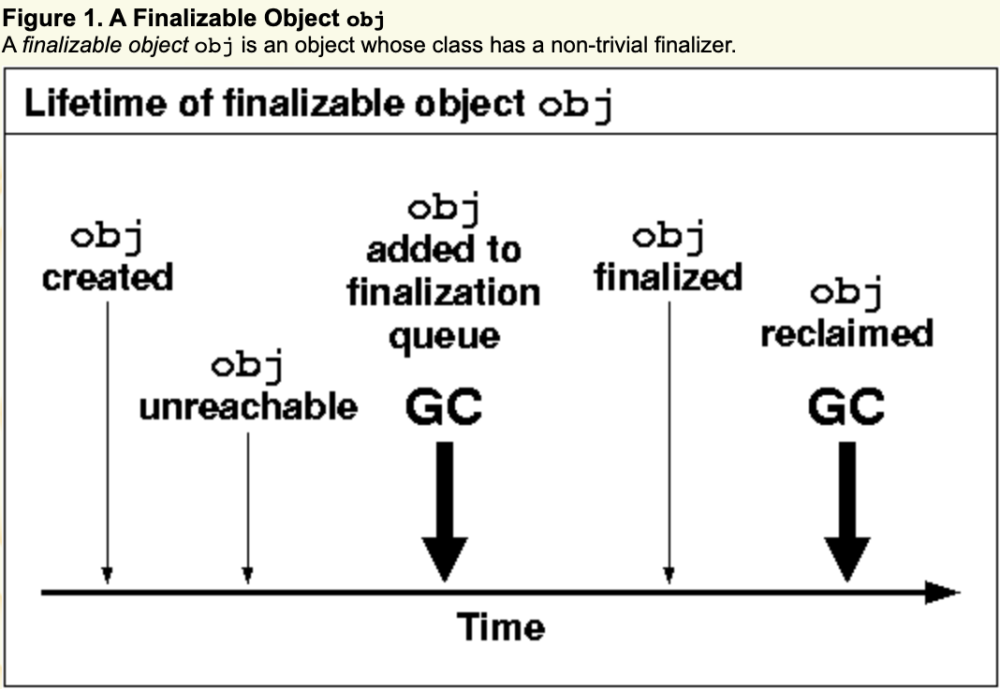
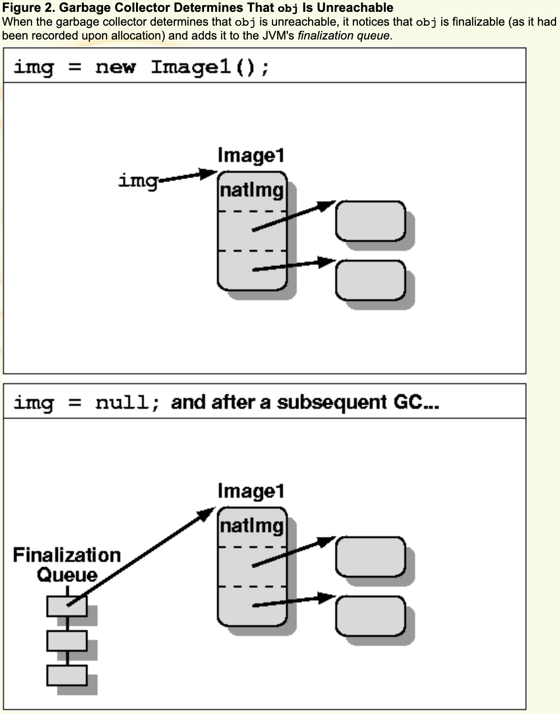
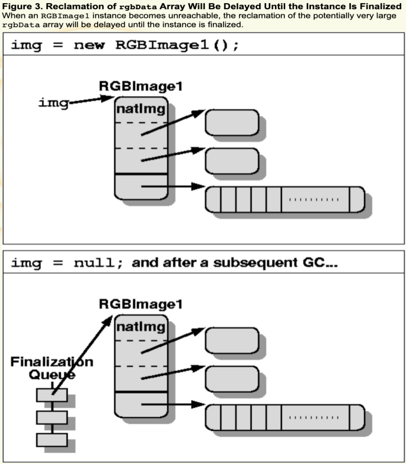
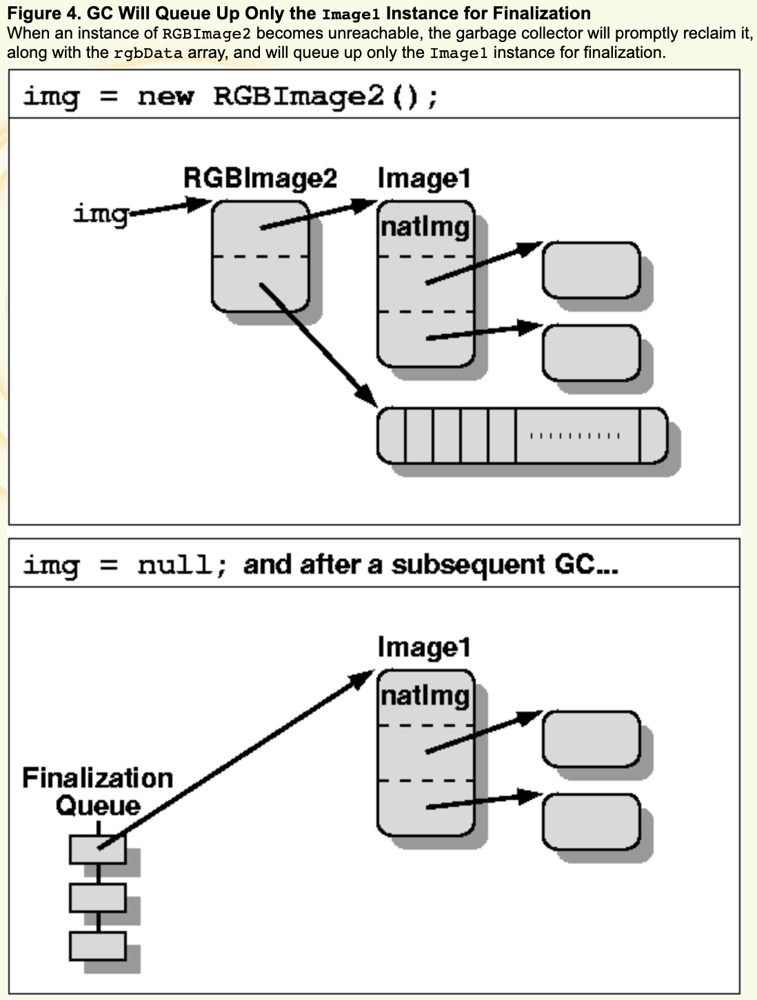
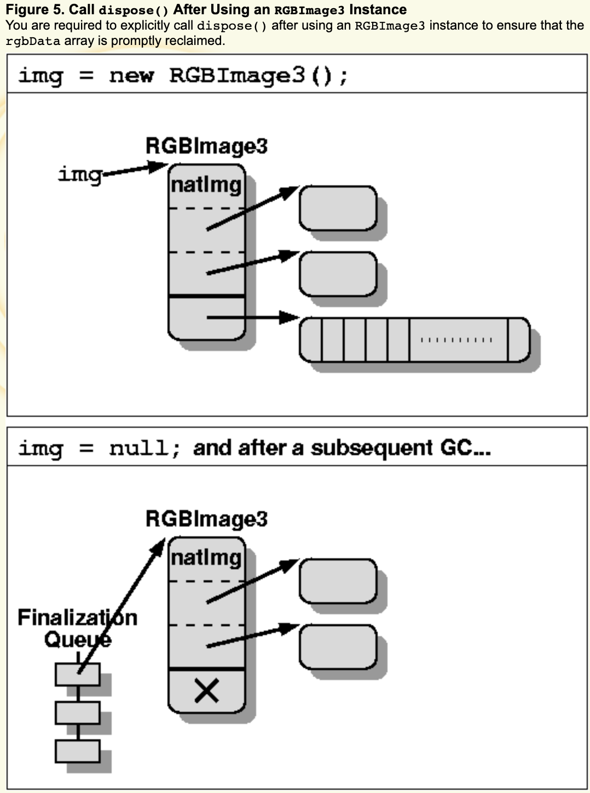
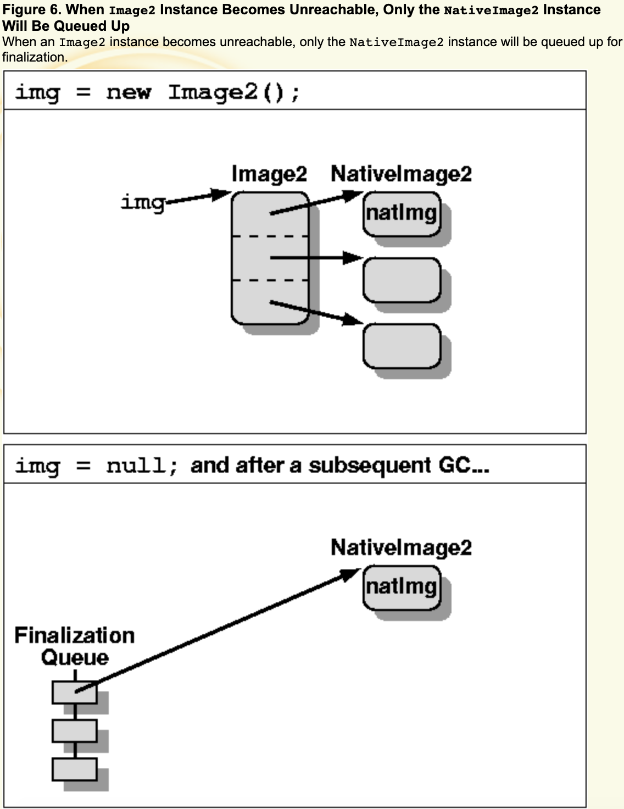
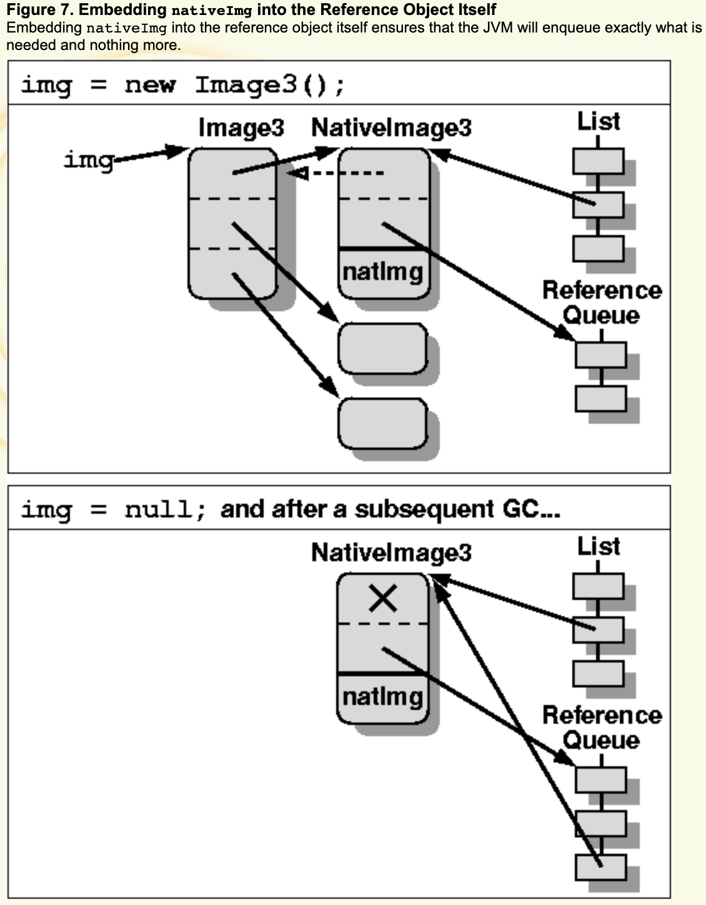

原文地址：http://www.devx.com/Java/Article/30192

# 如何处理Java Finalization的内存保留问题

​		Finalization是Java编程语言的一项功能，它使您可以对发现垃圾回收器无法访问的对象执行事后清除。它通常用于回收与对象关联的本机资源。以下是一个简单的完成示例：

```java
public class Image1 {
	// pointer to the native image data
	private int nativeImg;
	private Point pos;
	private Dimension dim;

	// it disposes of the native image;
	// successive calls to it will be ignored
	private native void disposeNative();
	public void dispose() { disposeNative(); }
	protected void finalize() { dispose(); }

	static private Image1 randomImg;
}
```

​		在Image1实例变得不可访问之后的一段时间，Java虚拟机（JVM）将调用其finalize（）方法，以确保已回收保存图像数据（在示例中由整数nativeImg指向）的本机资源。但是，请注意，尽管JVM对它的finalize（）方法进行了特殊处理，但它是一个包含任意代码的任意方法。特别是，它可以访问对象中的任何字段（示例中为pos和dim）。出人意料的是，它还可以使对象从静态字段（例如，randomImg = this;）变为可访问对象。我确实不建议使用后者，但是很遗憾，Java编程语言允许这样做。



以下步骤描述了可终结对象obj的生命周期，即对象的类具有非平凡的终结器（请参见图1）：

1. 分配obj后，JVM会在内部记录obj是可终结的（这通常会减慢现代JVM具有的其他快速分配路径）。
2. 当垃圾收集器确定obj无法访问时，它会注意到obj是可终结的（因为它是在分配时记录的），并将其添加到JVM的终结队列中。它还可以确保保留obj可以访问的所有对象，即使它们无法访问，因为终结器可能会访问它们。图2说明了Image1实例的情况。



1. 稍后，JVM的终结器线程将使obj出队，调用其finalize（）方法，并记录已调用obj的终结器。此时，obj被认为已完成。
2. 当垃圾收集器重新发现obj不可访问时，它将回收其空间以及可从其访问的所有内容（前提是后者是不可访问的）。

​        请注意，垃圾回收器至少需要两个周期（可能更多）来回收obj，并且需要保留在此过程中可从obj到达的所有其他对象。如果程序员不小心，则可能会造成暂时，细微和不可预测的资源保留问题。另外，JVM不保证它将调用已分配的所有可终结对象的终结器；它可能在垃圾收集器发现其中一些不可访问之前退出。

## 子类化时避免内存保留问题

Finalization处理可能会延迟资源的回收，即使您未明确使用它也是如此。考虑以下示例：

```java
public class RGBImage1 extends Image1 {
	private byte rgbData[];
}
```

RGBImage1，该类自然会从Image1继承finalize（）方法，并且所有RGBImage1实例也将被视为可终结的。当RGBImage1实例变得不可访问时，可能非常大的rgbData数组的回收将被延迟，直到该实例完成为止（请参见图3）。很难找到问题，因为终结器可能在深层的类层次结构中被“隐藏”。



避免此问题的一种方法是重新安排代码，使其使用“包含”模式而不是“扩展”模式，如下所示：

```java
public class RGBImage2 {
	private Image1 img;
	private byte rgbData[];

	public void dispose() {
		img.dispose();
	}
}
```

与RGBImage1相比，RGBImage2包含Image1的实例，而不是扩展Image1。当RGBImage2的实例变得不可访问时，垃圾收集器将立即将其与rgbData数组一起回收（假定后者无法从其他任何地方访问），并将仅将Image1实例排队以进行finalization（请参见图4）。由于类RGBImage2不继承Image1，因此它不会继承任何方法。因此，您可能必须向RGBImage1添加委托方法以访问Image1的必需方法（dispose（）方法就是这样的示例）。



但是，您不能总是以上述方式重新安排代码。在这种情况下，作为该类的用户，您将需要做更多的工作以确保其实例在完成时不会占用过多的空间。以下代码说明了如何：

```java
public class RGBImage3 extends Image1 {
	private byte rgbData[];

	public void dispose() {
		super.dispose();
		rgbData = null;
	}
}
```

RGBImage3与RGBImage1相同，但是增加了dispose（）方法，该方法使rgbData字段为空。您需要在使用RGBImage3实例后显式调用dispose（），以确保快速回收rgbData数组（请参见图5）。我建议在极少数情况下将字段显式清零。这就是其中之一。



## 保护用户免受内存保留问题的困扰

上一节介绍了在使用使用终结器的第三方类时如何避免内存保留问题。本节介绍如何编写需要事后清除的类，以便其用户不会遇到前面概述的问题。最好的方法是将此类分为两类（一个用于保存需要事后清除的数据，另一个用于保存其他所有内容），然后仅在前者上定义终结器。以下代码说明了此技术：

```java
final class NativeImage2 {
	// pointer to the native image data
	private int nativeImg;

	// it disposes of the native image;
	// successive calls to it will be ignored
	private native void disposeNative();
	void dispose() { disposeNative(); }
	protected void finalize() { dispose(); }
}

public class Image2 {
	private NativeImage2 nativeImg;
	private Point pos;
	private Dimension dim;

	public void dispose() { nativeImg.dispose(); }
}
```

Image2与Image1类似，但其中的nativeImg字段包含在单独的类NativeImage2中。从图像类对nativeImg的所有访问都必须经过一个间接级别。但是，当Image2实例不可访问时，将仅将NativeImage2实例排队等待完成；从Image2实例可访问的任何其他内容都将立即收回（请参见图6）。NativeImage2类被声明为final，因此用户无法对其进行子类化，并重新引入上一节中描述的内存保留问题。



一个细微的问题是NativeImage2不应是Image2的内部类。内部类的实例具有对创建它们的外部类的实例的隐式引用。因此，如果NativeImage2是Image2的内部类，并且将NativeImage2实例排队等待定型，则它还将保留相应的Image2实例，而这正是您要避免的事情。但是，假定只能从Image2类访问NativeImage2类。这就是为什么它没有公共方法的原因（它的dispose（）方法以及类本身都是程序包私有的）。

#### Finalization的另一种选择

​	上一节中的示例仍然有一个不确定性来源：JVM不保证它将在终结队列中调用对象的终结器的顺序。所有类（应用程序，库等）的终结器均被平等对待。因此，一个拥有大量内存或稀缺本机资源的对象可能会陷入终结队列中那些终结器的进度缓慢的对象（不一定是恶意的；可能是由于编程不便所致）之后的终结队列中。

```java
final class NativeImage3 extends WeakReference<Image3> {
	// pointer to the native image data
	private int nativeImg;

	// it disposes of the native image;
	// successive calls to it will be ignored
	private native void disposeNative();
	void dispose() {
		disposeNative();
		refList.remove(this);
	}

	static private ReferenceQueue<Image3> refQueue;
	static private List<NativeImage3> refList;
	static ReferenceQueue<Image3> referenceQueue() {
		return refQueue;
	}

	NativeImage3(Image3 img) {
		super(img, refQueue);
		refList.add(this);
	}
}

public class Image3 {
	private NativeImage3 nativeImg;
	private Point pos;
	private Dimension dim;

	public void dispose() { nativeImg.dispose(); }
}
```

Image3与Image2相同。NativeImage3与NativeImage2相似，但是其事后清除依赖于弱引用而不是终结处理。NativeImage3扩展了WeakReference，该对象的引用是关联的Image3实例。请记住，当引用对象的引用（在这种情况下为WeakReference）变得不可访问时，该引用对象将添加到与其关联的引用队列中。将nativeImg嵌入到引用对象本身可确保JVM完全排入所需内容，仅此而已（请参见图7）。同样，出于前面概述的原因，NativeImage3不应是Image3的内部类。



​		您可以通过两种方式确定垃圾回收器是否回收了引用对象的引用：显式地，通过在引用对象上调用get（）方法，或通过隐式地注意到引用对象已在关联对象上排队参考队列。本示例仅使用后者。

​		请注意，只有垃圾回收器可以发现引用对象，并且只有它们自己可以到达时，才将它们添加到与其关联的引用队列中。否则，它们将像其他任何无法访问的对象一样被简单地回收。这就是为什么将所有NativeImage3实例添加到静态列表的原因（实际上，任何数据结构都足够）：确保当其引用变为不可访问时，它们仍然可以访问和处理。自然，还必须确保在处置它们时将其从列表中删除（这是在dispose（）方法中完成的）。

​		当在Image3实例上显式调用dispose（）方法时，该实例上随后将不进行事后清除。也是正确的，因为没有必要。dispose（）方法从静态列表中删除NativeImage3实例，因此当其对应的Image3实例变得不可访问时，它是不可访问的。并且，如前所述，无法访问的参考对象不会添加到其相应的参考队列中。相反，在所有使用终结处理的先前示例中，无论您是否明确处置了与它们关联的本机资源，可终结对象在无法访问时都将被考虑进行终结处理。

​		JVM将确保当发现垃圾回收器无法访问Image3实例时，它将其对应的NativeImage3实例添加到其关联的引用队列中。然后由您决定出队并处置其本机资源。这可以通过在“清理”线程上执行的如下循环来完成：

```java
ReferenceQueue<Image3> refQueue =
		NativeImage3.referenceQueue();
	while (true) {
		NativeImage3 nativeImg =
			(NativeImage3) refQueue.remove();
		nativeImg.dispose();
	}
```

这是一个简单的例子。复杂的开发人员还可以根据他们需要如何优先处理的方式，确保将不同的参考对象与不同的参考队列关联。单个“清理”线程可以轮询所有可用的参考队列，并根据所需的优先级出队对象。此外，您可以选择分散资源回收，以减少对应用程序的破坏。

尽管以这种方式清理资源显然比使用终结处理更为复杂，但它也更强大，更灵活，并且将与终结处理相关的许多不确定性降至最低。这也与在JVM中实际实现终结处理的方式非常相似。对于明显使用大量本机资源并且在清理它们时需要更多控制的项目，我建议使用这种方法。谨慎使用终结处理对于大多数其他项目就足够了。

[注意：本文仅涉及使用终结处理时出现的两种类型的问题，即内存和资源保留问题。使用finalization和Reference类也会引起非常细微的同步问题。阅读Hans-J。Boehm的Finalization，Threads和基于Java Technology的内存模型对此做了很好的概述。]

[chrome-extension://ikhdkkncnoglghljlkmcimlnlhkeamad/pdf-viewer/web/viewer.html?file=https%3A%2F%2Fwww.hboehm.info%2Fmisc_slides%2Fjava_finalizers.pdf](chrome-extension://ikhdkkncnoglghljlkmcimlnlhkeamad/pdf-viewer/web/viewer.html?file=https%3A%2F%2Fwww.hboehm.info%2Fmisc_slides%2Fjava_finalizers.pdf)


### 仅在必须时使用Finalization

本文简要介绍了如何在JVM中实现终结处理。然后给出了一些示例，说明如何通过可终结对象来不必要地保留内存，并概述了此类问题的解决方案。最后，它描述了一种使用弱引用而不是终结处理的方法，该方法使您能够以更灵活和可预测的方式执行事后清理。

但是，完全依赖垃圾收集器来标识无法访问的对象，以便可以回收与它们关联的本机资源和潜在的稀有资源，这具有严重的缺陷：内存通常很多，用大量的资源来保护潜在稀缺的资源并不是一个好办法。战略。因此，当您使用已知具有关联的本机资源的对象（例如GUI组件，文件，套接字）时，在使用完该对象后一定要调用它的dispose（）或等效方法。这将确保立即回收本机资源，并减少这些资源用尽的可能性。这样，您将使用本文中讨论的方法进行事后清理，只是作为最后的手段，而不是主要的清理机制。

您还应该尝试将终结处理的使用仅限于绝对必要的情况。终结是一个不确定的过程，有时是不可预测的过程。您越依赖它，对JVM和应用程序的影响就越小。

