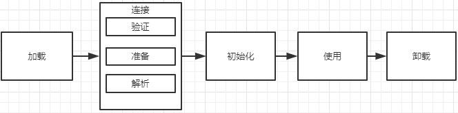

### 类加载

- 在java代码中，类型的加载、连接与初始化过程都是在程序运行期间完成的。

  这里的类型是指Class Interface Enum 非实例对象  

- 提供更大的灵活性，增加了更多的可能性  

  可以改变类的行为，进行特殊定制

  

### 类加载器的深入剖析

#### java 虚拟机于程序的生命周期

以下情况，java虚拟机会结束生命周期

1 执行了System.exit()方法

2 程序正常执行结束

3 程序执行过程中遇到了异常或错误而异常终止

4 由于操作系统出现错误而导致java虚拟机进程终止 

### 类的生命周期



加载：查找并加载类的二进制文件

连接

​	1 验证：确保被加载类的正确性（校验是否符合jvm规范）

​	2 准备：为类的静态变量分配内存，并将其初始化为默认值

​	默认值：数字默认为0 ；引用类型默认是null；boolean类型默认是false

​	3 解析：把类中的符号引用转换为直接引用。 符号引用是一种间接的引用，直接引用是直接指向的地址。

初始化：为类的静态变量赋予正确的初始值

使用

卸载

#### 类的加载、连接与初始化

JAVA程序对类的使用方式可分为两种：

​	1 主动使用

​	2 被动使用

所有的java虚拟机实现必须在每个类或接口被java程序“首次主动使用”时才会初始化它们


主动使用的情况：

​	1：创建类的实例

​	2：访问某个类或接口的静态变量，或者对改静态变量赋值

​	3：调用类的静态方法

​	4： 反射

​	5：初始化一个类的子类

​	6：java虚拟机启东市被标明为启动类的类（Java Test）

​	7: jdk1.7开始提供动态语言的支持：java.lang.invoke.MethodHandle实例的解析结果REF_getStatic,REF_putStatic,REF_invokStatic句柄对应的类没有初始化，则初始化

除以上7种情况，其它使用java类的方式都被看作是对类的被动使用，都不会导致类的初始化。这里的7中情况并不一定是准确的，只是一种泛化的定义，涵盖了大多数情况。

##### 类的加载

​		类的加载指的是将类的.class文件中的二进制数据读入到内存中，将其放在运行时数据区的方法区内，然后再内存中创建一个java.lang.Class对象（规范并未说明Class对象位于哪里，HotSpot虚拟机将其放在了方法区中）用来封装泪在方法区内的数据结构

​		加载.class文件的方式：

​			1：从本地系统中直接加载

​			2：通过网络下载.class文件

​			3：从zip,jar等归档文件中加载.class文件

​			4：从专有的数据库中提取.class文件

​			5：将java源文件动态的编译为.class文件（动态代理）

```java
/**
 *对于静态字段来说，只有直接定义了该字段的类才会被初始化
 * 当一个类在初始化时，要求其父类全部都已经初始化完毕了
 * -XX:+TraceClassLoading,用于追踪类的加载信息并打印出来
 * -XX:+<option> 表示开启option选项
 * -XX:-<option>表示关闭opiton选项
 * -XX:<option>=<value> 表示将option选项的值设置为value
 * 对于默认开启的参数可以使用-XX:-关闭；对于默认关闭的参数可以使用-XX:+开启
 */
public class Sty001 {
    public static void main(String[] args) {
         System.out.println(Child001.cStr);
    }
}
class Parent001 {
    public static String pStr = "p hello";
    static{
        System.out.println("parent001 static block");
    }
}
class Child001 extends Parent001 {
    public static String cStr = "c hello";
    static{
        System.out.println("child001 static block");
    }
}
/***
 * parent001 static block
 * child001 static block
 * c hello
 *================================================================
 * 增加 vm参数-XX:+TraceClassLoading后查看运行结果。这里说明后父类先被加载
 * [Loaded com.ylsh.jvm.Parent001 from file:/F:/ideaOpenSouceReposity/ylsh-study/target/classes/]
 * [Loaded com.ylsh.jvm.Child001 from file:/F:/ideaOpenSouceReposity/ylsh-study/target/classes/]
 * [Loaded java.net.URI$Parser from D:\JavaInstallFiles\jdk1.8.0_144\jre\lib\rt.jar]
 * parent001 static block
 * child001 static block
 * c hello
 */
```

