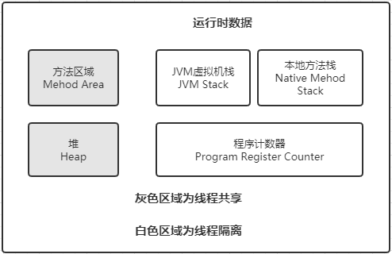

## jvm运行时内存区域



程序计数器


本地方法栈


Java虚拟机栈（JVM Stack)

- Java虚拟机栈描述的是Java方法的执行模型：每个方法执行的时候都会创建一个帧（Frame）栈用于存放局部变量表，操作栈，动态链接，方法出口等信息。一个方法的执行过程，就是这个方法对于栈帧的入栈出栈过程
- 线程隔离

堆（Heap）

- 堆里存放的是对象的实例
- 是java虚拟机管理内存中最大的一块
- GC主要的工作区域
- 线程共享

方法区域

-  存放了每个Class的结构信息，包括常量池、字段描述、方法描述
- GC的非主要工作区域

程序示例：

```java
public void method(){
	Object obj = new Object();
}
```

- 生成了2部分的内存区域：1 obje这个引用变量，以为是方法内的变量，放到JVM Stack里面；2 真正的Object class的实例对象，放到Heap里面
- 上述的new语句一共消耗了12个bytes,JVM规定引用占4个bytes(在JVM Stack),而空对象是8个bytes(在Heap)
- 方法结束后，对应Stack中的变量马上回收，但是Heap中的对象要等到GC来回收

## JVM垃圾回收（GC）模型

垃圾判断算法  

GC算法  

垃圾回收期的实现和选择  

### 垃圾判断算法

引用计数算法（Reference Counting）  

根搜索算法（GC Root Tracing）

#### 引用计数算法

- 给对象添加一个引用计数器，当有一个地方引用他，计数器加1，当引用失效，计数器减1，任何时刻计数器为0的度机箱就算不可能再被使用的
- 引用计数算法无法解决对象循环引用的问题

#### 根搜索算法

- 在实际的生产语言中（java、C#等），都是使用根搜索算法判定对象是否存活
- 算法的基本思路就是通过一系列的称为“GC Roots”的点作为起始进行向下搜索，当一个对象到GC Roots没有任何引用链（Reference Chain）相连，则证明此对象是不可用的
- 在java语言中，GC Roots包括
  1. 在vm栈（帧中的本地变量）中的引用
  2. 方法区中的静态引用
  3. JNI（即一般说的Native方法）中的引用

方法区

- java虚拟机规范标识可以不要求虚拟机在这区实现GC,这区GC的性价比一般比较低
- 在堆中，尤其是在新生代，常规应用进行一次GC一般可以回收70%-95%的控件，而方法区的GC效率远小于此
- 当前的商业JVM都有实现方法去的GC,主要回收两部分内容：废弃常量与无用类
- 类回收需要满足如下3个条件：
  1. 该类所有的实例都已经被GC,也就是JVM中不存在改Class的任何实例
  2. 加载改类的ClassLoader已经被GC
  3. 该类对应的java.lang.Class对象没有在任何地方被引用，如不能在任何地方通过反射访问该类的方法

- 在大量使用反射、动态代理、GCLib等字节码框架、动态生成JSP以及OSGI这类频繁自定义ClassLoader的场景都需要JVM具备类卸载的支持以保证方法区不会溢出

