## JVM常见GC算法

标记-清除算法（Mark-Sweep)  

标记-整理算法（Mark-Compact）  

复制算法（Copying）  

分代算法（Generational）  

### 标记-清除算法

- 算法分为标记和清除两个阶段，首先标记出所有需要回收的对象，然后回收所有需要回收的对象
- 缺点：
  1. 效率问题，标记和清理两个过程效率都不高
  2. 空间问题，标记清理之后会产生大量不连续的内存碎片，空间碎片太多可能会导致后续使用中无法找到足够的连续内存而提前触发另一次的垃圾搜集动作

- 效率不高,需要扫描所有对象。堆越大，GC越慢
- 存在内存碎片问题。GC次数越多，碎片越严重

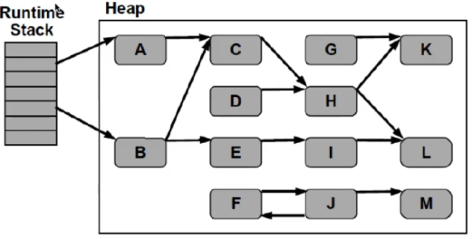

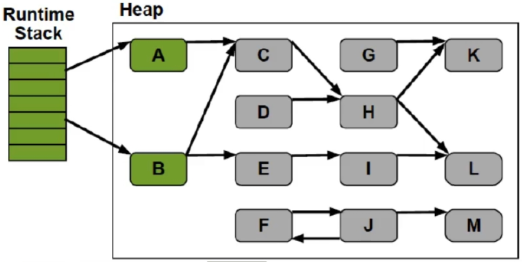

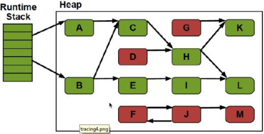

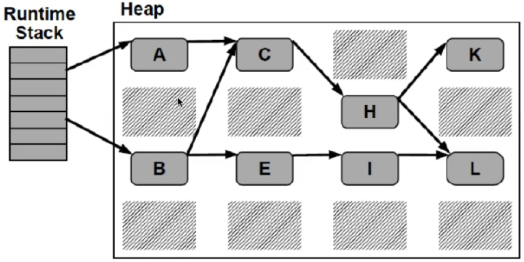

### 标记-整理算法

- 标记过程仍然一样，但是后续步骤不是进行直接清理，而是令所有存活的对象一端移动，然后直接清理掉这段边界以外的内存。

- 没有内存碎片

- 比Mark-Sweep耗费更多的时间进行compact

  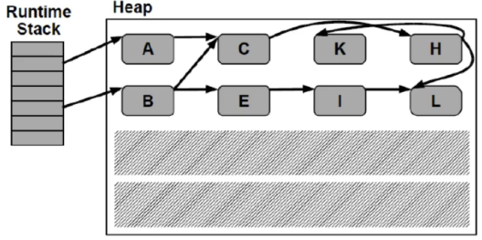

### 复制收集算法

- 将可用内存划分为两块，每次只使用其中的一块，当半区内存用完了，仅将还存活的对象复制到另外一块上面，然后就把原来整块内存空间一次性清理掉
- 这样使得每次内存回收都是对整个半区的回收，内存分配时也就不用考虑内存碎片等复杂情况，只要移动堆顶指针，按顺序分配内存就可以了，实现简单，运行高效。只是这种算法的代价是将内存缩小为原来的一半，代价高昂
- 现在的商业虚拟集中都是用了这一种手机算法来回收新生代
- 将内存分为一块较大的eden空间和2块较少的survivor空间，每次使用eden和其中一块survivor,当回收时将eden和survivor还存活的对象一次拷贝到另外一块survivor空间上，然后清理掉eden和用过的survivor
- oracel hotspot虚拟机默认eden和survivor的大小比例是8：1，也就是每次只有10%的内存是浪费的
- 复制收集算法在对象存活率高的时候，效率有所下降
- 如果不想浪费50%的空间，就需要有额外的空间进行分配担保用于应付半区内存中所有对象都100%存活的极端情况，所以在老年代一般不能直接选用这种算法

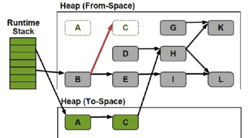

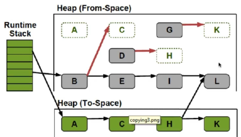

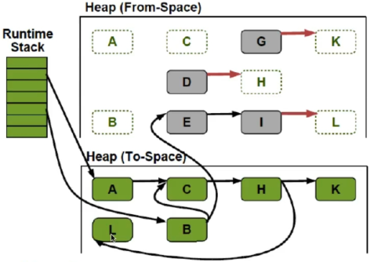

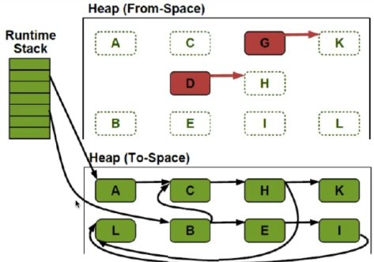

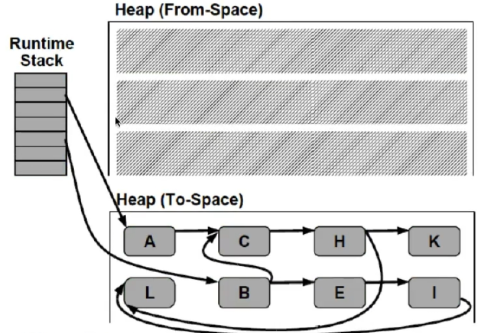

总结：

1. 只需要扫描存活的的对象，效率更高
2. 不会产生碎片
3. 需要浪费额外的内存作为复制区
4. 复制算法非常适合生命周期比较短的对象，因为每次GC总能回收大部分的对象，复制的开销比价小
5. 根据IBM的专门研究，98%的java对象只会存活1个GC周期，对这些对象很适合用复制算法。而且不用1：1的划分工作去和复制区的算法

### 分代算法

- 当前商业虚拟机的垃圾收集器都是采用分代手机（Generational Collecting）算法，根据对象不同的存活周期将内存划分为几块。
- 一般是把java堆分作新生代和老年代，这样就可以根据各个年代的特点采用最适当的收集算法，譬如新生代每次GC都有大批对象死去，只有少量存活，那就选用复制算法只需要付出少量存活对象的复制成本就可以完成收集。
- 综合前面几种GC算法的优缺点，针对不同生命周期的对象采用不同的GC算法

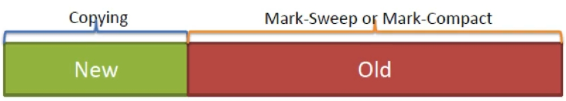

- Hotspot  JVM6中工划分为三个年代：年轻代（Yong Generation）、老年代（Old Generation）和永久代（Permanent Generation）.

  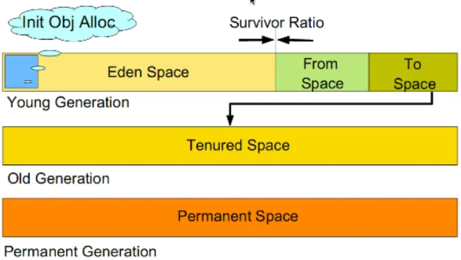

- 年轻代（Yong Generation）

  - 新生成的对象都放在新生代。年轻代用复制算法进行GC(理论上，年轻代代对象的生命周期非常短，所以适合复制算法)
  - 年轻代分三个区。一个Eden区，两个Survivor区（可以通过参数设置Survivor个数）。对象在Eden区中生成。当eden区满时，还存活的对象将被复制到一个survivor区，当这个survivor区满时，此区的存活对象被复制到另外一个survivor区，当第二个survivor区也满了的时候，从第一个survivor区复制过来并且此时还存活的对象，将被复制到老年代。2个survivor时完全对称，轮流替换。
  - eden和2个survivor的缺省值时8:1:1，也就是10%的空间被浪费。可以根据GC log的信息调整大小比例。

- 老年代(Old Generation）
  - 存放了经过一次或多次gc还存活的对象
  - 一般采用mark-sweep或mark-compact算法进行gc
  - 有多种垃圾收集器可以选择。每种垃圾收集器可以看作一个gc算法的具体实现。可以根据具体应用的需求选用合适的垃圾收集器（追求吞吐量？追求最短的响应时间？）

- ~~永久代~~
  - 并不属于堆（heap）.但gc也会涉及到这个区域
  - 存放了每个Class的结构信息，包括常量池、字段描述、方法描述。与垃圾收集要收集的java对象关系不大

