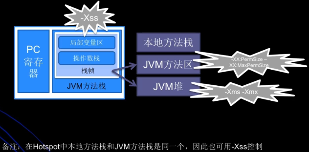
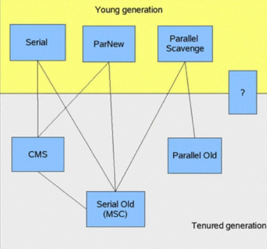

## 内存结构



### 内存分配

1. 堆上分配

   大多数情况在eden上分配，偶尔会直接在old上分配

   细节决定gc的实现  

2. 栈上分配。

   原子类型的局部变量

### 内存回收

- gc要做的事将呢些dead的对象所占用的内存回收掉
  - hotspot认为没有引用的对象是dead的
  - hotspot将引用分为四种：Strong、Soft、Weak、Phantom
    - Strong即默认通过Object o = new Object()这种方式赋值的引用
    - Soft、Weak、Phantom这三种则都是继承Reference  
- 在full gc 时会对Reference类型的引用进行特殊处理
  - Soft:内存不够时一定会被gc、长期不用也会被gc
  - Weak:一定会被gc,当被mark为dead，会在ReferenceQueue中通知
  - Phantom:本来就没引用，当从jvm heap中释放时会通知   

### 垃圾收集算法



### GC的时机

- 在分代模型的基础上，gc从时机上分为两种：scavenge gc和full gc
- scavenge gc(minor gc)
  - 触发时机：新对象生成时，eden空间满了
  - 理论上eden区大多数对象会在scaveng gc回收，复制算法的执行效率会很高，scavenge gc时间比较短
- full gc
  - 对整个jvm进行整理，包括young、old和perm
  - 主要触发时机：1old满了；2perm满了；3 System.gc()
  - 效率很低，尽量减少full gc

## java内存泄漏的经典原因

- 对象定义在错误的范围（Wrong Scope）
- 异常（Exception）处理不当
- 集合数据管理不当

### 对象定义在错误的范围

- 如果Foo实例对象的生命周期较长，会导致临时性内存泄漏。（这里的names变量其实只有临时作用）

```java
class Foo{
  private String[] names;
  public void doIt(int length){
    if(null == name || names.length < length){
      names = new String[length];
    }
    populate(name);
    print(name);
  }
}
```

- jvm喜欢生命周期短的对象，这样作已经足够高效

  ```
  class Foo{
    public void doIt(int length){
      String[] names = new String[length];
      populate(name);
      print(name);
    }
  }
  ```

### 异常处理不当

```java
Connect conn = DriverManager.getConnect(url,name,password);
try{
	String sql = ...;
	PreparedStatement stmt = ...;
	ResultSet rs = ...;
	while(rs.next()){
		doSomething();
	}
	rs.close();
	conn.close();

}catch(Exception e){
	如果doSomething（）抛出异常，rs.close()和conn.close()将不会被调用，
	会导致内存泄漏和db连接泄漏
}
```

### 集合数据管理不当

- 当使用Array-based的数据结构（ArrayList,HashMap等）时，尽量减少resize
  - 比如new ArrayList时，尽量估算size,在创建的时候吧size确定
  - 减少resize可以避免没有必要的array copying,gc碎片等问题
- 如果一个list只需要顺序访问，不需要随机访问（Random Access）,用LinkedList代替ArrayList
  - LinkedList本质时链表，不需要resize,但只适用于顺序访问