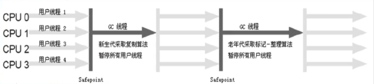
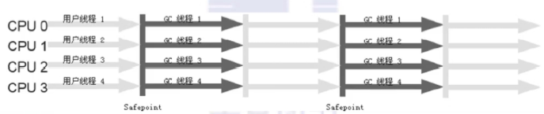

## 垃圾收集器（Garbage Collector）

- 分代模型：gc的宏观愿景
- 垃圾收集器：gc的具体实现
- hotspot jvm提供多种垃圾回收器，我们需要根据具体应用的需要采用不同的回收器
- 没有万能的垃圾回收器，每种垃圾回收器都有自己的使用场景

### 垃圾收集器的并行与并发

- 并行（Parallel）:指多个收集器的线程同时工作，但是用户线程处于等待状态
- 并发（Concurrent）:指收集器在工作的同时，可以允许用户线程工作。
  - 并发不代表解决了gc停顿的问题，在关键的步骤还是要停顿。比如在收集器标记垃圾的时候。但是在清理垃圾的时候快，用户线程和gc线程并发执行。

### Serial收集器

- 单线程收集器，收集时会暂停所有工作线程（Stop The World,简称STW）,使用复制收集算法，虚拟机运行在Client模式时的默认新生代收集器。

- 最早的收集器，单线程进行gc

- new 和 old generation都可以使用

- 在新生代，采用复制算法；在老年代，采用mark-compact 算法

- 因为时单线程gc，没有多线程切换的额外开销，简单实用

- hotspot client模式缺省的收集器

  

### ParNew收集器

- parnew收集器就是serial的多线程版本，除了使用多个收集线程外，其余行为包括算法、STW、对象分配规则、回收策略等都与serial收集器一模一样
- 对应的这种收集器时虚拟机运行在server模式的默认新生代收集器，在单cpu的环境中，parnew收集器并不会比serial收集器有更好的效果
- 是serial收集器在新生代的多线程版本
- 使用复制算法（因为针对新生代）
- 只有在多cpu环境下，效率才会比serial收集器高
- 可以通过-XX:ParallelGCThreads来控制gc线程的多少。需要结合具体cpu的个数
- server模式下新生代的缺省收集器

### Parallel Scavenge收集器

- parallel scavenge收集器时一个多线程收集器，也是使用复制算法，但它的对象分配规则与回收策略都与parinew收集器有所不同，它是以吞吐量最大化（即gc时间占总运行时间最小）为目标的收集器实现，它允许较长时间的STW换取总吞吐量最大化

### Serial Old收集器

- serial old 是单线程收集器，使用标记-整理算法，是老年代的收集器

### Parallel Old收集器

- 老年代版本吞吐量优先收集器，使用多线程和标记-整理算法，jvm1.6提供，在此之前，新生代使用了PS收集器的话，老年代除serial old外别无选择，因为PS无法与CMS收集器配合工作

- parallel scavenge 在老年代的实现

- 在jvm 1.6才出现

- 采用多线程，mark-compact算法

- 更注重吞吐量

- parallel scavenge + parallel old = 高吞吐量，但gc停顿可能不理想

  

## cms收集器的缺点

- cms以牺牲cpu资源的代价来减少用户线程的停顿。当cpu个数小于4的时候，有可能对吞吐量影响非常大
- cms在并发清理的过程中，用户线程还在跑。这时候需要预留一部分空间给用户线程
- cms用mark-sweep，会带来碎片问题。碎片过多的时候会容易频繁触发full gc

GC垃圾收集器的jvm参数定义

| 参数                   | 描述                                                         |
| ---------------------- | ------------------------------------------------------------ |
| UseSerialGC            | 虚拟机运行在client模式下的默认值，打开此开关后，使用Serial+SerialOld的收集器组合进行内存回收 |
| UsePraNewGC            | 打开此开关后，使用ParNew+Serial Old的收集器组合进行内存回收  |
| UseConcMarkSweepGC     | 打开此开关后，使用ParNew+CMS+Serial Old的收集器组合进行内存回收。Serial Old收集器将作为CMS收集器出现Concurrent Model Failture失败后的备用收集器 |
| UseParallelGC          | 虚拟机运行在server模式下的默认值，打开此开关后，使用Parallel Scavenge+Serial Old（PS MarkSweep）的收集器组合进行内存回收 |
| UseParallelOldGC       | 打开此开关后，使用Paralle Scavenge + Parallel Old的收集器组合进行内存回收 |
| SurvivorRatio          | 新生代中eden区域与survivor区域的容量比值，默认是8，代表eden:survivor = 8:1 |
| PretenureSizeThreshold | 直接晋升到老年代的对象大小，设置这个参数后，大于这个参数的对象将直接在老年代分配 |

