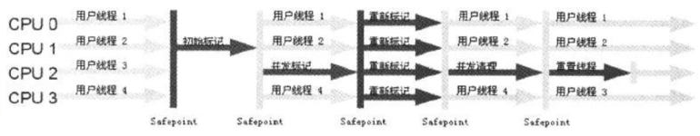
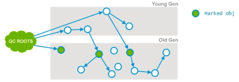
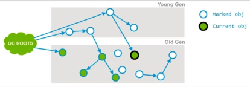
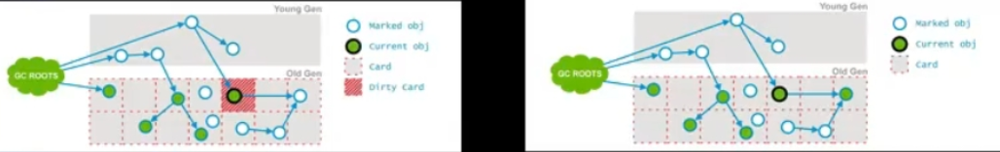
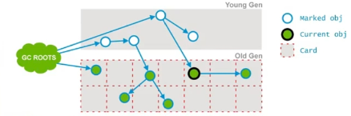

# CMS-Concurrent  Mark Sweep

枚举根节点

- 当执行系统停顿下来后，并不需要一个不漏地检查所有执行上下文和全局的引用位置，虚拟机应该是有办法直接得知那些地方存放着对象引用。在hotspot的实现中，是使用了一组oopmap的数据结构来达到这个目的的。

安全点

- 在OopMap的协助下，hotspot可以快速且准确地完成gc roots枚举，但一个很现实的问题是：可能导致引用关系变化，或者说oopmap内容变化的指令非常多，如果为每一条指令都生成对应的oopmap,那将会需要大量的额外空间，这样gc的空间成本将会变得更高。
- 实际上，hotspot并没有为每条指令都生成oopmap，而是在特定的位置记录了这些信息，这些位置称为安全点（safepoint）,即程序执行时并非在所有地方都能停顿下来开始gc,只有在达到安全点时才能暂停。
- safepoint的选定 即不能太少以至于让gc等待时间太长，也不能过于频繁以至于过分增大运行时的负载。所以，安全点的选定基本上是以是否具有让程序长时间执行的特征为标准进行选定的-因为每条指令执行的时间非常短暂，程序不太可能因为指令流长度太长这个原因而过长时间运行，长时间执行的最明显特征就是指令序列复用，例如方法调用、虚幻跳转、异常跳转等，所以具有这些功能的指令才会产生safepoint
- 对于safepoint，另一个需要考虑的问题是如何在gc发生时让所有线程（这里不包括执行jni调用的线程）都跑到最近的安全点上在停顿下来：抢占式中断（Preemptive Suspension）和主动式中断（Voluntary Suspension）
- 抢占式中断：它不需要线程的执行代码主动去配合，在gc发生时，首先把所有线程全部中断，如果有线程中断的地方不在安全点上，就恢复线程，让它跑到安全点上
- 主动式中断：当gc需要中断线程的时候，不直接对线程操作，仅仅简单地设置一个标志，各个线程执行时主动去轮询这个标志，发现中断标志为真时就自己中断挂起。轮询标志的地方和安全点时重合的，另外再加上创建对象需要分配内存的的地方。

现在几乎没有虚拟机采用抢占式中断来暂停线程从而响应gc事件。

安全区域

- 在使用safepoint似乎已经完美地解决了如何进入gc的问题，但实际上情况却不一定。safepoint机制保证了程序执行时，在不太长的时间内就会遇到可以进入gc的safepoint.但是如果程序在不执行的时候？所谓程序不执行就是没有分配cpu时间，典型的例子就是处于sleep状态或者blocked状态，这个时候线程无法响应jvm的中断请求，jvm也显然不太可能等待线程从新分配cpu时间。对于这种情况，就需要安全区域（safe region）来解决了。
- 在线程执行到safe region中的代码时，首先标识自己已经进入了safe region，那样，当在这段时间里jvm要发起gc时，就不用管标识自己为safe region状态的线程了。在线程要离开safe  region时，它要检查系统是否已经完成了根节点枚举（或者是整个gc过程），如果完成了，那线程就继续执行，否则它就必须等待直到收到可以安全离开safe region的信号为止。 

## CMS(Concurrent Mark Sweep)-收集器

- cms收集器，以获取最短回收停顿时间为目标，多数应用于互联网站或者b/s系统的服务器上。

- cms是基于 标记-清除 算法实现的，整个过程分为4个步骤：

  - 初始标记（cms initial mark）
  - 并发标记（cms concurrent mark）
  - 重新标记（cms remark）
  - 并发清除（cms concurrent seweep）

- 其中，初始标记、重新标记这两个步骤仍然需要stop the world

- 初始标记只是标记一下gc roots能直接关联到的对象，速度很快

- 并发标记阶段就是进行gc roots tracing的过程

- 重新标记阶段则是为类修正并发标记期间因用户程序继续运作而导致标记产生变动的那一部分对象的标记记录，这个阶段的停顿时间一般会比初始标记阶段稍长一些，但远比并发标记的时间短。

- cms收集器的运行步骤如下图所示，在整个过程中耗时最长的并发标记和并发清除过程收集线程都可以与用户线程一起工作，因此，从总体上看，cms收集器的内存回收过程是与用户线程一起并发执行的。

  

- 优点

  - 并发收集、低停顿，oracle官方文档称之为并发低停顿收集器（concurrent low pause collector）

- 缺点

  - 对cpu资源非常敏感，cms以牺牲cpu资源的代价来减少用户线程的停顿。当cpu个数小于4的时候，有可能对吞吐量影响非常大

  - cms在并发清理的过程中，用户线程还在跑。这时候需要预留一部分空间给用户线程。

    cms收集器无法处理浮动垃圾（floating garbage),可能会出现concurrent mode failture失败而导致另一次full gc的产生。如果在应用中老年代增长不是太快，可以适当调高参数-XX:CMSInitiatingOccupancyFraction的值来提高触发百分比，以便降低内存回收次数从而获取更好的性能。要是cms运行期间预留的内存无法满足程序的需要时，虚拟机将启动后备预案：临时启用Serial Old收集器来重新进行老年代的垃圾收集，这样停顿时间就很长了。所以说参数-XX:CMSInitiatingOccupancyFraction设置的太高很容易导致大量cocurrent mode failture失败，性能反而降低

  - cms用mark-sweep，会带来碎片问题。碎片过多的时候会容易频繁触发full gc。

    收集结束时会有大量空间碎片产生，空间碎片过多时，将会给大对象分配带来很大麻烦，往往出现老年代还有很大空间剩余，但是无法找到足够大的连续空间来分配当前对象，不得不提前进行一次full gc。cms收集器提供了一个-XX:+UseCMSCompactAtFullCollection开关参数（默认就是开启的），用于在cms收集器顶不住要进行full gc时开启内存碎片的合并整理过程，内存整理的过程时无法并发的，空间碎片问题没有了，但停顿时间就变长了。

### 空间分配担保

- 在发生minor gc之前，虚拟机会先检查老年代最大可用的连续空间是否大于新生代所有对象总空间，如果这个条件成立，那么minor gc可以确保时安全的。当大量对象在minor gc后仍然存活，就需要老年代进行空间分配担保，把survivor无法容纳的对象直接进入老年代。如果老年代判断剩余空间不足（根据以往每一次回收晋升到老年代对象容量的平均值作为经验值），则进行一次full gc

### cms收集器收集步骤

- Phase1:Initial Mark

  - 这个是cms两次stop-world事件的其中一次，这个阶段的目标是：标记呢些直接被gc root引用或被年轻代存活对象所引用的所有对象 

    

- Phase2:Concurrent Mark

  - 在这个阶段garbage collector会遍历老年代，然后标记所有存活的对象，它会根据上个阶段找到的gc roots 遍历查找。并发标记阶段，它会与用户的应用程序并发运行。并不是老年代所有的存活对象都会被标记，因为在标记期间用户的程序可能会改变一些引用

    

  - 在上面的图中，与阶段1的图进行对比，就会发现一个对象的引用已经发生了变化

- Phase3:Concurrent Preclean

  - 这也是一个并发阶段，与应用的线程并发运行，并不会stop应用的线程。在并发运行的过程中，一些对象的引用可能会发生变化，但是这种情况发生时，jVM会将包含这个对象的区域（card）标记为dirty,这也就是card marking

  - 在pre-clean 阶段，那些能够从dirty对象到达的对象也会被标记，这个标记做完之后,dirty card 标记就会被清除了

    

- Phase4:Concurrent Abortable Preclean

  - 这也是一个并发阶段，但是同样不会影响用户的应用线程，这个阶段是为了尽量承担STW(stop-the-world)中最终标记阶段的工作。这个阶段持续时间依赖于很多的因素，由于这个阶段是在重复做很多相同的工作，直接满足一些条件（比如：重复迭代的次数、完成的工作量或者时钟时间等）

- Phase5:Final Remark

  - 这个是STW阶段，也是cms中的最后一个，这个阶段的目标是标记老年代所有的存活对象，由于之前的阶段是并发执行的，gc线程可能跟不上应用程序的变化，为了完成标记老年代所有存活对象的目标，STW就非常的有必要了。

  - 通常cms的final remark阶段会在年轻代尽可能干净的时候运行，目的是为了减少连续的stw发生的可能性（年轻代存活对象过多的话，也会导致老年代设涉及的存活对象会很多）。这个阶段会比前面的几个阶段更复杂一些

    标记完成阶段

    - 经历上面5个阶段之后，老年代所有存活的对象都被标记过了，现在可以通过清除算法去清理呢些老年代不再使用的对象

- Phase6:Concurrent Sweep

  - 这里不需要stw,它是与用户的应用程序并发运行，这个阶段是：消除呢些不再使用的对象，回收它们的占用空间来为将来使用

    

- Phase7:Concurrent Reset

  - 这个阶段也是并发执行的，它会重设cms内部的数据结构，为下次的gc做准备

总结

- cms通过将大量工作分散到并发处理阶段来减少stw时间，在这块做的非常优秀，但是cms也有一些其它的问题
- 浮动垃圾的的处理
- 空间碎片
- 对于堆比较大的应用，gc的时间难以预估