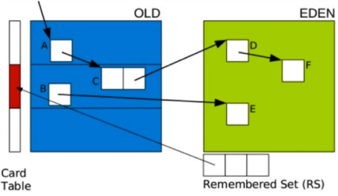

# G1   Garbage First Collector

## G1相对于CMS的优势

- G1在压缩空间方面有优势
- G1通过将内存空间分成区域（Region）的方式避免内存碎片问题。
- Eden 、Survivor、Old区不再固定，在内存使用效率上来说更灵活
- G1可以通过设置预期停顿时间（Pause Time）来控制垃圾收集时间，避免应用雪崩现象
- G1在回收内存后会马上同时做合并空闲内存的工作，而CMS默认实在STW(stop the world)的时候做
- G1会在Yong GC中使用，而CMS只能在O区使用

## G1的适合场景

- 服务器多核cpu、jvm内存占用较大的应用
- 应用在运行过程中会产生大量内存碎片、需要经常压缩空间
- 想要更可控、可预期的gc停顿周期：防止高并发下应用的雪崩现象

## G1 GC模式

- g1提供了两种gc模式，Yong GC和Mixed GC,两种都是完全Stop The World的
- Young GC:选定所有年轻代里的Region.通过控制年轻代的Region的个数，即年轻代内存的大小，来控制Yong GC的时间开销。
- Minxed GC:选定所有年轻代里的Region,外加根据global cocurrent marking统计得出收集收益高的若干老年代Region.在用户指定的开销目标范围内尽可能选择收益高的老年代Region
- Mixed GC不是Full GC,它只能回收部分老年代的Region,如果Mixed GC实在无法跟上程序分配内存的速度，导致老年代填满无法继续进行Mixed GC,就会使用serial old GC(Full GC)来收集整个GC heap.所以本质上，G1是不提供Full GC的

## global cocurrent marking

- global concurrent marking 的执行过程类似于CMS,但是不同的是，在G1 GC中，它主要是为Mixed GC提供标记服务的，并不是一次GC过程的一个必要环节。
- global concurrent marking的执行过程分为四个步骤
  - 初始标记（initial mark,STW）：它标记了从GC Root开始直接可达的对象.
  - 并发标记（Concurrent Marking）:这个阶段从GC Root开始对heap中的对象进行标记，标记线程与应用线程并发执行，并且收集各个Region的存活对象信息。
  - 从新标记（Remark,STW）:标记哪些在并发标记阶段发生变化的对象，将被回收
  - 清理（Cleanup）:清除空Region(没有存活对象的)，加入到free list.
- 第一阶段inital mark是共用了Yong GC的暂停，这是因为他们可以复用root scan操作，所以可以说global concurrent marking是伴随Yong GC而发生的
- 第四阶段Cleanup只是回收了没有存活对象的Region,所以它并不需要STW.

## G1在运行过程中的主要模式

- YGC(不同于CMS)
  - G1 YGC在eden充满时触发，在回收之后所有之前属于Eden的区块全部变成空白，即不属于任何一个分区（Eden 、Survivor、Old）
- 并发阶段
- 混合模式
- Full GC(一般是G1出现问题时发生 )

### Mixed GC

- 由一些参数控制，另外也控制着哪些老年代Region会被选入Cset(收集集合)
- G1HeapWastePercent:在global concurrent marking结束之后，我们可以知道old gen regions中有多少空间需要被回收，在每次YGC之后和再次Mixed GC之前，会检查垃圾占比是否达到此参数，只有达到了，下次才会发生Mixed GC
- G1MixedGCLiveThresholdPercent:old generation region中存活对象的占比，只有在此参数下，才会被选入CSet
- G1MixedGCCountTarget:一次global concurrent marking之后，最多执行Mixed GC的次数
- G1OldCsetRegionThresholdPercent:一次Mixed GC中能被选入CSet的最多old generation region数量
- GC步骤分为两步：
  - 全局并发标记（global concurrent marking）
  - 拷贝存活对象（evacuation）
- 在G1 GC中，global concurrent marking主要是为Mixed GC提供标记服务的，并不是一次GC过程的一个必须环节。global concurrent marking的执行过程分为四个步骤
  - 初始标记（inital mark,STW）:它标记了从GC Root开始直接可达的对象。
  - 并发标记（Concurrent Marking）:这个阶段从GC Root开始对heap中的对象进行标记，标记线程与应用程序线程并发执行，并且收集各个Region的存活对象信息
  - 重新标记（Remark,STW）:标记哪些在并发标记阶段发生变化的对象，将被回收
  - 清理（cleanup）:清除空Region（没有存活对象的），加入到free list

### G1 GC其它参数R

| 参数                               | 参数说明                                                     |
| ---------------------------------- | ------------------------------------------------------------ |
| -XX:G1HeapRegionSize=n             | 设置Region大小，并非最终值                                   |
| -XX:MaxGCPauseMillis               | 设置G1收集过程目标时间，默认值200ms,不是硬性条件             |
| -XX:G1NewSizePercent               | 新生代最小值，默认值5%                                       |
| -XX:G1MaxNewSizePercent            | 新生代最大值，默认值60%                                      |
| -XX:ParallelGCThreads              | STW期间，并行GC线程数                                        |
| -XX:ConcGcThreads=n                | 并发标记阶段，并行执行的线程数                               |
| -XX:InitiatingHeapOccupancyPercent | 设置触发标记周期的Java堆占用率阈值，默认值是45%。这里java堆占比指的是non_yong_capacity_bytes,包括old+humongous |

## G1收集器概览

- G1算法将堆划分为若干个区域（Region）,它仍然属于分代收集器。不过，这些区域的一部分包含新生代。新生代垃圾收集依然采用暂停所有应用线程的方式，将存活对象拷贝到老年代或者Survivor空间。老年代也分成很多区域，G1收集器通过将对象从一个区域复制到另外一个区域，完成了清理工作。这就意味着，在正常的处理过程中，G1完成了堆得压缩（至少是部分堆的压缩），这样也就不会有CMS内存碎片问题的存在了
- 在G1中，还有一种特殊的区域，叫Humongous区域。如果一个对象占用的空间达到或是超过了分区容量的50%，G1收集器就认为这是一个巨型对象，默认直接会被分配在老年代，但是如果它是一个短期存在的巨型对象，就会对垃圾收集器造成负面影响。为了解决这个问题，G1划分了一个Humongous区，它用来专门存放巨型对象。如果一个H区装不下一个巨型对象，那么G1会寻找连续的H分区来存储。为了能找到连续的H区，有时候不得不启动Full GC

## G1 Yong GC

- Yong GC主要是对Eden区进行GC,它在Eden空间耗尽时会被触发。在这种情况下，Eden空间的数据移动到Survivor空间中，如果Survivor空间不够，Eden空间的部分数据会直接晋升到老年代空间。Survivor区的数据移动到Survivor区中，也有部分数据晋升到老年代空间中。最终Eden空间的数据为空，GC完成工作，应用线程继续执行。

- 如果仅仅GC新生代对象，我们如何找到所有的根对象呢？老年代的所有对象都是根吗？那这样扫描下来会耗费大量的时间。于是，G1引进RSet的概念。它的全称是Remembered Set,作用是跟踪指向某个heap区内的对象引用。

  

- 在CMS中，也有RSet的概念，在老年代中有一块区域用来记录指向新生代的引用。这是一种point-out,在进行Young GC时，扫描根时，仅仅需要扫描这一块区域，而不需要扫描整个老年代。

- 但是在G1中，并没有使用point-out,这是由于一个分区太小，分区数量太多，如果是用point-out的话，会造成大量的扫描浪费，有些根本不需要GC的分区引用也扫描了

- 于是G1中使用point-in来解决。poing-in的意思是哪些分区引用了当前分区中的对象。这样，仅仅将这些对象当做根来扫描就避免了无效的扫描。

- 由于新生代有多个，那么我们需要在新生代之间记录引用吗？这是不必要的，原因在于每次GC时，所有新生代都会被扫描，所有只需要记录老年代到新生代之间的引用即可

- 需要注意的是，如果引用的对象很多，赋值器需要对每个引用做处理，赋值器开销会很大，为了解决赋值器开销这个问题，在G1中又引入了另外一个概念，卡表（Card Table）.一个Card Table将一个分区在逻辑上分为固定大小的连续区域，每个区域称之为卡。卡通常较小，介于128到512字节之间。Card Table通常为字节数组，由Card的索引（即数组下标）来标识每个分区的空间地址

- 默认情况下，每个卡都未被引用。当一个地址空间被引用时，这个地址空间对应的数组索引的值被标记为0，即标记为脏被引用，此外RSet也将这个数组下标记录下来。一般情况下，这个RSet其实是一个Hash Table,Key是被的Region的起始地址，Value是一个集合，里面的元素是Card Table的Index

- 垃圾收集阶段

  - 阶段1：根扫描
    - 静态和本地对象被扫描
  - 阶段2：更新RS 
    - 处理dirty card队列更新RS
  - 阶段3：处理RS
    - 检测从年轻代指向老年代的对象
  - 阶段4：对象拷贝
    - 拷贝存活的对象到survivor/old区域
  - 阶段5：处理引用队列
    - 软引用，弱引用，虚引用处理

