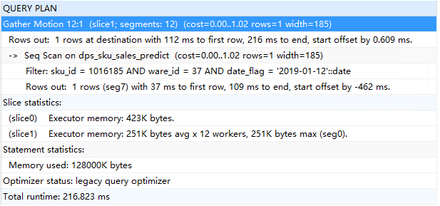
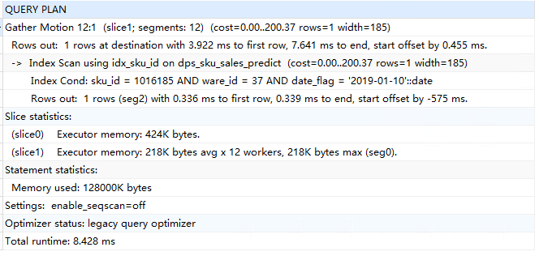

表中的查询需要用到sku_id,ware_id,date_flag 三个字段，基于这三个字段建了联合索引，但是建了索引却不生效，这三个字段可以确定一条唯一记录

当前表有2000多w数据

```sql
-- sql执行时间
[SQL]select * from backend.dps_sku_sales_predict 	where 	  sku_id=	1016185 and ware_id=37	 and date_flag='2019-01-12';
时间: 0.172s
受影响的行: 0

-- 通过 EXPLAIN ANALYZE 查看是否用到索引
EXPLAIN ANALYZE  select * from backend.dps_sku_sales_predict 	where 	  sku_id=	1016185 and ware_id=37	 and date_flag='2019-01-12';
```



结果是seq scan，顺序扫描，未用到索引，索引建的也没有问题。

postgrepsql 这里在有索引的情况下，并没有优先使用索引而是使用顺序扫描。

当前会话中设置关闭顺讯扫描，再次进行查询

```sql
set session enable_seqscan=false; -- 当前会话关闭顺序扫描
-- sql执行时间，明显的快了
[SQL]select * from backend.dps_sku_sales_predict 	where 	  sku_id=	1016185 and ware_id=37	 and date_flag='2019-01-10';
时间: 0.012s
受影响的行: 0
-- 执行计划
EXPLAIN ANALYZE  select * from backend.dps_sku_sales_predict 	where 	  sku_id=	1016185 and ware_id=37	 and date_flag='2019-01-10';
```



这里使用了idex scan,使用到了索引