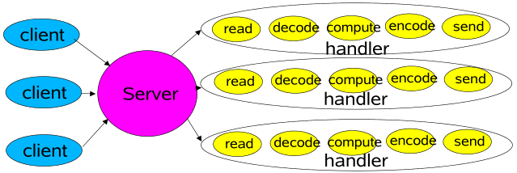
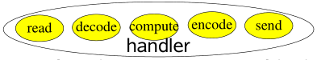
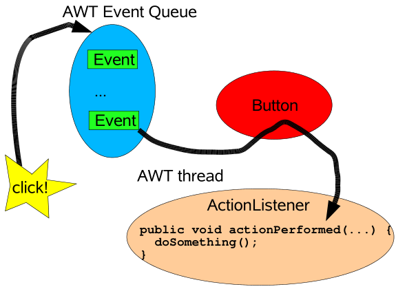
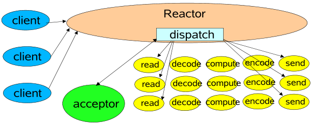
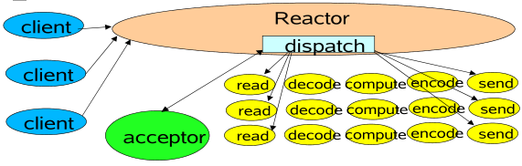
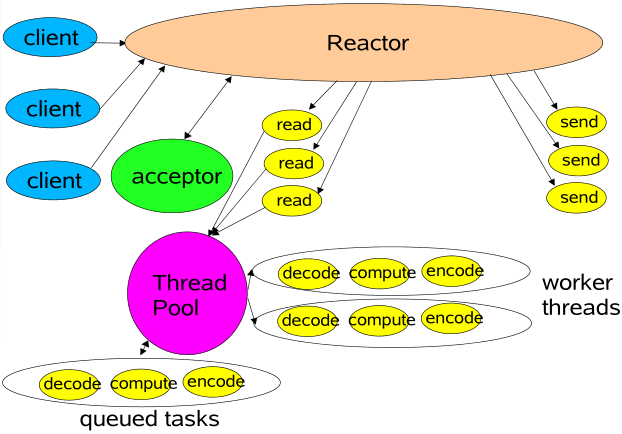
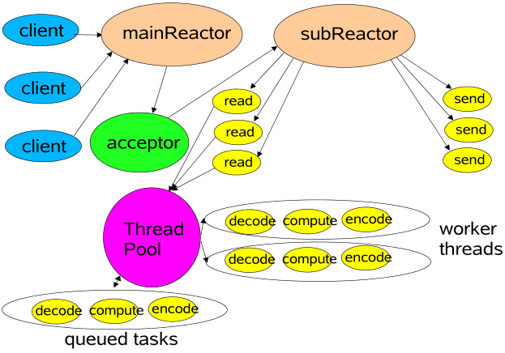

原文地址：

[chrome-extension://ikhdkkncnoglghljlkmcimlnlhkeamad/pdf-viewer/web/viewer.html?file=http%3A%2F%2Fgee.cs.oswego.edu%2Fdl%2Fcpjslides%2Fnio.pdf](chrome-extension://ikhdkkncnoglghljlkmcimlnlhkeamad/pdf-viewer/web/viewer.html?file=http%3A%2F%2Fgee.cs.oswego.edu%2Fdl%2Fcpjslides%2Fnio.pdf)

# java可扩展IO

## 大纲

- 可扩展网络服务
- 事件驱动处理
- Reactor 模型
  - 基本版
  - 多线程版
  - 其它变体
- java.nio非阻塞IO API演练

## 网络服务

- web服务，分布式对象等，大多数具有相同的基本结构：
  - 读请求
  - 解码请求
  - 流程处理服务
  - 编码回复
  - 发送回复
- 但是每个步骤的性质和成本不同(对系统资源的使用不同)
  - xm解析
  - 文件传输
  - web页面生成
  - 计算服务 ....

## 经典服务设置



每个处理程序可以在其自己的线程中启动

## 经典ServerSocket循环

```java
class Server implements Runnable {
    public void run() {
    try {
        ServerSocket ss = new ServerSocket(PORT);
        while (!Thread.interrupted())
        new Thread(new Handler(ss.accept())).start();
        // or, single-threaded, or a thread pool
    } catch (IOException ex) { /* ... */ }
}
static class Handler implements Runnable {
	final Socket socket;
	Handler(Socket s) { socket = s; }
	public void run() {
    try {
        byte[] input = new byte[MAX_INPUT];
        socket.getInputStream().read(input);
        byte[] output = process(input);
        socket.getOutputStream().write(output);
    } catch (IOException ex) { /* ... */ }
    }
    private byte[] process(byte[] cmd) { /* ... */ }
    }
}
```


注意: 大多数异常处理都来自代码示例

## 可扩展性目标

- 负载增加时的平稳降级（更多客户端）
- 通过增加资源（CPU，内存，磁盘，带宽）进行持续改进
- 同时满足可用性和性能目标
  - 短延迟
  - 满足高峰需求
  - 可调整的服务质量
- 分而治之通常是实现任何可扩展性目标的最佳方法

## 分而治之

- 将处理分为小任务

  每个任务执行一个动作而不会阻塞

- 启用每个任务后执行

  此处，IO事件通常充当触发器

  

- java.nio支持的基本机制
  - 非阻塞读写
  - （与感测到的IO事件相关的调度任务） 通过IO事件的监测，来触发相应的调度任务
- 无限变体（一系列的事件驱动设计，可能会产生很多的变体）
  
  - 事件驱动设计系列

## 事件驱动设计

- 通常比替代方法更有效

  - 较少的资源
    - 不要为每一个客户端创建一个线程
  - 低开销
    - 少的加锁操作，来达到少的上下文切换(少的上下文切换通常伴随着少的加锁操作)

  - 但是调度可能会更慢
    - 必须手动的为每个事件绑定动作

- 通常较难编程

  - 必须分解为简单的非阻塞动作
    - 类似于GUI事件驱动的操作
    - 无法消除所有阻塞：GC，页面错误等
  - 必须跟踪逻辑服务状态

## 背景：AWT中的事件



在不同的设计中，事件驱动使用类似的思想

## Reactor 模式

- Reactor通过调度适当的处理程序来响应IO事件

  - 类似于AWT线程

- 处理程序的执行是非阻塞的

  - 类似于AWT ActionListeners

- 通过将处理程序绑定到事件进行管理

  - 类似于AWT actionListener

- 参见Schmidt等人的“面向模式的软件体系结构，第2卷（POSA2）”

  还有Richard Stevens的网络书籍，Matt Welsh的SEDA框架等。

### 基本Reactor 设计



单线程版本

#### java.nio 支持

- Channels

  与支持无阻塞读取的文件，套接字等的连接

- Buffers 

  通道可以直接读取或写入的类数组对象

- Selectors 

  判断一组通道中的哪些发生IO事件

- SelectionKeys 

  维护IO事件状态和绑定

#### Reactor 1: 启动

```java
class Reactor implements Runnable {
	final Selector selector;
	final ServerSocketChannel serverSocket;
	Reactor(int port) throws IOException {
	selector = Selector.open();
	serverSocket = ServerSocketChannel.open();
	serverSocket.socket().bind(
		new InetSocketAddress(port));
	serverSocket.configureBlocking(false);
	SelectionKey sk =
		serverSocket.register(selector,SelectionKey.OP_ACCEPT);
	sk.attach(new Acceptor());
}
/*
或者使用显式的spi提供程序
Alternatively, use explicit SPI provider:
SelectorProvider p = SelectorProvider.provider();
selector = p.openSelector();
serverSocket = p.openServerSocketChannel();
*/
```

#### Reactor 2:循环调度

```java
// class Reactor continued
public void run() { // normally in a new Thread 通常在一个新的线程中
try {
	while (!Thread.interrupted()) {
		selector.select();
		Set selected = selector.selectedKeys();
		Iterator it = selected.iterator();
		while (it.hasNext())
			dispatch((SelectionKey)(it.next());
		selected.clear();
	}
} catch (IOException ex) { /* ... */ }
}
void dispatch(SelectionKey k) {
	Runnable r = (Runnable)(k.attachment());
	if (r != null)
	r.run();
}
```

#### Reactor 3:受体  （接收者）

```java
// class Reactor continued
class Acceptor implements Runnable { // inner
	public void run() {
		try {
			SocketChannel c = serverSocket.accept();
			if (c != null)
				new Handler(selector, c);
		}catch(IOException ex) { /* ... */ }
	}
}
}
```



#### Reactor 4: 处理程序设置

```java
final class Handler implements Runnable {
	final SocketChannel socket;
	final SelectionKey sk;
	ByteBuffer input = ByteBuffer.allocate(MAXIN);
	ByteBuffer output = ByteBuffer.allocate(MAXOUT);
	static final int READING = 0, SENDING = 1;
	int state = READING;
	Handler(Selector sel, SocketChannel c)throws IOException {
		socket = c; c.configureBlocking(false);
		// Optionally try first read now
		sk = socket.register(sel, 0);
		sk.attach(this);
		sk.interestOps(SelectionKey.OP_READ);
		sel.wakeup();
}
boolean inputIsComplete() { /* ... */ }
boolean outputIsComplete() { /* ... */ }
void process() { /* ... */ }
```

#### Reactor 5: 请求处理

```java
// class Handler continued
public void run() {
    try {
    if (state == READING) read();
    else if (state == SENDING) send();
    } catch (IOException ex) { /* ... */ }
}
void read() throws IOException {
    socket.read(input);
    if (inputIsComplete()) {
    process();
    state = SENDING;
    // Normally also do first write now
    sk.interestOps(SelectionKey.OP_WRITE);
    }
}
void send() throws IOException {
    socket.write(output);
    if (outputIsComplete()) sk.cancel();
    }
}
```

#### 每个状态的处理程序

- GoF状态对象模式的简单使用

  重新绑定适当的处理程序作为附件

```java
class Handler { // ...
    public void run() { // initial state is reader
   		socket.read(input);
    	if (inputIsComplete()) {
   			process();
    		sk.attach(new Sender());
    		sk.interest(SelectionKey.OP_WRITE);
    		sk.selector().wakeup();
    	}
	}
    class Sender implements Runnable {
        public void run(){ // ...
        socket.write(output);
        if (outputIsComplete()) sk.cancel();
        }
    }
}
```

### 多线程设计

- 从策略上添加线程以实现可伸缩性
  
- 主要适用于多处理器
  
- 工作线程

  - Reactors 应迅速触发处理程序

    处理程序会减慢Reactors 

- 将非IO处理放到其他线程执行

- 多个Reactors 线程

  - Reactors 线程可能会饱和的执行IO

  - 将负载分配给其它Reactors 线程

    负载均衡以匹配CPU和IO速率

### 工作线程

- 卸载非IO处理以加速Reactor线程

  类似于POSA2前摄器设计

- 比将计算绑定处理重新加工成事件驱动的形式更简单

  应当仍然是纯非阻塞计算

    足够的处理胜过开销

- 但是很难将处理与IO重叠

  最好在某个时刻可以先将所有输入读入缓冲区

- 使用线程池来进行调整和控制

  通常需要比客户端少的线程

### 工作线程池



### 线程池处理

```java
class Handler implements Runnable {
    // uses util.concurrent thread pool
    static PooledExecutor pool = new PooledExecutor(...);
    static final int PROCESSING = 3;
    // ...
    synchronized void read() { // ...
        socket.read(input);
        if (inputIsComplete()) {
              state = PROCESSING;
              pool.execute(new Processer());
        }
    }
    synchronized void processAndHandOff() {
        process();
        state = SENDING; // or rebind attachment
        sk.interest(SelectionKey.OP_WRITE);
    }
    class Processer implements Runnable {
   		public void run() { processAndHandOff(); }
    }
}
```

### 任务协调

- Handoffs （交接）

  每个任务都会启用，触发或调用下一个任务，通常速度最快，但可能很脆弱

- 每个处理者的回调

  设置状态，附件等

  GoF Mediator模式的变体

- 队列

  例如，跨阶段传递缓冲区

- Futures（期货）

  当每个任务产生结果时

  协作位于联接或等待/通知之上

### 使用PooledExecutor

- 可调工作线程池

- 主要方法execute（Runnable r）

- 控制：

  - 任务队列的种类（任何通道）

  - 最大线程数

  - 最小线程数

  - “暖”与按需线程  （监听线程，守护线程）保持活动间隔，直到空闲线程死亡

    如有必要，稍后将其替换为新的

- 饱和策略

  阻塞，衰退（下降），生产者运行等

### 多个Reactor 线程

- 使用Reactor池

  用于匹配CPU和IO速率

  静态或动态构造

  ​	每个都有自己的选择器，线程，调度循环

  主受体（请求接收者）分配给其他（Reactor线程）反应堆

```java
Selector[] selectors; // also create threads
int next = 0;
class Acceptor { // ...
public synchronized void run() { ...
        Socket connection = serverSocket.accept();
        if (connection != null)
       		 new Handler(selectors[next], connection);
    	if (++next == selectors.length) next = 0;
    }
}
```

### 使用多个Reactor 



### 使用其他java.nio功能

- 每个Reactor 有多个选择器

  将不同的处理程序绑定到不同的IO事件

  可能需要慎重，使用同步以进行协调

- File transfer

  Automated file-to-net or net-to-file copying

- Memory-mapped files

  Access files via buffers

- Direct buffers

  Can sometimes achieve zero-copy transfer

  But have setup and finalization overhead

  Best for applications with long-lived connections

### Connection-Based Extensions

- Instead of a single service request

  Client connects

  Client sends a series of messages/requests

  Client disconnects

- Examples

  Databases and Transaction monitors

  Multi-participant games, chat, etc

- Can extend basic network service patterns

  Handle many relatively long-lived clients

  Track client and session state (including drops)

  Distribute services across multiple hosts

