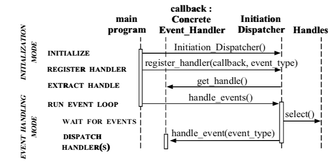
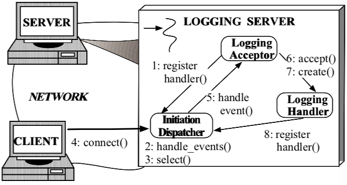
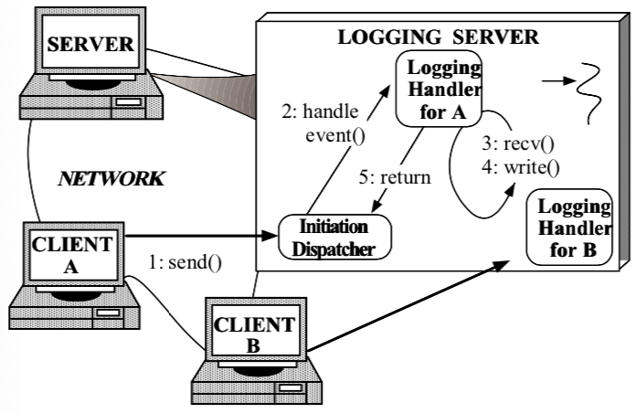
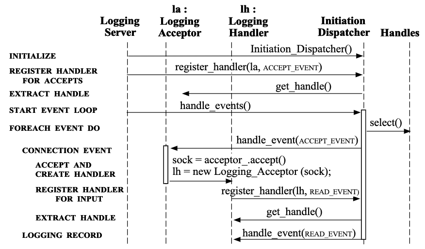

原文地址：

[http://www.dre.vanderbilt.edu/~schmidt/PDF/reactor-siemens.pdf](https://links.jianshu.com/go?to=http%3A%2F%2Fwww.dre.vanderbilt.edu%2F~schmidt%2FPDF%2Freactor-siemens.pdf)

# Reactor

用于同步事件的多路分解和调度句柄的对象行为模式。（对同步事件进行分解，进行调度）


​	本文的早期版本出现在“程序设计的模式语言” ISBN 0- 201-6073-4一书中，该书由Jim Coplien和Douglas C. Schmidt编辑，由Addison-Wesley出版，1995年。

## 1 Intent（意图）

​		Reactor设计模式处理由一个或多个客户端同时交付给应用程序的服务请求。应用程序中的每个服务可能包含几种方法，并由负责分派特定于服务的请求的单独事件处理程序表示。由初始化调度程序执行的事件处理程序的调度，该调度程序管理已注册的事件处理程序。服务请求的多路分解是由同步事件多路分解器执行的。

## 2 也称为调度，通知程序


## 3 Example（例子）

​	为了说明Reactor模式，请考虑图1所示的事件驱动服务器的分布式日志记录服务。客户端应用程序使用日志记录服务来记录有关其在分布式环境中的状态的信息。该状态信息通常包括错误通知，调试跟踪和性能报告。日志记录被发送到中央日志服务器，该服务器可以将记录写入各种输出设备，例如控制台，打印机，文件或网络管理数据库。


​																		图 1: 分布式日志服务

​		图1中所示的日志记录服务器处理客户端发送的日志记录和连接请求。日志记录和连接请求可以同时到达多个句柄。句柄标识OS内管理的网络通信资源。 

​		日志记录服务器使用面向连接的协议（例如TCP [1]）与客户端进行通信。想要记录数据的客户端必须首先将连接请求发送到服务器。服务器使用句柄工厂等待这些连接请求，该工厂监听客户端已知的地址。当连接请求到达时，句柄工厂通过创建代表连接端点的新句柄来建立客户端与服务器之间的连接。该句柄返回到服务器，然后服务器等待客户端服务请求到达该句柄。客户端连接后，他们可以将日志记录同时发送到服务器。服务器通过连接的套接字句柄接收这些记录。

​		开发并发日志服务器的最直观的方法也许是使用可以同时处理多个客户端的多个线程，如图2所示。该方法同步接受网络连接并产生“每个连接线程”以处理客户端日志记录。

​	

​										图2：多线程日志记录服务器

​		但是，使用多线程在服务器中实现日志记录的处理无法解决以下问题：  

- 效率：线程可能由于上下文切换，同步和数据移动而导致性能不佳

- 编程简单：线程可能需要复杂的并发控制方案

- 可移植性：线程并非在所有OS平台上都可用。   

  由于这些缺点，多线程通常不是开发并发日志服务器的最有效或最不复杂的解决方案

## 4上下文（Context）

​		分布式系统中的服务器应用程序，同时从一个或多个客户端接收事件  

## 5问题

​		但是，在调用特定服务之前，服务器应用程序必须解复用并将每个传入请求分派到其相应的服务提供者。开发有效的服务器机制以多路分解和分发客户端请求，需要解决以下问题：

- 可用性：即使正在等待其他请求到达，服务器也必须能够处理传入的请求。特别是，服务器不得在排除其他事件源的情况下无限期地阻塞任何单一事件源，因为这可能会大大延迟对其他客户端的响应。
- 效率：服务器必须最小化延迟，最大化吞吐量，并避免不必要地利用CPU。
- 编程简单：服务器的设计应简化适当的并发策略的使用
- 适配性：集成新的或改进的服务，例如更改消息格式或添加服务器端缓存，应该为现有代码带来最少的修改和维护成本。例如，实现新的应用程序服务不应要求修改通用事件多路分解和调度机制。
- 可移植性：将服务器移植到新的OS平台上不需要花费很多精力

## 6解

​		集成事件的同步多路分解和处理事件的相应事件处理程序的分派。此外，应将服务的特定于应用程序的调度和实现与通用事件多路分解和调度机制分离开。对于应用程序提供的每种服务，请引入一个单独的事件处理程序来处理某些类型的事件。所有事件处理程序都实现相同的接口。事件处理程序向启动分派器注册，该分派器使用同步事件多路分解器等待事件发生。当事件发生时，同步事件多路分解器通知启动调度程序，该调度程序同步地回调与该事件关联的事件处理程序。然后，事件处理程序将事件调度到实现所请求服务的方法。

## 7结构

Reactor模式的主要组成包括以下部分：

### Handles（句柄）

- 识别由操作系统管理的资源。这些资源通常包括网络连接，打开文件，计时器，同步对象等。在日志记录服务器中使用句柄来标识套接字端点，以便同步事件多路分解器可以等待事件发生在它们上。日志记录服务器感兴趣的两种事件是连接事件和读取事件，它们分别表示传入的客户端连接和日志记录数据。日志记录服务器为每个客户端维护一个单独的连接。每个连接都由套接字句柄表示在服务器中。

### Synchronous Event Demultiplexer（同步事件多路分解器）

- 阻止等待事件发生在一组句柄上。当可以在句柄上初始化（启动）操作而不会阻塞时，它将返回。select [1]是用于I / O事件的常见多路复用器，它是UNIX和Win32 OS平台提供的事件解复用系统调用。选择呼叫指示哪个句柄可以同步调用操作，而不会阻塞应用程序进程。

### Event Handler （事件处理程序）

- 指定一个由钩子方法[3]组成的接口，该方法抽象地表示特定于服务的事件的调度操作。此方法必须由特定于应用程序的服务来实现。

### Concrete Event Handler（具体的事件处理）

- 实现钩子方法以及以特定于应用程序的方式处理这些事件的方法。应用程序向启动分派器注册具体事件处理程序，以处理某些类型的事件。当这些事件到达时，Initiation Dispatcher会回调相应的具体事件处理程序的hook方法。  

  ​	日志服务器中有两个具体事件处理程序：日志处理程序和日志接受器。日志处理程序负责接收和处理日志记录。日志接受器创建并连接日志处理程序，该处理程序处理来自客户端的后续日志记录。  

下面的OMT类图说明了Reactor模式参与者的结构：


## 8 动态

### 8.1 常用协作（一般协作）

以下合作发生在Reactor模式中：

- 当应用程序向启动调度程序注册具体事件处理程序时，该应用程序指示事件的类型，该事件处理程序希望启动调度程序在相关事件发生时通知它。
- 初始化调度程序请求每个事件处理程序传回其内部句柄。该句柄向OS标识事件处理程序。
- 注册所有事件处理程序后，应用程序将调用处理事件以启动Initiation Dispatcher的事件循环。此时，启动分派器将来自每个已注册事件处理程序的句柄进行组合，并使用同步事件多路分解器等待事件在这些句柄上发生。例如，TCP协议层使用选择同步事件多路分解操作来等待客户端日志记录事件到达连接的套接字句柄。

- 当与事件源相对应的句柄变为“就绪”（例如，TCP套接字已“就绪以供读取”）时，同步事件多路分解器通知初始化调度程序。
- Initiation Dispatcher触发事件处理程序钩子方法，以响应就绪句柄上的事件。当事件发生时，Initiation Dispatcher将事件源激活的Handle（句柄）作为“键”来定位和调度适当的Event Handler的hook方法。

- Initiation Dispatcher调用事件处理程序的handle事件挂钩方法，以响应于事件执行特定于应用程序的功能。发生的事件类型可以作为参数传递给该方法，并由该方法在内部使用以执行其他特定于服务的多路复用和分派。第9.4节介绍了另一种调度方法

以下交互图说明了应用程序代码与Reactor模式中的参与者之间的协作：



### 8.2 协作方案

​		可以使用两种方案来说明用于日志记录服务器的Reactor模式内的协作。这些方案说明了使用反应式事件分派设计的日志记录服务器如何处理连接请求和记录来自多个客户端的数据。

#### 8.2.1 客户端连接到反应（多路复用）日志服务器。

第一种情况显示了客户端连接到日志记录服务器时采取的步骤。



此步骤顺序可以总结如下：

1. 日志记录服务器（1）向Initiation Dispatcher注册Logging Acceptor 以处理连接请求；
2. 日志记录服务器调用Initiation Dispatcher的handle事件方法（2）。
3. Initiation Dispatcher调用同步事件多路分解选择（3）操作，以等待连接请求或日志记录数据到达；
4. 客户端将（4）连接到日志服务器；
5. Initiation Dispatcher（5）将新的连接请求通知Logging Acceptor；
6. Logging Acceptor接受（6）新连接；
7. Logging Acceptor创建（7）日志处理程序以服务新客户端；
8. Logging Handler将其套接字句柄注册（8）到Initiation Dispatcher，并指示分配器在套接字变为“准备读取”时通知它。

#### 8.2.2客户端将日志记录发送到多路复用日志服务器

第二种情况显示了反应式日志服务器为日志记录提供服务所采取的步骤顺序。



此步骤顺序可以总结如下：

1. 客户端发送（1）日志记录；
2. 当客户端日志记录由OS在其套接字句柄上排队时，Initiation Dispatcher通知（2）关联的Logging Handler；
3. 以非阻塞方式接收（3）记录（重复步骤2和3，直到完全接收到日志记录为止）；
4. Logging Handler处理日志记录，并将其写入（4）到标准输出中。
5. Logging Handler将（5）控制权返回到Initiation Dispatcher的事件循环。

## 9实现

本节描述如何在C ++中实现Reactor模式。ACE通信软件框架[2]中提供的可重用组件会影响以下描述的实现。

### 9.1选择同步事件多路复用器机制（Select  the  Synchronous  Event  Demulti-plexer Mechanism）

初始调度程序使用一个同步事件多路分解器来同步等待直到一个或更多事件发生。这通常通过使用OS事件多路分解系统调用（如select）来实现。select call指示在不阻止应用程序 特定服务处理程序 所在的OS进程的情况下，哪个Handle准备执行I / O操作。一般而言，同步事件多路分解器基于现有的OS机制，而不是由Reactor模式的实现者开发。

### 9.2开发启动调度程序(Develop an Initiation Dispatcher)

以下是开发Initiation Dispatcher必需的步骤：

 实现事件处理程序表：A Initiation Dispatcher维护一个具体的事件处理程序表。因此，Initiation Dispatcher提供了在运行时从该表注册和删除处理程序的方法。该表可以以多种方式实现，例如，如果将句柄表示为小整数值的连续范围，则使用哈希，线性搜索或直接索引。

实现事件循环入口点：到事件调度程序事件循环的入口点应该由事件处理方法提供。此方法控制由同步事件多路分解器提供的句柄多路分解以及执行事件处理程序调度。通常，整个应用程序的main event循环都由此入口点控制。

​		当事件发生时，Initiation Dispatcher从同步事件多路分解调用返回，并通过为每个“就绪”的句柄调度Event Handler的Shandleeventhook方法来进行“反应”。该挂钩方法将执行用户定义的代码，并在完成后将控制权返回给“初始分配器”。

以下C ++类说明了Initiation Dispatcher的公共接口上的核心方法:

```c++
enum Event_Type
   // = TITLE
   // Types of events handled by the
   // Initiation_Dispatcher.
   //
   // = DESCRIPTION
   // These values are powers of two so
   // their bits can be efficiently ‘‘or’d’’
   // together to form composite values.
   {
   ACCEPT_EVENT = 01,
   READ_EVENT = 02,
   WRITE_EVENT = 04,
   TIMEOUT_EVENT = 010,
   SIGNAL_EVENT = 020,
   CLOSE_EVENT = 040
   };
   class Initiation_Dispatcher
   // = TITLE
   // Demultiplex and dispatch Event_Handlers
   // in response to client requests.

{
public:
// Register an Event_Handler of a particular
// Event_Type (e.g., READ_EVENT, ACCEPT_EVENT,
// etc.).
int register_handler (Event_Handler *eh,
Event_Type et);
// Remove an Event_Handler of a particular
// Event_Type.
int remove_handler (Event_Handler *eh,
Event_Type et);
// Entry point into the reactive event loop.
int handle_events (Time_Value *timeout = 0);
};
```

实现必要的同步机制：如果在仅具有一个控制线程的应用程序中使用Reactor模式，则可以消除所有同步。在这种情况下，Initiation Dispatcher会序列化应用程序进程中的事件处理程序处理事件挂钩

​		但是，启动分派器还可以在多线程应用程序中充当中央事件分派器。在这种情况下，在修改或激活共享状态变量（例如保存事件处理程序的表）时，必须对InitiationDispatcher中的关键部分进行序列化，以防止出现竞争情况。防止(种族状况)竞态的常见技术是使用互斥机制，例如信号量或互斥变量。

​		为了防止自锁，互斥机制可以使用用户递归锁[4]。当Initiation Dispatcher中的事件处理程序钩子方法中的同一线程持有锁时，递归锁将保持prevent deadlock。拥有锁的线程可以在不阻塞线程的情况下重新获取递归锁。此属性很重要，因为Reactor's handle events方法会调用特定于应用程序的事件处理程序。随后，应用程序挂钩方法代码可以通过其注册处理程序和删除处理程序方法重新输入Initiation Dispatcher。

### 9.3确定调度的类型

可以将两种不同类型的事件处理程序与a Handle关联，以用作Initiation Dispatcher调度逻辑的目标。反应堆模式的实现可以选择以下两种调度方法中的一种或两种：

事件处理程序对象：将事件处理程序与Handle is关联以使Event Handler成为对象的一种常用方法。例如，第7节中显示的Reactor模式实现将事件处理程序子类对象注册到一个Initiation Dispatcher。使用对象作为调度目标可以方便地对事件处理程序进行子类化以便重用和扩展5现有组件。此外，对象将服务的状态和方法集成到单个组件中。

事件处理程序函数：将事件处理程序与Handleis关联的另一种方法，是向Initiation Dispatcher注册函数。通过使用函数作为调度目标，可以方便地注册回调，而不必定义从Event Handler继承的新类。

适配器模式[5]用于同时支持对象和功能。例如，可以使用事件处理程序对象定义适配器，该对象持有指向事件处理程序功能的指针。在事件handler adapter对象上调用handle event方法时，它可以自动将调用转发给它持有的事件处理函数

### 9.4定义事件处理接口

假设我们使用事件处理程序对象而不是函数，则下一步是定义事件处理程序的接口。有两种方法：

单一方法接口：第7节中的OMT图说明了EventHandlerbase类接口的实现，该接口包含一个称为handleevent的单一方法，Initiation Dispatcher使用它来调度事件。在这种情况下，已发生事件的类型将作为参数传递给方法

​		以下C ++抽象基类说明了单方法接口：

```c++
class Event_Handler
// = TITLE
// Abstract base class that serves as the
// target of the Initiation_Dispatcher.
{
public:
// Hook method that is called back by the
// Initiation_Dispatcher to handle events.
virtual int handle_event (Event_Type et) = 0;
// Hook method that returns the underlying
// I/O Handle.
virtual Handle get_handle (void) const = 0;
};
```

​		单方法接口的优点是可以在不更改接口的情况下添加新类型的事件。但是，这种方法鼓励在子类的handle Event方法中使用switch语句，这限制了它的可扩展性。

多方法接口：实现事件处理程序接口的另一种方法是为每种事件类型（例如，handleinput，handleoutput或handletimeout）定义单独的虚拟钩子方法。

​		以下C ++抽象基类说明了单方法接口

```c++
class Event_Handler
{
public:
// Hook methods that are called back by
// the Initiation_Dispatcher to handle
// particular types of events.
virtual int handle_accept (void) = 0;
virtual int handle_input (void) = 0;
virtual int handle_output (void) = 0;
virtual int handle_timeout (void) = 0;
virtual int handle_close (void) = 0;
// Hook method that returns the underlying
// I/O Handle.
virtual Handle get_handle (void) const = 0;
};  
```

​		多方法接口的好处是很容易在基类中有选择地重写方法，并避免在hook方法中避免进一步的多路分解，例如通过switch or if语句。但是，它要求框架开发人员提前预见事件处理程序方法集。例如，针对通过UNIX选择机制可用的I / O事件，针对上面的EventHandler界面中的variant handle *方法进行了量身定制。但是，此接口不够广泛，无法涵盖通过Win32WaitForMultipleObjects mechanism（机制） [6]处理的所有类型的事件。

​		上述两种方法都是[3]中描述的摘机方法模式和[7]中描述的工厂回调模式的示例。这些模式的目的是提供定义明确的钩子，这些钩子可以由应用程序专门化，并可以由较低级别的调度代码进行回调。

### 9.5确定应用程序中的初始调度程序数量

可以仅使用Reactor模式的一个实例来构造许多应用程序。在这种情况下，Initiation Dispatcher可以实现为Singleton [5]。该设计对于将事件多路分解和调度集中到应用程序内的单个位置非常有用。

​		但是，某些操作系统限制了在单个控制线程中可以等待的句柄数。例如，Win32允许select和WaitForMultipleObject在单个线程中最多等待64个句柄。在这种情况下，可能需要创建多个线程，每个线程都运行自己的Reactor模式实例。

​		请注意，事件处理程序仅在Reactor模式的一个实例中序列化，因此，多个线程中的多个事件处理程序可以并行运行。如果不同线程中的事件处理程序访问共享状态，则此配置可能需要使用其他同步机制。

### 9.6具体事件处理程序的实现

具体的事件处理程序通常由应用程序开发人员创建，以执行特定的服务以响应6特殊事件。当启动调度程序调用相应的钩子方法时，开发人员必须确定要执行什么处理

​		以下代码为第3节中描述的日志服务器实现了具体的事件处理程序。这些处理程序提供了被动连接的建立（日志接受器）和数据接收（LoggingHandler）

Logging Acceptor类：此类是Acceptor-Connector模式[8]的Acceptor组件的示例。接受者-连接器模式将服务初始化任务与服务初始化后执行的任务分离。此模式使服务的特定于应用程序的部分（例如LoggingHandler）可以独立于用于建立连接的机制而变化。

​		A Logging Acceptor被动地接受来自客户端应用程序的连接，并创建特定于客户端的Logging Handler对象，该对象从客户端接收和处理日志记录。下面定义了Logging Acceptor类中的关键方法和数据成员：

```c++
class Logging_Acceptor : public Event_Handler
// = TITLE
// Handles client connection requests.
{
public:
// Initialize the acceptor_ endpoint and
// register with the Initiation Dispatcher.
Logging_Acceptor (const INET_Addr &addr);
// Factory method that accepts a new
// SOCK_Stream connection and creates a
// Logging_Handler object to handle logging
// records sent using the connection.
virtual void handle_event (Event_Type et);
// Get the I/O Handle (called by the
// Initiation Dispatcher when
// Logging_Acceptor is registered).
virtual HANDLE get_handle (void) const
{
return acceptor_.get_handle ();
}
private:
// Socket factory that accepts client
// connections.
SOCK_Acceptor acceptor_;
};
```

Logging Acceptor类继承自Event Handler base类。这使应用程序可以使用Initiation Dispatcher来注册Logging Acceptor.

​	Logging Acceptor还包含SOCK接受器的实例。这是一个具体工厂，使Logging Acceptor可以在侦听通信端口的被动模式套接字上接受连接请求。当连接从客户端到达时，SOCK Acceptor接受该连接并生成SOCK Stream对象。此后，SOCK Stream对象用于在客户端和日志记录服务器之间可靠地传输数据

​		用于实现日志记录服务器的SOCK Acceptor和SOCK Stream类是ACE [9]提供的C ++ socket wrapper库的一部分。这些套接字包装器将套接字接口的SOCK Stream语义封装在可移植且类型安全的面向对象的接口内。在Internet域中，SOCK Stream socket是使用TCP实现的。

Logging Acceptor的构造函数向ACCEPT事件的Initiation Dispatcher Singleton [5]自行注册。

```c++
Logging_Acceptor::Logging_Acceptor
(const INET_Addr &addr)
: acceptor_ (addr)
{
// Register acceptor with the Initiation
// Dispatcher, which "double dispatches"
// the Logging_Acceptor::get_handle() method
// to obtain the HANDLE.
Initiation_Dispatcher::instance ()->
register_handler (this, ACCEPT_EVENT);
}
```

此后，每当客户端连接到达时，Initiation Dispatcher便会回调到Logging Acceptor的handle事件方法，如下所示

```c++
void
Logging_Acceptor::handle_event (Event_Type et)
{
// Can only be called for an ACCEPT event.
assert (et == ACCEPT_EVENT);
SOCK_Stream new_connection;
// Accept the connection.
acceptor_.accept (new_connection);
// Create a new Logging Handler.
Logging_Handler *handler =
new Logging_Handler (new_connection);
}  
```

处理事件方法调用SOCK Acceptor的接受方法以被动地建立SOCK Stream。一旦SOCK Stream与新客户端连接，就会动态分配Logging Handler来处理日志记录请求。如下所示，Logging Handler向Initiation Dispatcher进行注册，该调度程序将多路复用与其关联的客户端的所有日志记录。

Logging Handler类：日志服务器使用以下所示的Logging Handler类接收客户端应用程序发送的日志记录:

```c++
class Logging_Handler : public Event_Handler
// = TITLE
// Receive and process logging records
// sent by a client application.
{
public:

// Initialize the client stream.
Logging_Handler (SOCK_Stream &cs);
// Hook method that handles the reception
// of logging records from clients.
virtual void handle_event (Event_Type et);
// Get the I/O Handle (called by the
// Initiation Dispatcher when
// Logging_Handler is registered).
virtual HANDLE get_handle (void) const
{
return peer_stream_.get_handle ();
}
private:
// Receives logging records from a client.
SOCK_Stream peer_stream_;
};
Logging Handler inherits from Event Handler,
which enables it to be registered with the Initiation
Dispatcher, as shown below:
Logging_Handler::Logging_Handler
(SOCK_Stream &cs)
: peer_stream_ (cs)
{
// Register with the dispatcher for
// READ events.
Initiation_Dispatcher::instance ()->
register_handler (this, READ_EVENT);
}
```

创建日志后，日志处理程序就会使用Initiation Dispatcher Singleton为READ事件注册自己。因此，当日志记录到达时，Initiation Dispatcher会自动调度关联Logging Handler的handle事件方法，如下所示:

```c++
void
Logging_Handler::handle_event (Event_Type et)
{
if (et == READ_EVENT) {
Log_Record log_record;
peer_stream_.recv ((void *) log_record, sizeof log_record);
// Write logging record to standard output.
log_record.write (STDOUT);
}
else if (et == CLOSE_EVENT) {
peer_stream_.close ();
delete (void *) this;
}
```

当套接字句柄上发生READ事件时，Initiation Dispatcher会回调Logging Handler的handle Event方法。此方法接收，处理日志记录并将其写入标准输出（STDOUT）。同样，当客户端关闭连接时，Initiation Dispatcher会传递一个CLOSE事件，该事件会通知日志记录处理程序关闭其SOCK流并删除自身

### 9.7服务端实现

日志记录服务器包含一个main函数。

日志记录服务器主要功能：该函数实现一个单线程并发日志记录服务器，该服务器在Initiation Dispatcher的handle Events事件循环中等待。当请求从客户端到达时，Initiation Dispatcher调用适当的Concrete Event Handler hook方法（具体的事件处理钩子方法），该方法接受连接并接收和处理日志记录。进入日志服务器的主要入口点定义如下：

```c++
// Server port number.
const u_short PORT = 10000;
int
main (void)
{
// Logging server port number.
INET_Addr server_addr (PORT);
// Initialize logging server endpoint and
// register with the Initiation_Dispatcher.
Logging_Acceptor la (server_addr);
// Main event loop that handles client
// logging records and connection requests.
for (;;)
Initiation_Dispatcher::instance ()->
handle_events ();
/* NOTREACHED */
return 0;
}  
```

主程序创建一个Logging Acceptor，其构造函数使用日志记录服务器的端口号对其进行初始化。然后，程序进入其主事件循环。随后，Initiation Dispatcher Singleton使用select event多路分解系统调用来同步等待连接请求和记录记录从客户端到达。

​		以下交互图说明了参与日志记录服务器的对象之间的协作示例



初始化Initiation Dispatcher对象后，它将成为日志服务器内控制流的主要焦点。所有后续活动都是由在Initiation Dispatcher中注册并由其控制的Logging Acceptor和LoggingHandler对象上的钩子方法触发的。

​		当连接请求到达网络连接时，Initiation Dispatcher会回调Logging Acceptor，后者接受网络连接并创建一个Logging Handler。此Logging Handler然后向Read Events的Initiation Dispatcher注册。因此，当客户端发送日志记录时，Initiation Dispatcher回调到客户端的Logging Handler，以在日志服务器的单控制线程中处理来自该客户端连接的传入记录

## 10已知用途

Reactor模式已在许多面向对象的框架中使用，包括以下内容

- InterViews：Reactor模式由InterViews [10]窗口系统发行版（称为Dispatcher）实现。InterViews Dispatcher用于定义应用程序的主事件循环并管理与一个或多个物理GUI显示器的连接

- ACE框架：ACE框架[11]使用Reactor模式作为其中央事件多路分解器和分派器

  反应堆模式已用于许多商业项目，包括

- CORBA ORB：在CORBA [12]的许多单线程实现中，ORB核心层（例如VisiBro-ker，Orbix和TAO [13]）使用Reactor模式进行解复用并将ORB请求分发给服务方
- 爱立信EOS呼叫中心管理系统：该系统使用Reactor模式来管理CallCenter管理系统中PBX与主管之间的事件服务器[14]路由的事件
- 项目频谱：项目频谱[15]的高速医学图像传输子系统在医学成像系统中使用反应堆模式

## 11后果（影响）

### 11.1好处

Reactor模式具有以下优点：

- 关注点分离：Reactor模式将与应用程序无关的解复用和分派机制与特定于应用程序的挂钩方法功能相分离。与应用程序无关的机制成为了可重用的组件，这些组件知道如何对事件进行多路分解并分派由事件处理程序定义的相应挂钩方法。相反，挂钩方法中的特定于应用程序的功能知道如何执行特定类型的服务。
- 改善事件驱动应用程序的模块化，可重用性和可配置性：该模式将应用程序功能分离为单独的类。例如，日志记录服务器中有两个单独的类：一个用于建立连接的建立连接，另一个用于接收和处理记录的处理。通过这种解耦，可以将连接建立类重新用于不同类型的面向连接的服务（例如文件传输，远程登录和视频点播）。因此，修改或扩展日志服务器的功能只会影响日志处理程序类的实现。
- 提高应用程序的可移植性：Initiation Dispatcher的界面可以独立于执行事件多路分解的OS系统调用而重用。这些系统调用可检测并报告一个或多个事件的发生，这些事件可能在多个事件源上同时发生。常见的事件源可能包括I / O句柄，计时器和同步对象。在UNIX平台上，事件多路分解系统调用称为selectandpoll [1]。在Win32 API [16]中，WaitForMultipleObjects系统调用执行事件多路分解
- 提供粗粒度的并发控制：Re-actor模式在事件多路分解和调度级别通过进程或线程对事件处理程序的调用进行序列化。InitiationDispatcher级别的序列化通常消除了在应用程序进程中进行更复杂的同步或锁定的需求

## 11.2缺点

Reactor模式具有以下缺点

- 有限的适用性：只有在操作系统支持Handles的情况下，才能有效地应用Reactor模式。可以使用Initiation Dispatcher中的多个线程来模拟Reactor模式的语义，例如，每个Handle使用一个线程。每当句柄上有可用事件时，其关联线程将读取该事件并将其放置在由初始化调度程序顺序处理的队列上。但是，这种设计通常效率非常低，因为它会序列化所有事件处理程序，从而在不增强并行性的情况下增加了同步和上下文切换开销
- 非抢占式：在单线程应用程序过程中，事件处理程序在执行时不会被抢占。这意味着事件处理程序不应在单个Handles上执行阻塞I / O，因为这将阻塞整个过程并阻碍对连接到other Handles的客户端的响应。因此，对于长时间操作，例如传输数兆字节的医学图像，[15]]，活动对象模式[17]可能更有效。活动对象使用多线程或多处理来与Initiation Dispatcher的主事件循环并行完成其任务。
- 难以调试：使用Reactor模式编写的应用程序可能难以调试，因为控制反转的流程在特定应用程序处理程序的框架基础结构和方法回调之间振荡。由于应用程序开发人员可能不了解或无法访问框架代码，因此增加了调试器中框架的运行时行为“单步执行”的难度。这类似于尝试使用LEXandYACC调试编译器词法分析器和解析器时遇到的问题。在这些应用程序中，当控制线程位于用户定义的动作例程中时，调试非常简单。但是，一旦控制线程返回到生成的确定性有限自动机（DFA）骨架，就很难遵循程序逻辑。

## 12    See Also

反应堆模式与观察者模式[5]相关，在此模式下，当单个主题发生更改时，所有依赖项都会被通知。在Reactor模式中，当事件源上发生处理程序感兴趣的事件时，将通知单个处理程序。Reactor模式通常用于将多个源中的事件多路复用到与其关联的事件处理程序，而Observer通常仅与单个事件源相关联。

​		反应堆模式与责任链（CoR）模式有关[5]，在该模式中，请求被委派给负责任的服务提供者。Reactor模式与CoR模式不同，因为Reactor将特定的EventHandler与特定的事件源相关联，而CoRpattern则在链中搜索以找到第一个匹配的EventHandler

​		可以将Reactor模式视为异步Proactor模式的异步变量[18]。Proac-tor支持异步事件的完成触发的多事件处理程序的解复用和分派。相反，Reactor模式负责多事件处理程序的解复用和分派，当有可能在不阻塞的情况下同步启动操作时，将触发这些事件处理程序

​		活动对象模式[17]使方法执行与方法调用脱钩，从而简化了在不同控制线程中调用的方法对共享资源的同步访问。当线程不可用或不希望线程的开销和复杂性时，通常使用Reactor模式代替Active Object模式

​		Reactor模式的实现为事件多路分解提供了Fa-cade [5]。Facade是一种界面，可屏蔽子系统中的应用程序与复杂的对象关系