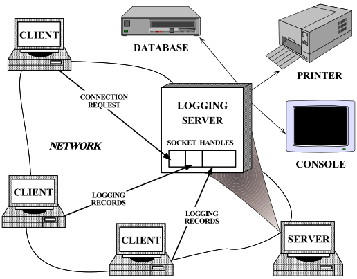
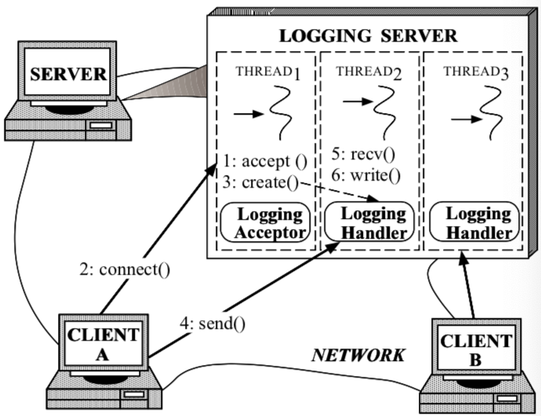
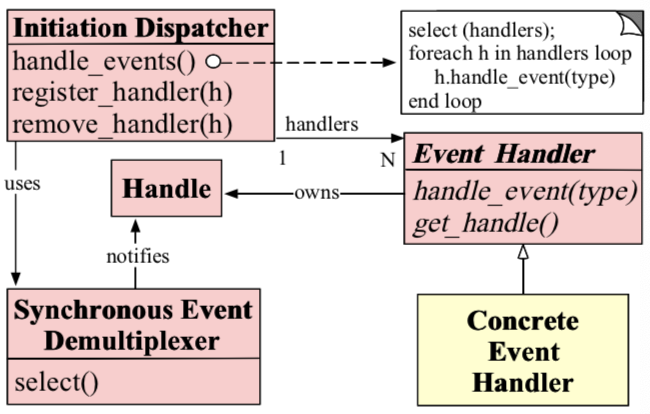

# Reactor

用于同步事件的多路分解和调度句柄的对象行为模式。（对同步事件进行分解，进行调度）

​	本文的早期版本出现在“程序设计的模式语言” ISBN 0- 201-6073-4一书中，该书由Jim Coplien和Douglas C. Schmidt编辑，由Addison-Wesley出版，1995年。

## 1 Intent（意图）

​		Reactor设计模式处理由一个或多个客户端同时交付给应用程序的服务请求。应用程序中的每个服务可能包含几种方法，并由负责分派特定于服务的请求的单独事件处理程序表示。由初始化调度程序执行的事件处理程序的调度，该调度程序管理已注册的事件处理程序。服务请求的多路分解是由同步事件多路分解器执行的。

## 2 也称为调度，通知程序

## 3 Example（例子）

​	为了说明Reactor模式，请考虑图1所示的事件驱动服务器的分布式日志记录服务。客户端应用程序使用日志记录服务来记录有关其在分布式环境中的状态的信息。该状态信息通常包括错误通知，调试跟踪和性能报告。日志记录被发送到中央日志服务器，该服务器可以将记录写入各种输出设备，例如控制台，打印机，文件或网络管理数据库。

​																		图 1: 分布式日志服务

​		图1中所示的日志记录服务器处理客户端发送的日志记录和连接请求。日志记录和连接请求可以同时到达多个句柄。句柄标识OS内管理的网络通信资源。 

​		日志记录服务器使用面向连接的协议（例如TCP [1]）与客户端进行通信。想要记录数据的客户端必须首先将连接请求发送到服务器。服务器使用句柄工厂等待这些连接请求，该工厂监听客户端已知的地址。当连接请求到达时，句柄工厂通过创建代表连接端点的新句柄来建立客户端与服务器之间的连接。该句柄返回到服务器，然后服务器等待客户端服务请求到达该句柄。客户端连接后，他们可以将日志记录同时发送到服务器。服务器通过连接的套接字句柄接收这些记录。

​		开发并发日志服务器的最直观的方法也许是使用可以同时处理多个客户端的多个线程，如图2所示。该方法同步接受网络连接并产生“每个连接线程”以处理客户端日志记录。

​	

​										图2：多线程日志记录服务器

​		但是，使用多线程在服务器中实现日志记录的处理无法解决以下问题：  

- 效率：线程可能由于上下文切换，同步和数据移动而导致性能不佳

- 编程简单：线程可能需要复杂的并发控制方案

- 可移植性：线程并非在所有OS平台上都可用。   

  由于这些缺点，多线程通常不是开发并发日志服务器的最有效或最不复杂的解决方案

## 4上下文（Context）

​		分布式系统中的服务器应用程序，同时从一个或多个客户端接收事件  

## 5问题

​		但是，在调用特定服务之前，服务器应用程序必须解复用并将每个传入请求分派到其相应的服务提供者。开发有效的服务器机制以多路分解和分发客户端请求，需要解决以下问题：

- 可用性：即使正在等待其他请求到达，服务器也必须能够处理传入的请求。特别是，服务器不得在排除其他事件源的情况下无限期地阻塞任何单一事件源，因为这可能会大大延迟对其他客户端的响应。
- 效率：服务器必须最小化延迟，最大化吞吐量，并避免不必要地利用CPU。
- 编程简单：服务器的设计应简化适当的并发策略的使用
- 适配性：集成新的或改进的服务，例如更改消息格式或添加服务器端缓存，应该为现有代码带来最少的修改和维护成本。例如，实现新的应用程序服务不应要求修改通用事件多路分解和调度机制。
- 可移植性：将服务器移植到新的OS平台上不需要花费很多精力

## 6解

​		集成事件的同步多路分解和处理事件的相应事件处理程序的分派。此外，应将服务的特定于应用程序的调度和实现与通用事件多路分解和调度机制分离开。对于应用程序提供的每种服务，请引入一个单独的事件处理程序来处理某些类型的事件。所有事件处理程序都实现相同的接口。事件处理程序向启动分派器注册，该分派器使用同步事件多路分解器等待事件发生。当事件发生时，同步事件多路分解器通知启动调度程序，该调度程序同步地回调与该事件关联的事件处理程序。然后，事件处理程序将事件调度到实现所请求服务的方法。

## 7结构

Reactor模式的主要组成包括以下部分：

### Handles（句柄）

- 识别由操作系统管理的资源。这些资源通常包括网络连接，打开文件，计时器，同步对象等。在日志记录服务器中使用句柄来标识套接字端点，以便同步事件多路分解器可以等待事件发生在它们上。日志记录服务器感兴趣的两种事件是连接事件和读取事件，它们分别表示传入的客户端连接和日志记录数据。日志记录服务器为每个客户端维护一个单独的连接。每个连接都由套接字句柄表示在服务器中。

### Synchronous Event Demultiplexer（同步时间多路分解器）

- 阻止等待事件发生在一组句柄上。当可以在句柄上初始化（启动）操作而不会阻塞时，它将返回。select [1]是用于I / O事件的常见多路复用器，它是UNIX和Win32 OS平台提供的事件解复用系统调用。选择呼叫指示哪个句柄可以同步调用操作，而不会阻塞应用程序进程。

### Event Handler （事件处理程序）

- 指定一个由钩子方法[3]组成的接口，该方法抽象地表示特定于服务的事件的调度操作。此方法必须由特定于应用程序的服务来实现。

### Concrete Event Handler（具体的事件处理）

- 实现钩子方法以及以特定于应用程序的方式处理这些事件的方法。应用程序向启动分派器注册具体事件处理程序，以处理某些类型的事件。当这些事件到达时，Initiation Dispatcher会回调相应的具体事件处理程序的hook方法。  

  ​	日志服务器中有两个具体事件处理程序：日志处理程序和日志接受器。日志处理程序负责接收和处理日志记录。日志接受器创建并连接日志处理程序，该处理程序处理来自客户端的后续日志记录。  

下面的OMT类图说明了Reactor模式参与者的结构：

## 8 动态

### 8.1 常用协作（一般协作）

以下合作发生在Reactor模式中：

- 当应用程序向启动调度程序注册具体事件处理程序时，该应用程序指示事件的类型，该事件处理程序希望启动调度程序在相关事件发生时通知它。
- 初始化调度程序请求每个事件处理程序传回其内部句柄。该句柄向OS标识事件处理程序。
- 注册所有事件处理程序后，应用程序将调用处理事件以启动Initiation Dispatcher的事件循环。此时，启动分派器将来自每个已注册事件处理程序的句柄进行组合，并使用同步事件多路分解器等待事件在这些句柄上发生。例如，TCP协议层使用选择同步事件多路分解操作来等待客户端日志记录事件到达连接的套接字句柄。