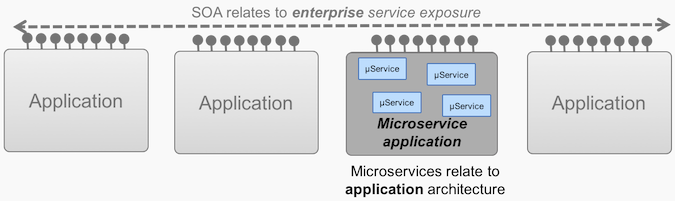

原文地址：

https://www.ibm.com/blogs/cloud-computing/2018/09/06/soa-versus-microservices/

# SOA与微服务：有什么区别？

如果您从事IT工作，您可能已经听说过SOA与微服务的争论。毕竟，如今，每个人都在谈论微服务和敏捷应用程序。

乍一看，这两种方法听起来非常相似。在某些方面，它们是。两者与传统的整体式体系结构的不同之处在于，每个服务都将承担自己的责任。两者都受益于一定程度的去耦。

主要区别在于范围。简而言之，面向服务的体系结构（SOA）具有企业范围，而微服务体系结构具有应用程序范围。

考虑到每个差异，这是一些非常基本的定义：

- 面向服务的体系结构（SOA）是一项企业范围的计划，旨在创建可重用的，同步可用的服务和API。这有助于开发人员更快，更轻松地创建应用程序，并整合其他系统的数据。

- 微服务架构是构建单个应用程序的一种选择，该方式可以使该应用程序更加敏捷，可扩展且更具弹性。

  

  

## 为什么这种差异很重要

当您忽略这种差异时，每种方法的许多核心原理都变得不兼容。如果您接受范围上的差异，您可能会很快意识到两者可以潜在地互补，而不是竞争。

以下是这种区别发挥作用的几种情况：

1. 重用。在SOA中，集成的重用是主要目标，并且在企业级别，争取达到某种程度的重用是必不可少的。在微服务架构中，创建在整个应用程序的运行时可重用的微服务组件会导致依赖性降低，从而降低敏捷性和弹性。微服务组件通常更喜欢通过复制来重用代码并接受数据重复以帮助改善去耦。
2. 同步呼叫。SOA中的可重用服务可使用主要的同步协议（例如RESTful API）在整个企业中使用。但是，在微服务应用程序中，同步调用会引入实时依赖性，从而导致弹性丧失。它还可能导致延迟，从而影响性能。在微服务应用程序中，首选基于异步通信的交互模式，例如事件源，其中使用发布订阅模型使微服务组件能够在另一个组件中发生数据更改时保持最新状态。
3. 数据重复。在SOA中提供服务的明确目标是使所有应用程序都可以从其主要源直接同步获取数据并进行更改，从而减少了维护复杂数据同步模式的需求。在微服务应用程序中，理想情况下，每个微服务都可以对其所需的所有数据进行本地访问，以确保其与其他微服务（甚至与其他应用程序）的独立性，即使这意味着在其他系统中存在某些重复数据。当然，这种重复会增加复杂性，因此必须在敏捷性和性能方面取得平衡，但这被认为是微服务设计的现实。

有人会指出，SOA与微服务的争论要复杂得多。没错还有很多。

有关这些细微差别的更详细的技术说明，您可能需要阅读这篇文章。它涉及更多细节。但是，从业务角度来看，范围是至关重要的区别。

有关这些细微差别的更详细的技术说明，您可能需要阅读这篇文章。它涉及更多细节。但是，从业务角度来看，范围是至关重要的区别。

要了解有关如何构建敏捷应用程序的更多信息，请下载免费的《敏捷应用程序体系结构》电子书。