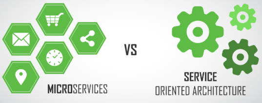
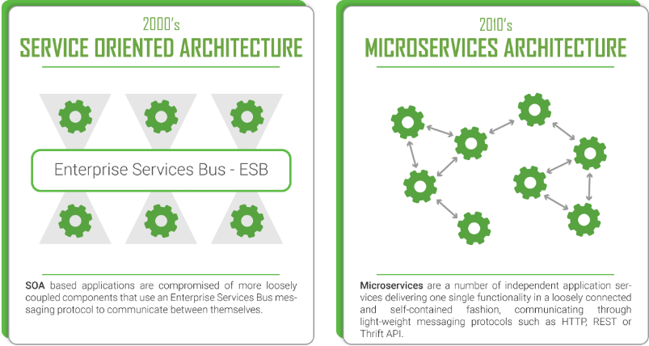

原文地址：https://dzone.com/articles/microservices-vs-soa-is-there-any-difference-at-al

# 微服务与SOA –根本有区别吗？

了解微服务和SOA架构之间的真正区别，它们的重点以及开发中最常用的用法。

最近，关于这两种类型的体系结构之间的差异，或者是否存在任何差异，大惊小怪。为了更深入地探讨引发数百场辩论的这个问题，我将首先简要定义SOA和微服务架构及其起源，然后我们将它们进行比较，并了解如何最好地区分它们。

## 面向服务的体系结构（SOA）

面向服务的体系结构是一种软件体系结构，其中应用程序的不同组件通过网络上的通信协议向其他组件提供服务。通信可以涉及简单的数据传递，也可以涉及两个或多个协调彼此之间连接服务的服务。这些独特的服务执行一些小功能，例如验证付款，创建用户帐户或提供社交登录。

面向服务的体系结构与如何使应用程序模块化无关，而与如何通过集成分布式，单独维护和部署的软件组件组成应用程序有关。它由技术和标准支持，使组件可以更轻松地通过网络（尤其是IP网络）进行通信和合作。

SOA中有两个主要角色：服务提供者和服务使用者。软件代理可以扮演两个角色。消费者层是用户（人员，应用程序的其他组件或第三方）与SOA进行交互的点，提供者层则由SOA中的所有服务组成。

SOA最初是在90年代中期开始的，当时一家名为Gartner Group的公司意识到了软件体系结构的这一新兴趋势，并将其采纳并在全球范围内推广。通过这样做，他们设法极大地加快了该体系结构模式的采用和进一步发展。但是，将分布式服务用作软件体系结构的最早记录可以追溯到80年代初。

## 微服务

从某种意义上说，微服务是面向服务的体系结构发展的下一步。基本上，这种体系结构类型是将软件，Web或移动应用程序开发为独立服务套件（也称为微服务）的一种特殊方式。创建这些服务仅是为了服务一个特定的业务功能，例如用户管理，用户角色，电子商务购物车，搜索引擎，社交媒体登录等。此外，它们彼此完全独立，这意味着可以将其编写为不同的编程语言和使用不同的数据库。集中式服务管理几乎不存在，微服务使用轻量级的HTTP，REST或Thrift API在彼此之间进行通信。

这个词本身源自2011年5月在威尼斯附近举行的软件架构师研讨会。他们首次使用“微服务”一词来描述参与者所看到的是他们中许多人最近探索的一种通用架构风格。2012年5月，同一小组决定将“微服务”作为最合适的名称。但是，微软，亚马逊，Netflix和Facebook等大型科技公司已经在微服务领域开展了十多年的合作。在提出通用名称之前，其他人将它们称为“微型Web服务”或“细粒度SOA”。

是的，乍一看，似乎我们在谈论与SOA相同的事情。但是，我将引用微服务领域的先驱Martin Flower的话，他曾经说过，我们应该将SOA视为微服务的超集。

## 所以，区别在哪里？

我们可以说两种体系结构的相似之处多于差异，但是，归根结底，它们是两种不同类型的体系结构。为了支持我的观点，首先，我将以表格的形式介绍体系结构的特定部分，以区分它们。稍后，我将详细介绍其中的一些。开始了！

| 面向服务的架构                           | 微服务架构                                 |
| ---------------------------------------- | ------------------------------------------ |
| 最大化应用程序服务的可重用性             | 专注于解耦                                 |
| 系统的改变需要修改整体                   | 系统的变化是创建新服务                     |
| DevOps和持续交付正在变得流行，但不是主流 | 专注于DevOps和持续交付                     |
| 专注于业务功能重用                       | 更加重视“有限背景”的概念                   |
| 为了进行通信，它使用企业服务总线（ESB）  | 对于通讯，使用不太复杂和简单的消息传递系统 |
| 支持多种消息协议                         | 使用轻量级协议，例如HTTP，REST或Thrift API |
| 对部署到该平台的所有服务使用通用平台     | 应用服务器并未真正使用，通常会使用云平台   |
| 容器（例如Docker）的使用不那么流行       | 容器与微服务配合得很好                     |
| SOA服务共享数据存储                      | 每个微服务可以具有独立的数据存储           |
| 共同治理和标准                           | 放松的治理，更加注重团队协作和选择自由     |

我将在上表中更详细地介绍一些方面，并进一步说明不同之处：

- 开发–在两种架构中，都可以使用不同的编程语言和工具来开发服务，这将技术多样性带入了开发团队。可以在多个团队中组织开发，但是在SOA中，每个团队都需要了解通用的通信机制。另一方面，使用微服务，这些服务可以独立于其他服务运行和部署。因此，更容易频繁地部署新版本的微服务或独立扩展服务。您可以在此处进一步了解微服务的这些好处。
- “边界上下文”-SOA鼓励共享组件，而微服务则尝试通过“边界上下文”最小化共享。有界上下文是指组件及其数据作为单个单元的耦合，具有最小的依赖性。由于SOA依靠多种服务来满足业务请求，因此基于SOA构建的系统可能比微服务要慢。
- 通信-在SOA中，ESB可能会成为影响整个系统的单点故障。由于每个服务都通过ESB进行通信，因此如果其中一项服务变慢，则可能会阻塞对该服务的请求，从而阻塞ESB。另一方面，微服务的容错性要好得多。例如，如果一个微服务发生内存故障，则仅会影响该微服务。所有其他微服务将继续定期处理请求。
- 互操作性-SOA通过其消息传递中间件组件促进多种异构协议的使用。微服务试图通过减少集成选择的数量来简化架构模式。因此，如果要在异构环境中使用不同协议集成多个系统，则需要考虑SOA。如果可以通过相同的远程访问协议访问所有服务，那么微服务将是您的更好选择。
- 大小-最后但并非最不重要的一点是，SOA和微服务之间的主要区别在于大小和范围。微服务中的前缀“微”是指内部组件的粒度，这意味着它们必须比SOA趋向要小得多。微服务中的服务组件通常只有一个目的，并且确实做到了这一点。另一方面，在SOA中，服务通常包含更多的业务功能，并且通常将它们实现为完整的子系统。

## 结论

一个人不能简单地说一种架构比另一种更好。它主要取决于您要构建的应用程序的目的。SOA更适合需要与许多其他应用程序集成的大型，复杂的企业应用程序环境。话虽这么说，较小的应用程序不需要SOA，因为它们不需要消息中间件。另一方面，微服务更适合于较小且分区合理的基于Web的系统。另外，如果您正在开发移动或Web应用程序，那么微服务将为您提供作为开发人员的更大控制权。最后，我们可以得出结论，由于它们具有不同的用途-微服务和SOA确实是不同类型的体系结构。