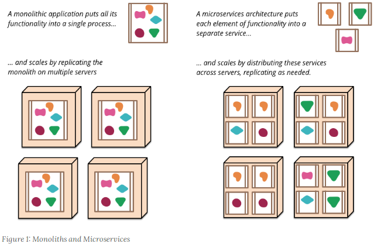
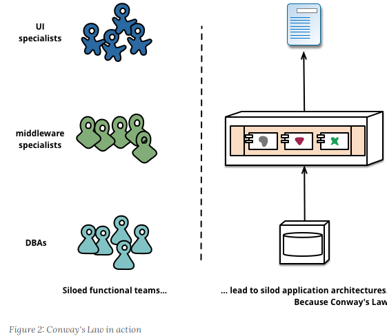
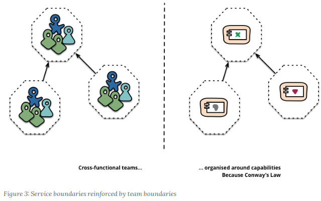
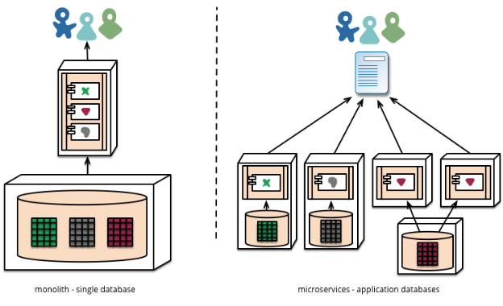
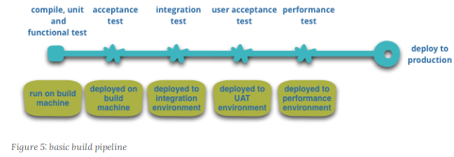
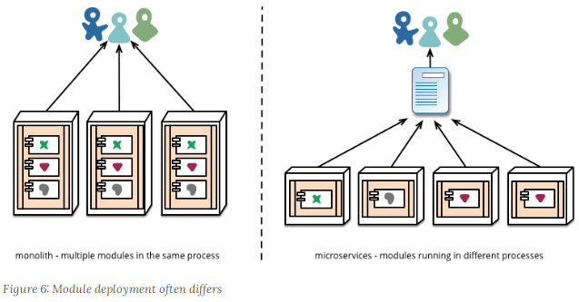

原文地址：https://www.martinfowler.com/articles/microservices.html

# 微服务

## 这个新的建筑术语的定义

在过去的几年中，出现了“微服务体系结构”一词，用于描述将软件应用程序设计为可独立部署的服务套件的特定方式。尽管没有对此架构风格的精确定义，但围绕业务能力，自动部署，端点中的智能以及对语言和数据的分散控制，组织周围存在某些共同特征。

“微服务”-在拥挤的软件体系结构大道上的又一个新名词。尽管我们的天性是轻蔑地掠过这些事物，但是这些术语描述了一种越来越受欢迎的软件系统样式。在过去的几年中，我们已经看到许多项目都使用这种样式，并且到目前为止，结果是积极的，以至于对于我们的许多同事来说，这已成为构建企业应用程序的默认样式。但是，令人遗憾的是，没有太多信息可以概括出微服务风格是什么以及如何做到这一点。

简而言之，微服务体系结构样式[1]是一种将单个应用程序开发为一组小服务的方法，每个小服务都在自己的进程中运行并与轻量级机制（通常是HTTP资源API）进行通信。这些服务围绕业务功能构建，并且可以由全自动部署机制独立部署。这些服务的集中管理几乎没有，可以用不同的编程语言编写并使用不同的数据存储技术。

要开始解释微服务样式，将其与整体式样式进行比较很有用：以单个单元构建的整体式应用程序。企业应用程序通常由三个主要部分构建：客户端用户界面（由在用户计算机上的浏览器中运行的HTML页面和javascript组成）和数据库（由许多插入到常用（通常是关系式）数据库管理中的表组成）系统）和服务器端应用程序。服务器端应用程序将处理HTTP请求，执行域逻辑，从数据库检索和更新数据，以及选择并填充要发送到浏览器的HTML视图。该服务器端应用程序是一个整体-一个逻辑可执行文件[2]。对系统的任何更改都涉及构建和部署新版本的服务器端应用程序。

这种整体服务器是构建此类系统的自然方法。您处理请求的所有逻辑都在单个过程中运行，从而使您可以使用语言的基本功能将应用程序划分为类，函数和名称空间。一定要小心，您可以在开发人员的便携式计算机上运行和测试应用程序，并使用部署管道来确保正确测试了更改并将其部署到生产中。您可以通过在负载均衡器后面运行许多实例来水平缩放整体

整体应用程序可以成功，但是越来越多的人对它们感到沮丧，尤其是随着越来越多的应用程序部署到云中。变更周期捆绑在一起-对应用程序的一小部分进行更改，需要重建和部署整个整体。随着时间的流逝，通常很难保持良好的模块化结构，这使得很难保留只影响该模块中一个模块的更改。扩展要求扩展整个应用程序，而不是需要更多资源的部分应用程序。

这些挫败感导致了微服务架构的风格：将应用程序构建为服务套件。除了服务可独立部署和可扩展之外，每个服务还提供了牢固的模块边界，甚至允许使用不同的编程语言编写不同的服务。他们也可以由不同的团队来管理。

我们并不声称微服务风格是新颖的或创新的，其根源至少可以追溯到Unix的设计原理。但是我们确实认为，没有足够的人考虑使用微服务架构，并且如果使用微服务架构，那么许多软件开发会更好。

## 微服务架构的特征

我们不能说对微服务架构风格有一个正式的定义，但是我们可以尝试描述我们认为符合标签的架构的共同特征。与任何概述通用特征的定义一样，并非所有微服务架构都具有所有特征，但是我们确实希望大多数微服务架构都具有大多数特征。虽然我们的作者一直是这个相当松散的社区的活跃成员，但我们的意图是尝试描述我们在自己的工作以及我们所认识的团队的类似努力中所看到的。特别是，我们没有规定要符合的定义。

### 通过服务进行组件化

自从我们从事软件行业以来，就一直希望通过将组件连接在一起来构建系统，这与我们在物理世界中看到事物的方式非常相似。在过去的几十年中，我们看到了在大多数语言平台中都包含的大型公共库概要中取得了长足的进步。

在谈论组件时，我们会遇到难以定义组件的定义。我们的定义是，组件是可以独立替换和升级的软件单元。

微服务架构将使用库，但是它们将自己的软件组成组件的主要方式是分解成服务。我们将库定义为链接到程序中并使用内存中函数调用进行调用的组件，而服务是进程外组件，它们通过某种机制（例如Web服务请求或远程过程调用）进行通信。（这与许多OO程序中的服务对象的概念不同[3]。）

使用服务作为组件（而不是库）的主要原因之一是服务是可独立部署的。如果您的应用程序[4]在单个过程中包含多个库，则对任何单个组件的更改都将导致必须重新部署整个应用程序。但是，如果该应用程序分解为多个服务，则可以预期许多单个服务的更改仅要求重新部署该服务。这不是绝对的，某些更改会更改服务接口，从而导致某种程度的协调，但是好的微服务架构的目标是通过服务契约的内聚性服务边界和演化机制来最大程度地减少这些影响。

将服务用作组件的另一个结果是更明确的组件接口。大多数语言都没有定义明确的发布接口的良好机制。通常，唯一的文档和（约束）纪律可以防止客户端破坏组件的封装，从而导致组件之间的耦合过于紧密。服务通过使用显式的远程调用机制使避免这种情况变得更加容易。

使用这样的服务确实有缺点。远程调用比进程内调用更昂贵，因此远程API需要更粗粒度，这通常更难使用。如果您需要更改组件之间的职责分配，那么当您跨越流程边界时，这种行为转移就很难做到。

初步近似，我们可以观察到服务映射到运行时进程，但这仅是初步近似。服务可能包含将始终一起开发和部署的多个流程，例如仅由该服务使用的应用程序流程和数据库。

### 围绕业务能力进行组织

当希望将大型应用程序拆分为多个部分时，管理层通常将重点放在技术层，从而导致UI团队，服务器端逻辑团队和数据库团队。当团队按这些方向分开时，即使简单的更改也可能导致跨团队项目需要时间和预算批准。一个精明的团队将围绕此问题进行优化，并减少两种弊端中的较小者-只需将逻辑强加到他们可以访问的任何应用程序中即可。换句话说，逻辑无处不在。这是康威定律[5]发挥作用的一个例子。

设计系统（广泛定义）的任何组织都将产生其结构是组织通信结构副本的设计。梅尔文·康威（Melvyn Conway），1967年

微服务划分方法不同，分为围绕业务能力组织的服务。此类服务针对该业务领域采用了软件的广泛实施，包括用户界面，持久性存储和任何外部协作。因此，团队是跨职能的，包括开发所需的全部技能：用户体验，数据库和项目管理。

以这种方式组织的一家公司是www.comparethemarket.com。跨职能团队负责构建和操作每个产品，每个产品分为多个通过消息总线进行通信的单独服务。

大型单片应用程序也始终可以围绕业务功能进行模块化，尽管这种情况并不常见。当然，我们会敦促组成一个整体应用程序的大型团队按照业务范围划分自己。我们在这里看到的主要问题是，它们往往是围绕太多上下文进行组织的。如果整体跨越了这些模块化边界中的许多边界，那么团队中的各个成员可能很难将其放入他们的短期记忆中。另外，我们看到模块化的生产线需要大量的(约束)纪律来实施。服务组件所需的必要的，更明确的分隔使得更容易保持团队界限。

#### 微服务有多大？

尽管“微服务”已成为这种体系结构样式的流行名称，但不幸的是，它的名称确实引起了人们对服务规模的关注，并引发了关于“微”的构成的争论。在与微服务从业者的对话中，我们看到了各种规模的服务。报告的最大尺寸遵循亚马逊的两个比萨饼团队的概念（即整个团队可以吃两个比萨饼），这意味着最多可以容纳十二个人。在较小的规模上，我们已经看到了一组六个支持一组六个服务的设置。

这就引发了一个问题，即在此大小范围内是否存在足够大的差异，以致每六个人的服务大小和每个人的服务大小不应该被归入一个微服务标签之下。目前，我们认为最好将它们组合在一起，但是随着我们进一步探索这种风格，我们肯定会改变主意。

### 产品不是项目

我们看到的大多数应用程序开发工作都使用项目模型：目的是交付某些软件，然后将其视为已完成。完成后，将软件移交给维护组织，并解散构建该软件的项目团队。

微服务的支持者倾向于避免这种模式，而是倾向于团队应该在产品的整个生命周期内拥有产品的想法。这样做的一个共同灵感是亚马逊的“构建，运行”概念，其中开发团队对生产中的软件负全部责任。这使开发人员可以日常接触其软件在生产中的行为方式，并增加与用户的接触，因为他们必须承担至少一些支持负担。

产品的心态与业务能力的联系紧密相关。与其将软件视为要完成的功能集，不如说存在着一种持续的关系，即问题是软件如何帮助其用户增强业务能力。

没有理由不能在整体应用程序中采用相同的方法，但是较小的服务粒度可以使在服务开发人员与其用户之间建立个人关系变得更加容易。

### 智能端点和哑管道

在不同流程之间建立通信结构时，我们已经看到了许多产品和方法，这些产品和方法强调在通信机制本身中投入大量智慧。一个很好的例子就是企业服务总线（ESB），其中，ESB产品通常包括用于消息路由，编排，转换和应用业务规则的复杂工具。

微服务社区赞成一种替代方法：智能端点和哑管道。从微服务构建的应用程序旨在尽可能地分离和具有凝聚力-它们拥有自己的域逻辑，并在传统的Unix意义上充当过滤器-接收请求，适当地应用逻辑并产生响应。使用简单的RESTish协议而不是诸如WS-Choreography或BPEL之类的复杂协议或通过中央工具进行编排来对这些文件进行编排。

最常用的两种协议是带有资源API的HTTP请求响应和轻量级消息传递[8]。第一个的 |最好表达是在网络上，而不是在网络后面-伊恩·罗宾逊（Ian Robinson）  | 微服务团队使用建立在万维网（很大程度上是Unix）上的原理和协议。通常，开发人员或操作人员只需很少的精力就可以缓存使用过的资源。

常用的第二种方法是通过轻量级消息总线进行消息传递。所选的基础结构通常是哑巴的（哑巴仅用作消息路由器）-简单的实现（例如RabbitMQ或ZeroMQ）除了提供可靠的异步结构外，所做的工作不多-智能终端仍然存在于生产和销售端点消费信息；在服务中。

在整体中，组件在进程中执行，并且它们之间的通信是通过方法调用或函数调用进行的。将整体式服务转换为微服务的最大问题在于更改通信模式。从内存中方法调用到RPC的幼稚转换会导致健谈的通信，效果不佳。相反，您需要使用更粗略的方法来替换细粒度的通信。

#### Microservices and SOA

当我们谈论微服务时，一个常见的问题是这是否只是我们十年前看到的面向服务的体系结构（SOA）。这是有好处的，因为微服务风格与某些SOA倡导者所支持的风格非常相似。但是，问题在于SOA意味着太多不同的东西，而且在大多数情况下，我们遇到一种称为“ SOA”的东西，这与我们在此描述的样式有很大不同，通常是由于着眼于过去用于ESB的原因。集成单片应用程序。

特别是，我们已经看到了许多面向服务的拙劣实现，从倾向于将复杂性隐藏在ESB的[6]中，到失败的多年计划，这些计划花费了数百万美元且没有任何价值，而到了集中化的治理模型，这些模型主动抑制了变化，有时很难看清这些问题

当然，微服务社区中使用的许多技术都是从开发人员在大型组织中集成服务的经验中获得的。宽容读者模式就是一个例子。使用网络的努力有所贡献，使用简单的协议是从这些经验中获得的另一种方法-坦率地说，这种偏离中央标准的反应已经达到了复杂性。（每当您需要一个本体来管理您的本体时，您就知道自己陷入了严重的麻烦。）

SOA的这种普遍表现导致一些微服务倡导者完全拒绝了SOA标签，尽管其他人认为微服务是SOA的一种形式[7]，也许面向服务是正确的。无论哪种方式，SOA意味着如此不同的事实这一事实意味着拥有一个术语可以更清晰地定义这种体系结构样式是很有价值的。

### 分散治理

集中治理的后果之一是倾向于在单一技术平台上实现标准化。经验表明，这种方法是束手无策的-不是每个问题都是钉子，也不是每个解决方案都是锤子。我们更喜欢使用正确的工具来完成工作，而整体式应用程序可以在一定程度上利用不同的语言，但这并不常见。

将整体组件拆分为服务时，我们在构建每个组件时都可以选择。您想使用Node.js站起来一个简单的报告页面吗？去吧。C ++是否适合用于特别粗糙的近实时组件？精细。您想交换一种更适合某个组件的读取行为的数据库类型吗？我们拥有重建他的技术。

当然，仅仅因为您可以做某事，并不意味着您应该-而是以这种方式对系统进行分区意味着您可以选择。

构建微服务的团队也更喜欢采用不同的标准方法。他们宁愿使用一种有用的工具，即其他开发人员可以用来解决与他们所面临的问题类似的问题的工具，而不是使用书面记录在纸上某个地方的一组定义的标准。这些工具通常是从实现中获取的，有时与更广泛的群体共享，但并非唯一地使用内部开源模型。既然git和github已经成为事实上的版本控制系统的选择，内部内部的开放源代码实践变得越来越普遍

Netflix是遵循这种理念的组织的一个很好的例子。共享有用的，最重要的是，经过试验验证的代码，因为库鼓励其他开发人员以类似的方式解决类似的问题，但仍为选择其他方法（如果需要）敞开了大门。共享库往往专注于数据存储，进程间通信以及我们在下面进一步讨论的基础架构自动化等常见问题。

对于微服务社区而言，开销尤其没有吸引力。这并不是说社区不重视服务合同。相反，因为它们往往更多。只是他们正在寻找管理这些合同的不同方法。诸如“容忍读者”和“消费者驱动的合同”之类的模式通常应用于微服务。这些援助服务合同是独立发展的。在构建过程中执行以消费者为导向的合同可以增强信心，并提供有关服务是否正常运行的快速反馈。的确，我们知道在澳大利亚有一个团队，该团队以消费者驱动的合同推动新服务的构建。他们使用简单的工具来定义服务合同。在为新服务编写代码之前，这已成为自动化构建的一部分。然后，仅将服务构建到满足合同要求的程度，这是一种避免在构建新软件时出现“ YAGNI” [9]困境的优雅方法。这些技术及其周围发展起来的工具通过减少服务之间的时间耦合来限制对中央合同管理的需求。

分散式治理的最高点也许是亚马逊推广的构建/运行精神。团队负责他们构建的软件的各个方面，包括24/7全天候运行的软件。这种责任级别的下放绝对不是常态，但我们确实看到越来越多的公司将责任推向开发团队。Netflix是采用这种精神[11]的另一个组织。您的寻呼机每天晚上3点醒来，肯定是在编写代码时专注于质量的强大动力。这些想法尽可能远离传统的集中式治理模型。

#### 多种语言，多种选择

JVM作为平台的增长只是在通用平台内混合语言的最新示例。几十年来，使用高级语言进行剥壳是一种常见的做法。顺便说一句，并在较低级别中编写对性能敏感的代码。但是，许多巨石都不需要这种性能优化级别，也不需要DSL和更高级别的抽象（这让我们感到沮丧）。相反，整体语言通常是单一语言，趋势是限制使用的技术数量[10]。

### 分散数据管理

数据管理的分散化以多种不同的方式呈现。从最抽象的角度讲，这意味着系统的世界概念模型将有所不同。在大型企业中进行集成时，这是一个常见问题，客户的销售视图将与支持视图不同。在销售视图中被称为客户的某些内容可能根本不会出现在支持视图中。那些具有相同属性的属性可能具有不同的属性，并且（更差的）公共属性具有不同的语义。

此问题在应用程序之间很常见，但也可能在应用程序内发生，特别是当该应用程序划分为单独的组件时。对此进行思考的一种有用方法是“边界上下文的域驱动设计”概念。DDD将复杂域划分为多个有界上下文，并映射出它们之间的关系。此过程对于单片和微服务体系结构都是有用的，但是服务和上下文边界之间存在自然的联系，这有助于弄清这一点，并且正如我们在业务功能部分所描述的那样，这加强了分离。

除了分散有关概念模型的决策外，微服务还分散了数据存储决策。整体应用程序倾向于使用单个逻辑数据库来存储持久性数据，而企业通常更喜欢跨多个应用程序使用单个数据库-这些决定中的许多决定是由供应商围绕许可的商业模型决定的。微服务更喜欢让每个服务管理自己的数据库，或者使用相同数据库技术的不同实例，或者完全不同的数据库系统-一种称为Polyglot Persistence的方法。您可以在整体中使用多语种持久性，但是在微服务中它会更频繁地出现。

#### 经过战斗测试的标准和强制执行的标准

微服务团队倾向于避开企业体系结构组制定的那种严格的强制性标准，但是却乐于使用甚至宣传使用开放式标准（例如HTTP，ATOM和其他微格式），这有点矛盾。

关键区别在于标准的制定方式和实施方式。由IETF等组织管理的标准只有在更广泛的世界中有几种实时实施时才成为标准，并且通常源于成功的开源项目。

这些标准与企业世界中的许多世界是一个不同的世界，这些世界通常是由近期编程经验很少或受供应商影响过大的团队开发的。

将跨微服务的数据责任分散到管理更新的含义中。处理更新的常见方法是使用事务来确保更新多个资源时的一致性。这种方法通常在整料中使用。

使用这样的事务有助于保持一致性，但会带来明显的时间耦合，这在多个服务之间是有问题的。众所周知，分布式事务难以实现，因此，微服务体系结构强调服务之间的无事务协调，并明确认识到一致性可能只是最终的一致性，而问题只能通过补偿操作来解决。

对于许多开发团队来说，以这种方式选择管理不一致性是一个新的挑战，但这是通常与业务实践相匹配的挑战。企业通常会处理一定程度的不一致以快速响应需求，同时具有某种逆转流程来处理错误。只要在更大的一致性下解决错误的成本小于失去业务的成本，就可以进行权衡。

### 基础设施自动化

基础设施自动化技术在过去几年中发生了巨大的发展，尤其是云技术和AWS的发展降低了构建，部署和运行微服务的操作复杂性。

微服务正在构建的许多产品或系统，都是由具有持续交付及其先驱持续集成经验的团队构建的。以这种方式构建软件的团队广泛使用基础架构自动化技术。如下所示的构建管道中对此进行了说明。

由于这不是有关持续交付的文章，因此我们在这里仅关注几个关键功能。我们希望尽可能地放心我们的软件正在运行，因此我们运行许多自动化测试。升级工作软件的渠道意味着我们可以自动部署到每个新环境。

可以很轻松地在这些环境中构建，测试并推动一个整体应用程序。事实证明，一旦您为自动化整体生产进行了投资，然后部署更多的应用程序就不再那么令人恐惧了。请记住，CD的目的之一是使部署变得无聊，因此，只要它仍然无聊，它的一个或三个应用程序就无关紧要[12]。

我们看到团队使用广泛的基础架构自动化的另一个领域是在生产中管理微服务。与我们上面的断言相反，只要部署很无聊，整体和微服务之间就不会有太大的区别，每种服务的运营前景可能会截然不同。

#### 轻松做正确的事

我们发现，由于持续交付和部署而导致自动化程度提高的一个副作用是，创建了有用的工具来帮助开发人员和操作人员。现在，用于创建人工制品，管理代码库，建立简单服务或添加标准监视和日志记录的工具非常普遍。网络上最好的例子可能是Netflix的开源工具集，但是还有其他一些工具，包括我们广泛使用的Dropwizard。

### 失败的设计

使用服务作为组件的结果是，需要对应用程序进行设计，以便它们可以容忍服务故障。由于供应商不可用，任何服务呼叫都可能失败，客户必须尽可能优雅地对此做出响应。与单片设计相比，这是一个缺点，因为它引入了额外的处理复杂性。结果是微服务团队不断反思服务故障如何影响用户体验。Netflix的Simian Army在工作日内导致服务甚至数据中心出现故障，以测试应用程序的弹性和监控能力

这种在生产中的自动测试足以使大多数操作小组通常在下班前感到不寒而栗。这并不是说整体式的建筑风格无法实现复杂的监控设置-在我们的经验中这并不常见。

由于服务随时可能发生故障，因此重要的是能够迅速检测到故障，并在可能的情况下自动恢复服务。微服务应用程序非常注重应用程序的实时监控，同时检查体系结构元素（数据库每秒收到多少请求）和业务相关指标（例如每分钟收到多少订单）。语义监视可以为发生错误的情况提供预警系统，从而触发开发团队进行跟进和调查。

#### 断路器和生产就绪代码

断路器出现在Release It中！以及“隔板”和“超时”等其他模式。这些模式一起实现，在构建通信应用程序时至关重要。Netflix博客文章在解释它们的应用方面做得非常好。

这对于微服务架构特别重要，因为微服务偏爱编排和事件协作会导致紧急行为。尽管许多专家都赞扬意外出现的价值，但事实是，突然出现的行为有时可能是一件坏事。监视对于迅速发现不良紧急行为至关重要，因此可以对其进行修复。

整体组件可以像微服务一样透明地构建-实际上，它们应该如此。不同之处在于，您绝对需要知道在不同进程中运行的服务何时断开连接。对于在同一过程中的库，这种透明度不太可能有用。

微服务团队希望看到每项服务的复杂监视和日志记录设置，例如显示上/下状态的仪表板以及各种与业务和业务相关的指标。关于断路器状态，当前吞吐量和等待时间的详细信息是我们在野外经常遇到的其他示例。

#### 同步呼叫被认为是有害的

每当您在服务之间进行大量同步调用时，都会遇到停机带来的成倍影响。简单来说，这就是系统的停机时间成为各个组件的停机时间的产物。您面临一个选择，使您的呼叫异步或管理停机时间。在www.guardian.co.uk上，他们在新平台上实施了一条简单规则-每个用户请求一个同步调用，而在Netflix，他们的平台API重新设计已将异步性内置到API结构中。

### 进化设计

微服务从业人员通常来自进化设计的背景，并将服务分解视为进一步的工具，使应用程序开发人员能够控制其应用程序中的更改而不会减慢更改速度。变更控制并不一定意味着减少变更-使用正确的态度和工具，您可以对软件进行频繁，快速且控制良好的变更

每当您尝试将软件系统分解为组件时，您都会面临如何分割各个部分的决定-我们决定对应用程序进行分割的原则是什么？组件的关键特性是独立替换和可升级性的概念[13]-这意味着我们寻找可以想象重写组件而不影响其协作者的观点。实际上，许多微服务组通过明确期望许多服务将被废弃而不是长期发展而将其进一步发展。

Guardian网站是一个应用程序的一个很好的例子，该应用程序是作为整体设计和构建的，但是已经朝着微服务的方向发展。整体仍然是网站的核心，但是他们更喜欢通过构建使用整体API的微服务来添加新功能。对于固有的临时功能（例如处理体育赛事的专用页面），此方法特别方便。可以使用快速开发语言将网站的此类部分快速组合在一起，并在活动结束后将其删除。我们已经在一家金融机构中看到了类似的方法，在这种方法中，为市场机会添加了新服务，并在几个月甚至几周后将其丢弃。

这种对可替换性的强调是模块化设计的更一般性原理的特例，该原理通过变化的模式来驱动模块化[14]。您想在同一模块中同时保留更改的内容。系统中很少变化的部分应该与当前正在大量流失的部分提供不同的服务。如果您发现自己反复将两个服务一起更改，则表明它们应该合并。

将组件放入服务中将为更详细的发布计划提供机会。对于整体，任何更改都需要完整构建和部署整个应用程序。但是，使用微服务时，您只需要重新部署您修改的服务即可。这样可以简化并加快发布过程。缺点是您必须担心一项服务的更改会破坏其用户。传统的集成方法是尝试使用版本控制来解决此问题，但是微服务领域的首选是仅将版本控制作为最后的手段。通过设计服务以尽可能容忍其供应商的变更，我们可以避免很多版本控制。

## 微服务是未来吗？

我们撰写本文的主要目的是解释微服务的主要思想和原理。通过花时间来做到这一点，我们清楚地认为微服务体系结构风格是一个重要的想法-对于企业应用程序，应该认真考虑一下。我们最近使用该样式构建了多个系统，并认识了其他使用并喜欢这种方法的系统。

我们所知道的以某种方式引领建筑风格的人包括亚马逊，Netflix，卫报，英国政府数字服务，realestate.com.au，Forward和comparethemarket.com。在2013年的会议上，到处都有很多公司正在迁移到可归类为微服务的公司的例子-包括Travis CI。此外，许多组织长期以来一直在做我们称之为微服务的事情，但却从未使用过这个名称。（通常将其标记为SOA-尽管正如我们所说的，SOA有许多相互矛盾的形式。[15]）

尽管有这些积极的经验，但是，我们并没有争论我们可以确定微服务是软件体系结构的未来方向。尽管到目前为止，与单片应用程序相比，我们的经验是积极的，但我们意识到，没有足够的时间来进行全面的判断。

通常，您做出体系结构决策的真正后果只有在您做出决策后的几年才会显现出来。我们已经看到了一个项目，在这个项目中，一个对模块化有强烈需求的优秀团队已经建立了一个整体架构，并且多年来一直在衰落。许多人认为，由于服务边界是明确的并且很难修补，因此微服务不太可能出现这种衰减。但是，直到我们看到足够的系统和足够的使用期限，我们才能真正评估微服务架构的成熟程度。

人们肯定会期望微服务成熟度很差，这是有原因的。在进行组件化的任何努力中，成功都取决于软件适合组件的程度。很难准确地确定组件边界应位于何处。进化设计认识到正确设置边界的困难，因此易于重构它们的重要性。但是，当您的组件是具有远程通信的服务时，则重构要比进程内库困难得多。跨服务边界移动代码很困难，参与者之间的任何接口更改都需要协调，需要向后兼容，并且测试变得更加复杂。

另一个问题是，如果组件组成不清晰，那么您要做的就是将复杂性从组件内部转移到组件之间的连接。这不仅可以解决复杂性问题，还可以将其转移到不太明确且难以控制的地方。当您查看一个小的，简单的组件的内部而又缺少服务之间的混乱连接时，很容易想到事情会更好。

最后，还有团队合作能力的因素。技能更强的团队倾向于采用新技术。但是，对于技能娴熟的团队来说，更有效的技术并不一定适用于技能娴熟的团队。我们已经看到了很多情况，即缺乏熟练的团队来构建凌乱的整体架构，但是花些时间来看看当微服务发生这种混乱时会发生什么。一个糟糕的团队总是会创建一个糟糕的系统-在这种情况下，很难说微服务是减少混乱还是使其变得更糟。

我们听到的一个合理的论据是，您不应该从微服务架构开始。取而代之的是从整体开始，使其保持模块化，并在整体出现问题后将其拆分为微服务。（尽管此建议并不理想，因为良好的进程内接口通常不是良好的服务接口。）

因此，我们对此持谨慎乐观的态度。到目前为止，我们已经对微服务风格有足够的了解，认为这可能是一条值得走的路。我们无法确定最终的结果，但是软件开发的挑战之一是只能根据当前必须掌握的不完善信息来做出决策。