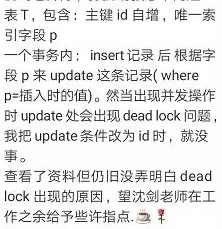
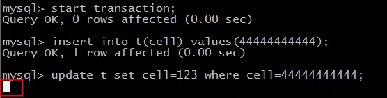
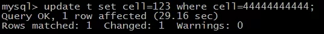
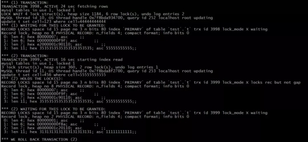
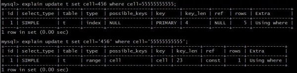
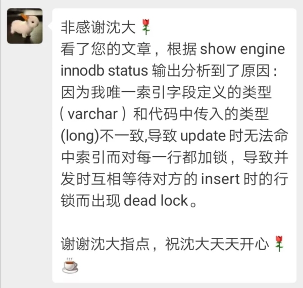

转载地址：https://zhuanlan.51cto.com/art/201907/599390.htm

原文标题：两个小工具，MySQL死锁分析，新技能又Get



同一个表，事务内先插入一条记录，再更新这条记录，并发时会死锁。

[](https://s4.51cto.com/oss/201907/11/58d8877a878b36429f754361bf0dbfd1.jpg)

并且能够复现。

可以通过什么工具模拟并发事务，查看信息，解决问题呢?这是今天要分享的内容。

**一、前置准备**

```mysql
set session transaction isolation level repeatable read; 
set session autocommit=0;  
create table t ( id int(20) primary key AUTO_INCREMENT, cell varchar(20) unique )engine=innodb;   start transaction; insert into t(cell) values(11111111111); insert into t(cell) values(22222222222); insert into t(cell) values(33333333333); commit; 
```

说明：

- 案发时，事务隔离级别RR;
- 多终端实验，需要关闭事务自动提交;
- 建表，设置PK与unique，初始化数据;

**二、并发事务模拟**

```
Session A： start transaction; insert into t(cell)values(44444444444);  [1]         Session B：         start transaction;         insert into t(cell) values(55555555555); [2] update t set cell=123 where cell=44444444444; [3]            update t set cell=456 where cell=55555555555; [4] 
```

开启两个终端模拟并发事务：

- 红色SQL为事务A;
- 黑色SQL为事务B;
- [1][2][3][4]为执行时序;

**三、实验现象**

```
insert into t(cell)values(44444444444);  [1] 
```

事务A插入数据，***执行

结果：插入成功

```
insert into t(cell) values(55555555555); [2] 
```

事务B插入数据，第二执行

结果：插入成果

```
update t set cell=123 where cell=44444444444; [3] 
```

事务A修改[1]中插入的数据，第三执行

结果：阻塞，等待执行结果

[](https://s2.51cto.com/oss/201907/11/06271342f9d9ef1f22df57fe1e506533.jpg)

画外音：修改一条自己插入的数据，在等待什么呢?

```
update t set cell=456 where cell=55555555555; [4] 
```

事务B修改[2]中插入的数据，***执行

结果：

- 事务B死锁，事务B被回滚;
- [](https://s4.51cto.com/oss/201907/11/58d3ad5f9553f22a6a42d5665c4909f6.jpg-wh_600x-s_3227839554.jpg)

- 事务A中，[3]语句阻塞结束，执行成功;
- [](https://s2.51cto.com/oss/201907/11/10d6e49b3f63c2515a8cd486b7d80c18.jpg)

画外音：说明事务A中阻塞的语句，确实在等事务B中的某个锁。

**四、结果分析**

两个事务，各自修改自己插入的数据，却产生了死锁，确实诡异。

上述实验现象的两个核心问题是：

- 语句[3]阻塞，在等待什么锁?
- 语句[4]死锁，此时事务A和事务B一定是彼此占住一把锁，请求彼此的锁，这些锁又是什么呢?

工具一：

```
show engine innodb status; 
```

执行之后，显示的内容如下(放大仔细看)：

[](https://s5.51cto.com/oss/201907/11/59803ac87afaf47aa4bc3a5c5eb48b1b.jpg-wh_600x-s_2998640760.jpg)

信息很多，别急，楼主娓娓道来。

***部分，关键词是：

- Transaction 1，事务3998;
- 在执行
- ```
  update t set cell=123 where cell=44444444444; 
  ```

- 正在等待锁释放(waiting for this lock to be granted)，记录锁(record locks)，主键索引上(index primary)，互斥锁(lock_mode X)，物理记录(physical record)，asc 55555555555;

画外音：英文比较差没事，抓关键词。

画外音，InnoDB存储引擎，聚集索引与非聚集索引的实现方式，决定了锁会加在聚集索引上，详见文章：

《[1分钟了解MyISAM与InnoDB的索引差异](http://database.51cto.com/art/201808/582172.htm)》。

第二部分，关键词是：

- Transaction 2，事务3999;
- 正在执行
- ```
  update t set cell=456 where cell=55555555555; 
  ```

- 持有锁(holds the lock)，记录锁(record locks)，主键索引上(index primary)，互斥锁(lock_mode X)，物理记录(physical record)，asc 55555555555;
- 正在等待锁释放(waiting for this lock to be granted)，记录锁(record locks)，主键索引上(index primary)，互斥锁(lock_mode X)，物理记录(physical record)，asc 11111111111;
- 事务2回滚(we roll back transaction 2);

通过show engine innodb status; 能够看到很多事务与锁之间的信息，对分析问题十分有帮助，这些信息，能够解释一些问题，但仍有两个疑惑：

(1)事务1为啥想拿55555555555的锁?

画外音：这正是，事务1被阻塞的原因。

(2)事务2为啥想拿11111111111的锁?死锁的发生，说明事务1此时真占着11111111111的锁，这又是为什么呢?

画外音：***个事务占111抢555，第二个事务占555抢111，循环嵌套，才会死锁。

**工具二：**

```
explain 
```

为了进一步寻找原因，可以通过explain看下导致死锁语句的执行计划。

```
explain update t set cell=456 where cell=55555555555; 
```



(1) select_type：SIMPLE

这是一个简单类型的SQL语句，不含子查询或者UNION。

(2) type：index

访问类型，即找到所需数据使用的遍历方式，潜在的方式有：

- ALL(Full Table Scan)：全表扫描;
- index：走索引的全表扫描;
- range：***where子句的范围索引扫描;
- ref/eq_ref：非唯一索引/唯一索引单值扫描;
- const/system：常量扫描;
- NULL：不用访问表;

上述扫描方式，ALL最慢，逐步变快，NULL最快。

怀疑点1：明明cell字段有uniq索引，为何要进行走PK索引的全表扫描呢?

(3) possible_keys：NULL

可能在哪个索引找到记录。

(4) key：PRIMARY

实际使用索引。

画外音：使用PK进行的全表扫描。

(5) ref：NULL

哪些列，或者常量用于查找索引上的值。

怀疑点2：where条件中的查询条件55555555555，本来应该作为在索引上被检索的值呀?

(6) rows：5

找到所需记录，预估需要读取的行数。

怀疑点3：明明修改的是5，为何初始化的1，2，3，以及***个事务插入的4，以及第二个事务插入的5，都要被读取呢?不应该全表扫描呀。

通过explain，基本已经可以判断：

```
update t set cell=456 where cell=55555555555; 
```

并没有和我们预想一样，走cell索引进行查询，而是走了PK索引进行了全表扫描。

再仔细一看：

```mysql
create table t ( id int(20) primary key AUTO_INCREMENT, cell varchar(20) unique )engine=innodb; 
```

建表的时候cell定义的是字符串类型。

而更新的时候，

```
update t set cell=456 where cell=55555555555; 
```

使用的是整数类型。

类型转换，会导致全表扫描，出现锁升级，锁住全部记录。

加上引号，再次通过explain验证一下：

```
explain update t set cell= '456 ' where cell= '55555555555 '; 
```

[](https://s4.51cto.com/oss/201907/11/3256cbda10cc1166a070385ef19c9e86.jpg-wh_600x-s_1449781760.jpg)

果然印证了猜想：

- type：range，变为了走索引的字符串比对，范围扫描;
- possible_keys：cell，通过cell索引找到了记录;
- key：cell，实际使用cell索引;
- ref：const，使用了常量' 555'进行比对;
- rows：1，预估读取行数是1;

这下全部可以解释了。

[](https://s2.51cto.com/oss/201907/11/f02338ccc131f86075e0b1070e34ccb4.jpg-wh_600x-s_1534540077.jpg)

**总结**

就本例而言：需要注意字符串与整数之间的强制类型转换，有时候少一个引号，就会使得行锁升级为表锁。

死锁是MySQL中非常难调试的问题，常见的思路与方法有：

- 通过多终端模拟并发事务，复现死锁;
- 通过show engine innodb status; 可以查看事务与锁的信息;
- 通过explain可以查看执行计划;

思路比结论更重要，希望大家有收获。