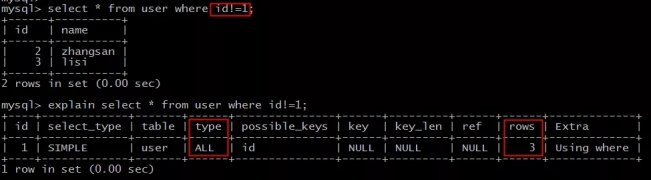
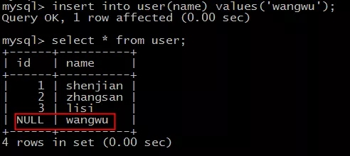
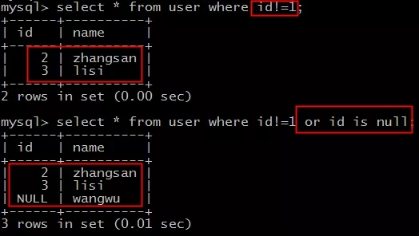
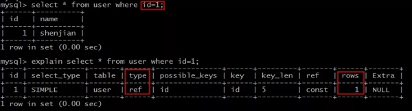
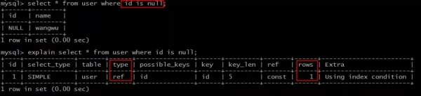

原文地址：https://zhuanlan.51cto.com/art/201907/599075.htm

原文标题：数据库允许空值(null)，往往是悲剧的开始（1分钟系列）

数据准备：

```
create table user ( id int, name varchar(20), index(id) )engine=innodb;   insert into user values(1,'shenjian'); insert into user values(2,'zhangsan'); insert into user values(3,'lisi'); 
```

说明：id为索引，非唯一(non unique)，允许空(null)。

**知识点1(热身)：负向查询不能命中索引，会导致全表扫描。**

[](https://s2.51cto.com/oss/201907/05/a88472fe9132ba1ee5a109c590eb453b.jpg-wh_651x-s_2685916222.jpg)

```
explain select * from user where id!=1; 
```

索引字段id上的不等于查询，如上图所示：

- type=ALL，全表扫描;
- rows=3，全表只有3行;

**知识点2(划重点)：允许空值，不等于(!=)查询，可能导致不符合预期的结果。**

[](https://s5.51cto.com/oss/201907/05/c4ee9e083d43ecab21699255940517cf.jpg)

```
insert into user(name) values('wangwu'); 
```

先构造一条id为NULL的数据，可以看到共有4条记录。

```
select * from user where id!=1; 
```

再次执行不等于查询。

你猜结果集有几条记录(共4条，不等于排除1条)?

答错了!

结果集只有2条记录，空值记录记录并未出现在结果集里。

[](https://s2.51cto.com/oss/201907/05/47aaa5be83961e85e573c3555550c15c.jpg)

```
select * from user where id!=1 or id is null; 
```

如果想到得到符合预期的结果集，必须加上一个or条件。

画外音：恶心不恶心，这个大坑你踩过没有?

**知识点3(附加)：某些or条件，又可能导致全表扫描，此时应该优化为union。**

[](https://s5.51cto.com/oss/201907/05/5026dd6567a14887a1b5b18413a718d3.jpg-wh_600x-s_3910581497.jpg)

```
explain select * from user where id=1; 
```

索引字段id上的等值查询，能命中索引，如上图所示：

- type=ref，走非唯一索引;
- rows=1，预估扫描1行;

[](https://s4.51cto.com/oss/201907/05/c47bfd381faae24b53509de3962fbb20.jpg-wh_600x-s_458781702.jpg)

```
explain select * from user where id is null; 
```

索引字段id上的null查询，也能命中索引，如上图所示：

- type=ref，走非唯一索引;
- rows=1，预估扫描1行;

[](https://s1.51cto.com/oss/201907/05/475e50202021d8f72db9bdf390e1efcf.jpg-wh_600x-s_1929578257.jpg)

```
explain select * from user where id=1 or id is null; 
```

如果放到一个SQL语句里用or查询，则会全表扫描，如上图所示：

- type=ALL，全表扫描;
- rows=4，全表只有4行;

[](https://s1.51cto.com/oss/201907/05/bcc672cd88effe77c5ada80491a87f43.jpg-wh_600x-s_3368278455.jpg)

```
explain select * from user where id=1  union select * from user where id is null; 
```

此时应该优化为union查询，又能够命中索引了，如上图所示：

- type=ref，走非唯一索引;
- rows=1，预估扫描1行;

画外音：第三行临时表的ALL，是两次结果集的合并。

**总结**

- 负向比较(例如：!=)会引发全表扫描;
- 如果允许空值，不等于(!=)的查询，不会将空值行(row)包含进来，此时的结果集往往是不符合预期的，此时往往要加上一个or条件，把空值(is null)结果包含进来;
- or可能会导致全表扫描，此时可以优化为union查询;
- 建表时加上默认(default)值，这样能避免空值的坑;
- explain工具是一个好东西;
- 

数据库字段允许空值，会遇到一些问题，此处包含的一些知识点，和大家聊一聊。

数据准备：

```
create table user ( id int, name varchar(20), index(id) )engine=innodb;   insert into user values(1,'shenjian'); insert into user values(2,'zhangsan'); insert into user values(3,'lisi'); 
```

说明：id为索引，非唯一(non unique)，允许空(null)。

**知识点1(热身)：负向查询不能命中索引，会导致全表扫描。**

[](https://s2.51cto.com/oss/201907/05/a88472fe9132ba1ee5a109c590eb453b.jpg-wh_651x-s_2685916222.jpg)

```
explain select * from user where id!=1; 
```

索引字段id上的不等于查询，如上图所示：

- type=ALL，全表扫描;
- rows=3，全表只有3行;

**知识点2(划重点)：允许空值，不等于(!=)查询，可能导致不符合预期的结果。**

[](https://s5.51cto.com/oss/201907/05/c4ee9e083d43ecab21699255940517cf.jpg)

```
insert into user(name) values('wangwu'); 
```

先构造一条id为NULL的数据，可以看到共有4条记录。

```
select * from user where id!=1; 
```

再次执行不等于查询。

你猜结果集有几条记录(共4条，不等于排除1条)?

答错了!

结果集只有2条记录，空值记录记录并未出现在结果集里。

[](https://s2.51cto.com/oss/201907/05/47aaa5be83961e85e573c3555550c15c.jpg)

```
select * from user where id!=1 or id is null; 
```

如果想到得到符合预期的结果集，必须加上一个or条件。

画外音：恶心不恶心，这个大坑你踩过没有?

**知识点3(附加)：某些or条件，又可能导致全表扫描，此时应该优化为union。**

[](https://s5.51cto.com/oss/201907/05/5026dd6567a14887a1b5b18413a718d3.jpg-wh_600x-s_3910581497.jpg)

```
explain select * from user where id=1; 
```

索引字段id上的等值查询，能命中索引，如上图所示：

- type=ref，走非唯一索引;
- rows=1，预估扫描1行;

[](https://s4.51cto.com/oss/201907/05/c47bfd381faae24b53509de3962fbb20.jpg-wh_600x-s_458781702.jpg)

```
explain select * from user where id is null; 
```

索引字段id上的null查询，也能命中索引，如上图所示：

- type=ref，走非唯一索引;
- rows=1，预估扫描1行;

[](https://s1.51cto.com/oss/201907/05/475e50202021d8f72db9bdf390e1efcf.jpg-wh_600x-s_1929578257.jpg)

```
explain select * from user where id=1 or id is null; 
```

如果放到一个SQL语句里用or查询，则会全表扫描，如上图所示：

- type=ALL，全表扫描;
- rows=4，全表只有4行;

[](https://s1.51cto.com/oss/201907/05/bcc672cd88effe77c5ada80491a87f43.jpg-wh_600x-s_3368278455.jpg)

```
explain select * from user where id=1  union select * from user where id is null; 
```

此时应该优化为union查询，又能够命中索引了，如上图所示：

- type=ref，走非唯一索引;
- rows=1，预估扫描1行;

画外音：第三行临时表的ALL，是两次结果集的合并。

**总结**

- 负向比较(例如：!=)会引发全表扫描;
- 如果允许空值，不等于(!=)的查询，不会将空值行(row)包含进来，此时的结果集往往是不符合预期的，此时往往要加上一个or条件，把空值(is null)结果包含进来;
- or可能会导致全表扫描，此时可以优化为union查询;
- 建表时加上默认(default)值，这样能避免空值的坑;
- explain工具是一个好东西;