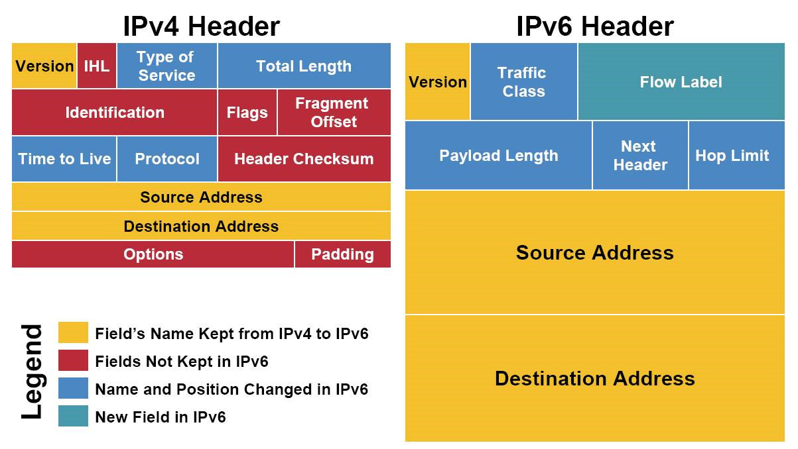
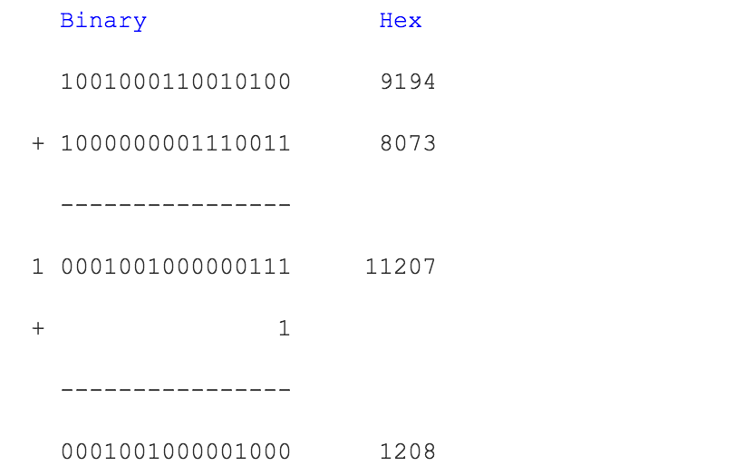

## IPV4与IPV6对比

ip包分为头部（header）和数据（payload/data）

### 黄色区域（同名区域）

version(4位)表明ip协议版本

​	ipv4: version=0100   ipv6: version:0110

source address: 发出地  destination addr:目的地

### 蓝色区域

​    time to live 存活时间（hop limit  in ipv6）表示一个ip包的最大存活时间。ipv4这个区域记录一个整数，ip包传输过程中没经过一个路由time to live 就会减1，time to live 为0时就作废ip包，ip包不在发送。ipv6中的 hop limit 同ipv4作用一样。此字段可避免ip在互联网中无限接力

​     服务类型=type of service(ipv4)=traffic class(ipv6).最初的作用是给ip包分优先级的，例如：实时性高的语音的优先级先于web服务。目前 被分为两部分：differentialted service field(ds,前6位)和explict congestion notification(ecn,后2位)，ds用来区分服务类型，ecn表明ip包途径路由的交通状况。

​    协议=protocol(ipv4)=next header(ipv6).说明ip包payload部分所遵循的协议，也就是ip包之上的协议（tcp?udp?）

​	内容长度=total length(ipv4)=payload length(ipv6)

### 红色区域

 ipv4特有，ipv6删除区域。

每个options有32位，是选填区域。可有可无。除去options，ipv4的头部有20bytes(上面每行4bytes).options使得头部区域的长度是变动的。IHL(intenet header length)记录头部长度，用total length记录整个ip包的长度。ipv6没有options,整个头部的长度固定为40bytes,故ipv6不需要IHL.payload length标识ipv6的数据部分长度，ip包长度=40bytes + payload length

 ipv4的header checksum区域用于校验ip包的头部信息，checksum与之前的crc算法不同。ipv6没有checksum区域。ipv6依靠高层的协议来完成，免去checksum时间，减小网路延迟（latency）

identification,flags和fragment offset，这个三个包是为分片重组服务的。分片：路由将一个ip包拆成多个ip包传送，接收路由器需要将拆分的碎片重组（reassembly）成一个ip包。不同的局域网锁支持的最大传输单元（MTU, maximum transportation unit）不同。如果一个ip包超过了局域网支持的mtu,就需要在进入改局域网时分片传输。分片重组会给网络带来很大负担。最好在ip包发出之前就探测整个路径上的最小mtu(min(所有经过局域网中的mtu)),ip包的大小不超过最小mtu,可避免碎片化。ipv6在设计上避免碎片化。每一个ipv6局域网的mtu都必须大于等于1280bytes.ipv6默认发送的ip包大小为1280bytes

### 绿色区域

flow lablel是ipv6新增区域。用来提箱路由器来重复使用之前的接力路径。这样ip包可以自动保持出发时的顺序。对流媒体有帮助，flow lablel的使用还在进一步开发中

## 我尽力

ip协议产生是在一个松散的网络。是不可靠的，ip传输过程出现错误，ip包会被丢掉。更多的质量控制交给高层协议处理，ip协议只负责有效率的传输。所以ip协议也不保证ip包到达的传输顺序。ip包根据routing table决定路由路线，如果routing table跟新，路由路线变更导致后发的ip可能先到达

ipv6的flow label可以建议将一些ip包保持一样的接力路径，路由器可能忽略该建议

## header checksum算法

head checksum区域有16位。它是这样获取的，从header获取除checksum只晚的0/1序列。如：9194 8073 0000 4000 4011 C0A8 0001 C0A8 00C7 (十六进制hex, 这是一个为演示运算过程而设计的header)

按照十六位（4位hex）分割整个序列。将分割后的各个4位的hex累积相加。如果有超过16位的进位出现，则将进位加到16位结果的最后一位：

上面的计算叫做one's complement sum。求得所有十六位数的和，

one's complement sum(4500, 0073, 0000, 4000, 4011, C0A8, 0001, C0A8, 00C7) = 1433

然后，将1433的每一位取反(0->1, 1->0)， 就得到checksum：EBCC这样，我们的header就是:9194 8073 0000 4000 4011 EBCC C0A8 0001 C0A8 00C7

IP包的接收方在收到IP包后，可以求上面各个16位数的one's complement sum，应该得到FFFF。如果不是FFFF，那么header是不正确的，整个IP包会被丢弃。

(再次提醒，示例所用的IP header不是真实的header，它只是起演示算法的作用)

 

