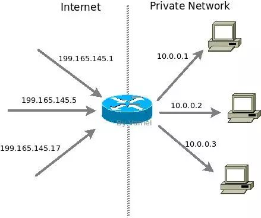

 ipv4长度只有32位，只能提供大约40亿个地址。造成地址耗尽。所以诞生了ipv6,但是ipv6和ipv4不兼容，ipv4向ipv6迁移困难。一些技术，例如CIDR和NAT，的推广，可以缓解ipv4的稀缺状态。

## CIDR

CIDR(Classless Inter Domain Routing)改进ipv4分类。传统ip分类将ip地址直接对应默认的分类，从而将internet分割为网络。cidr在路由表中增加了子网掩码（subnet masking）,从而可以更细分网络。利用cider,可灵活的将某个范围的ip地址分给某个网络。

### ip地址分类

ip地址可分为如下几类：


最初的ipv4分类设计，一个ipv4总共32位，可以分为网络（network）和主机（host）两部分。子网掩码（subnet masking）是用于表示哪些位代表了网络部分。如下subnet mask 255.0.0.0的二进制表示为

```
11111111  00000000 00000000  00000000
```

前8位位1，表示ip地址的前八位为网络部分。后24位指该网络的各个主机。一个A类网络可以有$$2^{24}$$（16777216）台主机。由于ipv4地址已经分好类了，所以当我们拿到一个ip地址，我们就可以通过上面查到它的子网掩码。（B类$$2^{16}$$;C类，$$2^8$$）

### 传统路由表

ip分类方便ip包的接力。ip包达到某个路由器后根据路由表（routing table）来决定接力的下一站。一个传统的路由表看起来是这样的：


该路由表的网络拓扑如下：


由于ip分类，我们不需要记录subnet mask.当我们要前往199.165.146.17时，已知道这台主机位于一个c类地址，所以它的子网掩码是255.255.255.0，也就是说199.165.146代表类网络，17代表了主机。

### CIDR路由表

由于默认分类，造成网络只能按照A, B , C的方式存在。假设一个网络（比如MIT网络）分配了一个A类地址，那么该网络将容许16888216个主机。如果该网络无法使用完这些ip地址，这些ip地址也无法被其它网络使用。再比如上面的网络，199.165.145必须作为一个整个网络的存在。如果我们只有10台主机，将会浪费200多个ip地址。cidr的本质是在路由表中加入子网掩码，并根据该列信息对网络进行分割，而不是根据默认的a.b.c进行分割，比如：


根据路由第一条记录：


通过子网掩码可以知道，前31位表示网络，最后一位表示主机。子网掩码总是有连续多个1组成，比如上面的31个1.也可以记为199.165.145.254/31，来同时表示ip地址和子网掩码。

路由器将原来的199.165.145网络中的一部分分割出来。这一网络可以容纳两台点电脑，也就是199.165.145.254和199.165.145.255.这个网络对应网卡eth2。当有ip包通向这两个ip地址时，会前往eth2,而不是eth0.

网络拓扑如下：


利用cidr,可以将ip地址根据需要进行分割，从而不浪费ip地址。

### NAT

CIDR可以节约地址，不能创造地址，不能解决ip耗尽问题。nat(network address translation)

理论上每个ip地址代表了internet上的一个设备。但是一些ip被保留，用于一些特殊的用途。下面三段ip被保留用作私有ip地址：


私有ip只用于局域网内部。理论上，我们不应该在互联网上看到来自或者发往私有ip地址的ip包。与私有ip地址对应的是全球ip地址（globle ip address）

nat是为私有网络服务的。该网络中的主机使用私有ip地址。当私有网络内部主机和外部internet通信时，网关（gateway)路由器负责将私有ip地址转换为全球ip地址，这个地址转换的过程就是network address translation.网关路由的nat功能，在最极端的情况下，我们可以只分配一个全球ip给网关路由器，而私有网络中的设备使用私有ip.由于私有ip地址可以在不同私有网络中重复使用，所以就大大减小了设备对ip地址的需求。

#### 基础NAT

NAT的一种为基础NAT,也称为1对1（one-to-one)nat.在基础nat下，网关路由器一一转换一个外部ip和地址和一个私有ip地址。网关路由器保存有ip的nat对应关系，比如：



内外部地址通过网关进行转换。此外ip头部的checksum,以及更高层写协议（比如udp和tcp）中的校验ip的checksum也会更改。

基础ip尽管是1对1转换的ip地址，但还是可以减小内部网络对ip地址的需求。通常来说，一个局域网中只有少数的设备处于开机状态并不需要给每个设备对应一个全球ip地址。nat可以动态的管理全球ip地址，并将全球ip地址对应到开机设备，从而减小内部网络对ip地址的需求。

#### NAPT(network address and port translation)

在基础nat中，高层协议的端口号并不会改动。napt下，ip地址和端口号可能同时改动。

udp和tcp有端口（port）的概念，用ip：port来代表通信的一端。napt就是在网关路由器处建立两个通信通道，一个通往内部网络，一个通往外部网络，然后将网关处的通道端口连接，从而让内部和外部通信。比如：


我们看到，通往ip 199.165.145.1建立了三个端口的连接：8888，8889和8080.它们分别在napt处改为通往10.0.0.1:80  10.0.0.1:8080和10.0.0.3:6000.napt记录有外部ip：端口和内部ip:端口的一一对应关系。在ip包经过的时候，网关路由器会更改ip地址，端口号以及相关的checksum.

利用napt我们可以使用一个（或者多个单少量的）外部ip和大量的端口号，来应对多个内部ip以及相应的端口号，从而大大减小了对全球ip地址的需求。

nat和napt设置比较复杂，违背互联网最初设计理念。但是ipv4的使用习惯使得nat被广泛推广。由于nat所处的网关服务器是最理想的设置防火墙的位置，nat还往往和防火墙共同建设，以提高私有网络的安全性。


$$

$$
